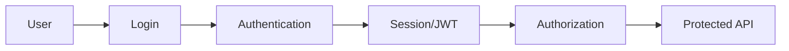
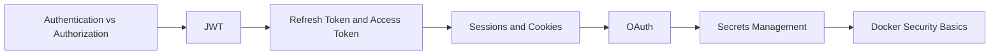

# Auth Security Content Table

- [[Authentication vs Authorization]]
- [[JWT]]
- [[Refresh Token and Access Token]]
- [[OAuth]]
- [[Sessions and Cookies]]
- [[Secrets Management]]
- [[Docker Security Basics]]

## Revision dashboard

Auth/security protects users, APIs, data, secrets, and infrastructure.

## Related API notes

- [[REST API]], [[GRAPHQL]], and [[API Gateway]] often need auth middleware.
- [[CORS]] matters when browser frontend calls protected APIs.
- [[Secrets Management]] connects with [[AWS IAM]] and production deployment.
- [[Rate limiting with Redis]] helps protect login and public API endpoints.

## Visual topic map

Use this map like the Excalidraw roadmap: follow the arrows first, then open the linked notes.

## Color legend

- Blue = core concept
- Green = recommended pattern
- Red = risk or failure mode
- Purple = tradeoff
- Orange = current 2026 update

## Linked notes in this map

- [[Authentication vs Authorization]]
- [[JWT]]
- [[Refresh Token and Access Token]]
- [[Sessions and Cookies]]
- [[OAuth]]
- [[Secrets Management]]
- [[Docker Security Basics]]

## Grill audit additions

- [[API Abuse and Bot Protection]]

## Must not miss

- [[API Abuse and Bot Protection]]
- token storage and rotation
- object-level authorization
- refresh token revocation
- secret management
- audit logs
- OWASP API Security risks

## Complete auth/security checklist

A good auth/security note should answer:

1. who the user/client is
2. how identity is verified
3. what the user is allowed to access
4. where tokens/sessions are stored
5. how tokens expire, rotate, and revoke
6. how secrets are stored
7. how login, refresh, logout, and password reset work
8. how object-level authorization is enforced
9. how abuse is detected and rate limited
10. how security events are logged and audited

## Easy real-life example

A user logs in with email/password. The backend verifies credentials, creates a session or token, sends it securely, and later checks that token before allowing access to `GET /me`.

## Difficult production example

An admin dashboard must support login, MFA, short-lived access tokens, refresh token rotation, logout/revocation, role-based permissions, object-level checks, audit logs, secure cookies, CSRF protection for cookie auth, rate limits on login, and safe secret storage.

## Senior interview bank

### 1. What is the difference between authentication and authorization?

Authentication proves who the user is. Authorization decides what that user can do. For example, login authenticates Priyanshu, but authorization decides whether Priyanshu can delete a specific order.

### 2. What is the safest way to handle access and refresh tokens?

Use short-lived access tokens and longer-lived refresh tokens with rotation and revocation. Store tokens safely based on client type. For browser apps, secure HttpOnly cookies are often safer against token theft by JavaScript, but they require CSRF protection when used cross-site.

### 3. What are common API security mistakes?

Common mistakes are missing object-level authorization, trusting client-provided role/user ids, no rate limits, weak token storage, long-lived tokens without revocation, leaking secrets, inconsistent audit logs, and not following OWASP API Security risks.

