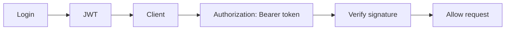
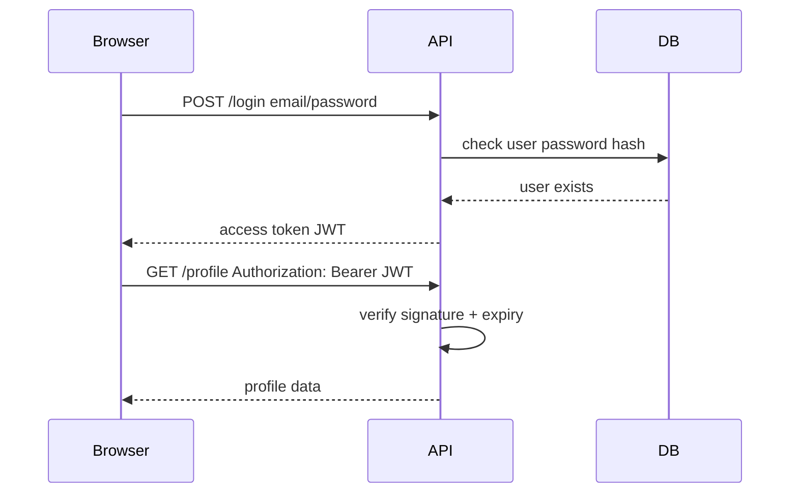
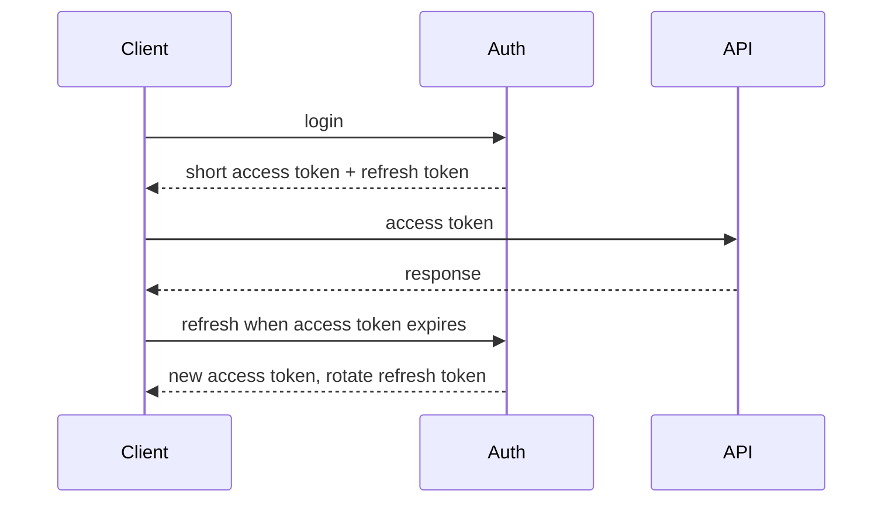

# JWT

## Complete notes

JWT is a signed token that can carry user claims between client and server.

## Easy explanation

JWT is a signed token that carries claims, so an API can verify who/what the token represents without looking it up every time.

In simple words: if you can explain `JWT` with one real request, one failure case, and one metric, you understand the topic much better than just memorizing the definition.

## Simple example

Think of a user trying to access a protected resource. This topic decides who the user is, what they are allowed to do, how tokens/secrets are protected, and how abuse is detected.

For `JWT`, ask yourself:

1. What is the normal happy path?
2. What can fail?
3. What is the tradeoff?
4. What would I monitor in production?

## Real-life examples

### Easy real-life example

After login, the API returns a signed token that says the user id and expiry time.

### Difficult production example

A production API validates issuer, audience, signature, expiry, key rotation, token revocation strategy, and avoids storing sensitive data inside JWT claims.

### How to relate this topic

When reading `JWT`, connect it to:

- one user action
- one backend component
- one failure case
- one tradeoff
- one metric

## Important points

- Core idea: `JWT` must be understood through its production use case, not just its definition.
- When to use it: Focus on identity, authorization boundary, token/session lifecycle, secret storage, abuse prevention, auditability, and OWASP API risks.
- At scale: explain the bottleneck, failure path, operational owner, and rollback/fallback.
- What to monitor: 401/403 rate, login failures, token refresh failures, suspicious IP/device activity, permission-denied spikes, and audit events.
- Interview rule: always give one concrete example, one tradeoff, one failure mode, and one metric.

## Diagram



## JWT parts

```text

header.payload.signature
```

## Common mistakes

- Checking only authentication and forgetting object-level authorization.
- Storing secrets/tokens in logs, Git, frontend code, or Docker images.
- Using long-lived tokens without rotation or revocation strategy.
- Ignoring abuse flows such as credential stuffing and fake account creation.
- Not auditing sensitive actions.

## Quick revision

JWT is a signed token that can carry user claims between client and server.

## Examples and deeper diagrams

### Login flow example



### JWT payload example

```json
{
  "sub": "user_123",
  "role": "admin",
  "exp": 1710000000
}
```

### Important warning

JWT payload is encoded, not encrypted. Anyone can decode it. So never put password, API keys, private address, or secrets in JWT payload.

### Practical rule

Use short-lived access tokens and refresh tokens if long login sessions are needed.

## 2026 update: JWT safety checklist

> [!danger] Common JWT mistakes
> <span class="sd-risk">Do not store long-lived JWTs in localStorage</span> for sensitive applications. Prefer short-lived access tokens, refresh-token rotation, secure cookies where suitable, audience/issuer validation, and key rotation.




## Deep understanding checklist

To fully understand `JWT`, be able to answer:

1. Where does it sit in the architecture?
2. What production problem does it solve?
3. What is the simplest implementation?
4. What breaks when traffic or data grows?
5. What is the main failure mode?
6. What tradeoff does it introduce?
7. Which metric proves it is healthy?

Strong answer focus: Focus on identity, authorization boundary, token/session lifecycle, secret storage, abuse prevention, auditability, and OWASP API risks.

## Senior interview bank

These are topic-specific questions and strong answers for `JWT`.

### 1. What exact security bug can happen here?

The most dangerous bug is usually broken object-level authorization: the user is logged in but accesses another user's or tenant's resource. The fix is to check ownership/permission on every object access, not only at login.

### 2. How would you store and rotate secrets/tokens safely?

Use a secret manager, short-lived access tokens, refresh-token rotation, secure cookies where appropriate, least-privilege IAM, audit logs, and rotation. Never put secrets in Git, frontend code, Docker images, or logs.

### 3. How do you handle compromised credentials?

Revoke or rotate refresh tokens, invalidate sessions, force password reset or re-auth, rotate affected secrets, audit suspicious actions, and add detection for repeated abuse patterns.

### 4. What should be logged and what must not be logged?

Log request id, user id, tenant id, action, result, IP/device risk, and denial reason. Do not log passwords, full tokens, secrets, private keys, or sensitive payloads.

### 5. How does this fail at scale?

At scale, attackers distribute traffic across IPs, target expensive endpoints, abuse password reset/login, and probe authorization gaps. Defense needs tenant/user/API-key quotas, anomaly detection, WAF/bot controls, and audit trails.

## Topic-specific drill

### How would I answer `JWT` if the interviewer asks directly?

For `JWT`, I would explain the attacker model, authorization boundary, storage/secret risk, audit trail, and how abuse is detected.

### What is the trap question for `JWT`?

The trap is giving only a definition. A senior answer must include a concrete production example, a failure mode, a tradeoff, and a metric.

### What should I draw?

Draw the smallest flow that shows where `JWT` sits, then add the failure path next to the happy path.

## Reviewer checklist

- Can I explain this without reading the note?
- Can I draw the happy path and failure path?
- Can I name one concrete metric?
- Can I explain the tradeoff against a simpler option?
- Can I give a production example in under two minutes?
