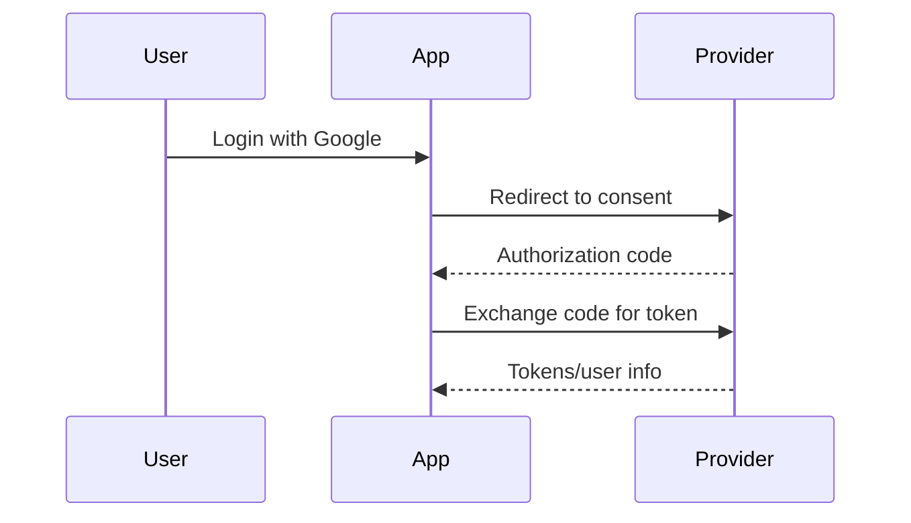

# OAuth

## Complete notes

OAuth lets users grant one app access to another service without sharing password.

## Easy explanation

OAuth is a safe permission flow where a user lets one app access another service without giving that app their password.

In simple words: if you can explain `OAuth` with one real request, one failure case, and one metric, you understand the topic much better than just memorizing the definition.

## Simple example

Imagine "Login with Google." Your app redirects the user to Google, receives an authorization code, exchanges it for tokens on the backend, validates the response, and creates an app session.

For `OAuth`, ask yourself:

1. Who is the client?
2. Who is the authorization server?
3. What scopes are requested?
4. Is PKCE used?
5. Where are tokens stored and rotated?

## Real-life examples

### Easy real-life example

A user clicks 'Login with Google' and grants your app permission without sharing their Google password.

### Difficult production example

A mobile app uses Authorization Code Flow with PKCE, validates state/redirect URI, stores refresh tokens safely, rotates tokens, and handles provider outage/token revocation.

### How to relate this topic

When reading `OAuth`, connect it to:

- one user action
- one backend component
- one failure case
- one tradeoff
- one metric

## Important points

- OAuth is delegated authorization: one app gets limited access to another service without receiving the user's password.
- The modern default for web/mobile is Authorization Code Flow with PKCE.
- Important actors: resource owner, client, authorization server, resource server.
- Important values: authorization code, access token, refresh token, redirect URI, scopes, state, PKCE verifier/challenge.
- OAuth is not the same as authentication, though OpenID Connect uses OAuth-style flows for login.
- Validate redirect URI, state, issuer, audience, expiry, scopes, and token signature where applicable.
- Monitor login failures, token exchange failures, refresh failures, suspicious redirect/client activity, and consent errors.

## Diagram

## Common mistakes

- Confusing OAuth with password sharing.
- Confusing OAuth with OpenID Connect authentication.
- Not using PKCE for public clients.
- Not validating `state`, redirect URI, issuer, audience, expiry, and scopes.
- Storing access/refresh tokens insecurely.
- Giving broad scopes when narrow scopes are enough.
- No refresh-token rotation or revocation strategy.

## Quick revision

OAuth lets users grant one app access to another service without sharing password.

## Deep understanding checklist

To fully understand `OAuth`, be able to answer:

1. Where does it sit in the architecture?
2. What production problem does it solve?
3. What is the simplest implementation?
4. What breaks when traffic or data grows?
5. What is the main failure mode?
6. What tradeoff does it introduce?
7. Which metric proves it is healthy?

Strong answer focus: Focus on identity, authorization boundary, token/session lifecycle, secret storage, abuse prevention, auditability, and OWASP API risks.

## Production example and edge cases

Example: "Login with Google" redirects the user to Google, receives an authorization code, exchanges the code for tokens on the backend, validates the response, creates an app session, and stores only what is needed.

Edge cases:

- attacker changes redirect URI
- missing `state` allows CSRF
- public mobile/SPA client needs PKCE
- access token expires during an API call
- refresh token is stolen
- user revokes consent
- provider is down or token exchange times out
- requested scope is too broad

Interview answer rule: explain the flow and the security checks, not only "OAuth lets login with Google."

## Senior interview bank

These are topic-specific questions and strong answers for `OAuth`.

### 1. What problem does OAuth solve?

OAuth lets a user grant a client limited access to a resource server without sharing the user's password with that client. The access is limited by scopes and token lifetime.

### 2. What is Authorization Code Flow with PKCE?

The client redirects the user to the authorization server, receives an authorization code, and exchanges it for tokens. PKCE adds a verifier/challenge so a stolen authorization code cannot be exchanged by an attacker.

### 3. OAuth vs OpenID Connect?

OAuth is for delegated authorization. OpenID Connect adds identity/authentication on top of OAuth using ID tokens and standardized user identity claims.

### 4. What security checks are required?

Validate redirect URI, `state`, PKCE, issuer, audience, expiry, token signature, scopes, and client configuration. Store tokens securely and rotate/revoke refresh tokens.

### 5. What can go wrong in production?

Redirect URI abuse, stolen refresh tokens, missing PKCE, broad scopes, provider outage, invalid token validation, expired tokens, and confusing access token with app session.

## Topic-specific drill

### How would I answer `OAuth` if the interviewer asks directly?

For `OAuth`, I would draw Authorization Code Flow with PKCE, name the actors, explain scopes/tokens/redirect URI/state, then discuss token storage, refresh rotation, revocation, and provider failure.

### What is the trap question for `OAuth`?

The trap is saying OAuth is simply "login." OAuth is delegated authorization; OpenID Connect is the authentication layer commonly used for login.

### What should I draw?

Draw user -> app -> authorization server -> authorization code -> backend token exchange -> resource server access.

## Reviewer checklist

- Can I explain this without reading the note?
- Can I draw the happy path and failure path?
- Can I name one concrete metric?
- Can I explain the tradeoff against a simpler option?
- Can I give a production example in under two minutes?
