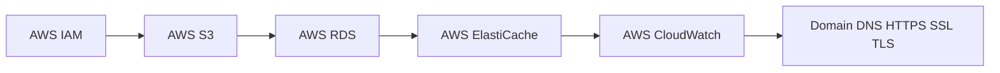

# AWS Services Content Table

- [[AWS S3]]
- [[AWS RDS]]
- [[AWS ElastiCache]]
- [[AWS CloudWatch]]
- [[AWS IAM]]
- [[Domain DNS HTTPS SSL TLS]]

## Revision dashboard

AWS services provide storage, databases, [[what is redis|Redis]], logs, permissions, domains, and HTTPS for production backend.

## Visual topic map

Use this map like the Excalidraw roadmap: follow the arrows first, then open the linked notes.

## Color legend

- Blue = core concept
- Green = recommended pattern
- Red = risk or failure mode
- Purple = tradeoff
- Orange = current 2026 update

## Linked notes in this map

- [[AWS IAM]]
- [[AWS S3]]
- [[AWS RDS]]
- [[AWS ElastiCache]]
- [[AWS CloudWatch]]
- [[Domain DNS HTTPS SSL TLS]]
