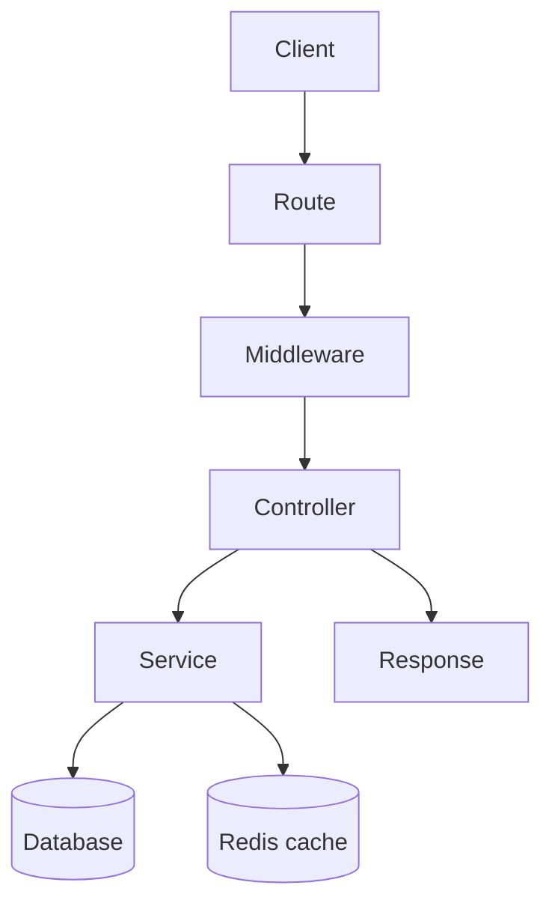
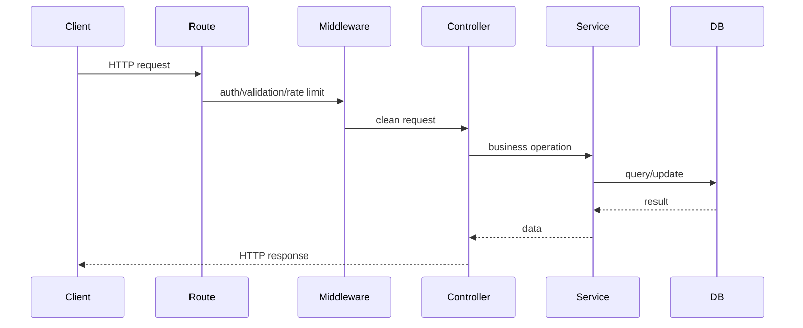

# Basic backend content table

## Complete notes

Backend is the server-side part of an app.

It handles data, authentication, business logic, database work, security, and API responses.

## Main parts

- Route receives the request.
- Middleware checks auth, validation, logging, and rate limits.
- Controller handles request/response.
- Service contains business logic.
- Model/database layer stores and reads data.

## Diagram

## Common backend responsibilities

- Authentication and authorization.
- CRUD APIs.
- File uploads.
- Payments.
- Background jobs.
- Sending email or notifications.
- Caching and rate limiting.

## Quick revision

Backend = API routes + business logic + database + security + response.

## Important additions

### Backend request lifecycle

### Must know for backend

- HTTP methods and status codes.
- Auth: login, JWT/session, middleware.
- Validation before database write.
- Error handling with consistent response shape.
- Logging for debugging.
- Environment variables for secrets/config.
- Database indexes for performance.

### Common status codes

| Code | Meaning |
|---|---|
| 200 | success |
| 201 | created |
| 400 | bad request |
| 401 | not logged in |
| 403 | no permission |
| 404 | not found |
| 429 | too many requests |
| 500 | server error |
