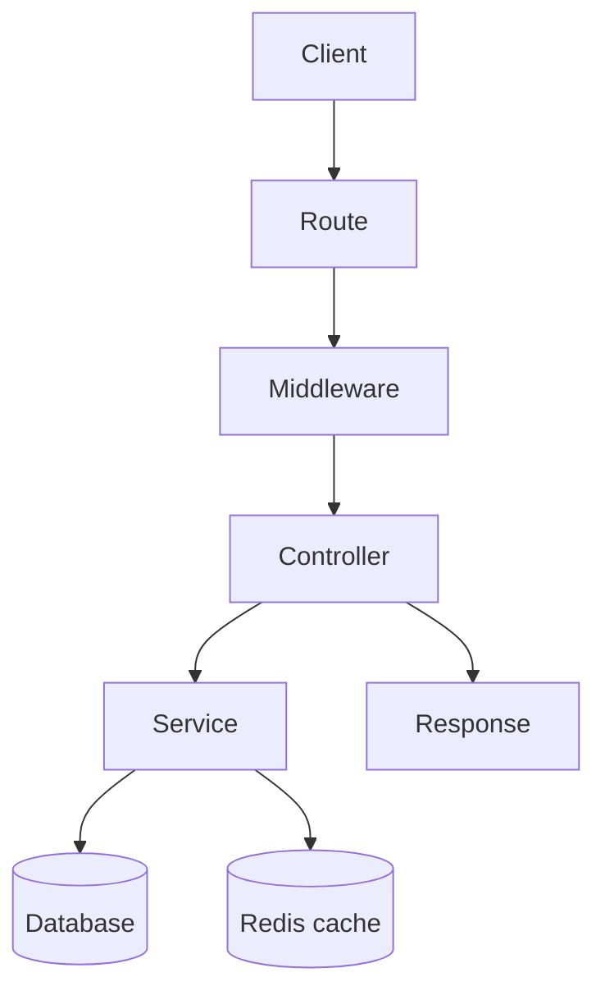
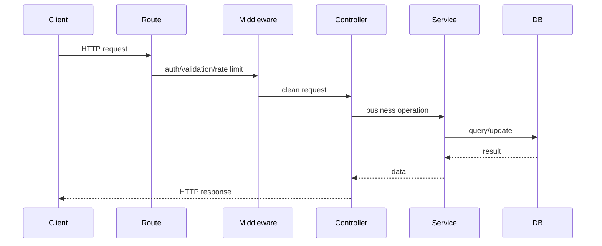

# Basic backend content table

## Complete notes

Backend is the server-side part of an app.

It handles data, [[Authentication vs Authorization|authentication]], business logic, database work, security, and API responses.

## Main parts

- Route receives the request.
- Middleware checks auth, validation, logging, and rate limits.
- Controller handles request/response.
- Service contains business logic.
- Model/database layer stores and reads data.

## Diagram

## Common backend responsibilities

- Authentication and authorization.
- CRUD APIs.
- File uploads.
- Payments.
- Background jobs.
- Sending email or notifications.
- Caching and rate limiting.

## Quick revision

Backend = API routes + business logic + database + security + response.

## Important additions

### Backend request lifecycle

### Must know for backend

- HTTP methods and status codes.
- Auth: login, JWT/session, middleware.
- Validation before database write.
- Error handling with consistent response shape.
- Logging for debugging.
- Environment variables for secrets/config.
- Database indexes for performance.

### Common status codes

| Code | Meaning |
|---|---|
| 200 | success |
| 201 | created |
| 400 | bad request |
| 401 | not logged in |
| 403 | no permission |
| 404 | not found |
| 429 | too many requests |
| 500 | server error |

## Real backend request checklist

When you build or explain a backend request, include:

1. route and HTTP method
2. authentication and authorization
3. validation and sanitization
4. controller/request handling
5. service/business logic
6. database/cache/queue calls
7. error handling and status code
8. logs, metrics, and trace/request id
9. rate limiting and security checks
10. response shape

## Related notes to open next

- [[REST API]]
- [[API Error Handling]]
- [[API Gateway]]
- [[Authentication vs Authorization]]
- [[JWT]]
- [[Sessions and Cookies]]
- [[Rate limiting with Redis]]
- [[Database Indexing]]

## Easy real-life example

A todo app backend receives `POST /tasks`, checks the logged-in user, validates the task title, saves it in the database, writes a log, and returns `201 Created` with the new task.

## Difficult production example

A payment backend receives `POST /payments`, checks auth, validates amount/currency, uses an idempotency key, calls a payment provider, writes payment status to the database, publishes an event to a queue, handles provider timeout safely, and returns a consistent response. This is backend thinking: route, security, business rule, database, side effect, failure handling, and observability together.

## Senior interview bank

### 1. What happens when a request hits the backend?

The request enters through a route or gateway, then middleware handles logging, auth, validation, rate limit, and request ids. The controller parses the request and calls a service. The service runs business logic and talks to database/cache/queue/external APIs. The backend then returns a response with the right status code and error format if something failed.

### 2. Where should business logic live?

Business logic should live mostly in the service/domain layer, not inside route handlers. Controllers should stay thin: receive input, call service, return response. This keeps code testable and avoids duplicating rules across endpoints.

### 3. What makes a backend production-ready?

A production backend has validation, auth, authorization, consistent errors, logs, metrics, tracing, timeouts, retries, rate limits, secure secret handling, database indexes, and a clear deployment/rollback process.

