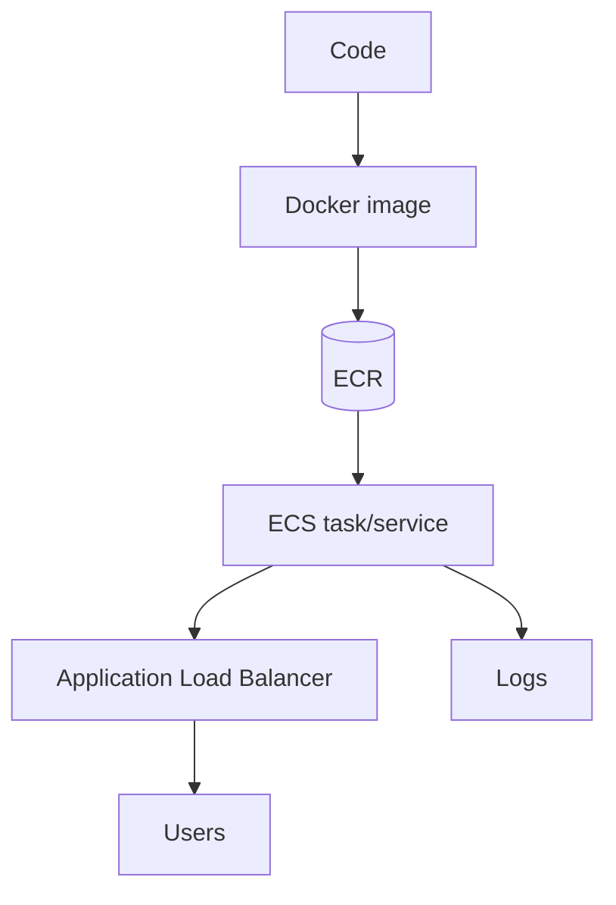
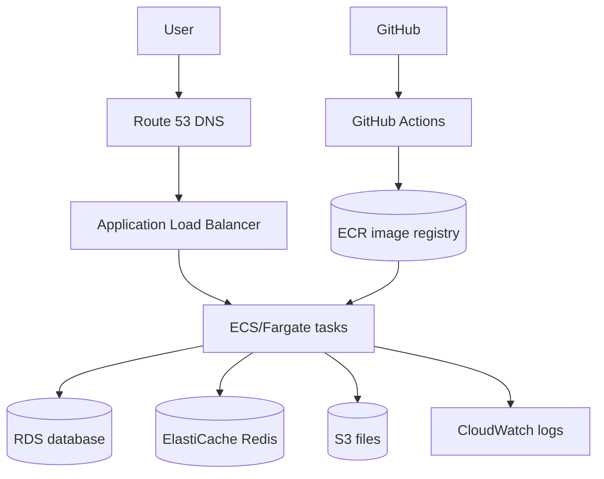

# AWS Deployment

## Complete notes

AWS deployment means putting your app on Amazon cloud so users can access it from internet.

## Common AWS services for backend

- EC2: virtual server.
- ECS: run containers.
- ECR: store Docker images.
- S3: store files/static assets.
- RDS: managed relational database.
- ElastiCache: managed Redis.
- CloudWatch: logs and monitoring.
- IAM: permissions/security.
- ALB: application load balancer.

## Deployment flow

## Important production setup

- Environment variables.
- Secrets.
- Database connection.
- Redis connection.
- Health check route.
- Logs.
- HTTPS/domain.
- Auto restart.

## Quick revision

AWS deployment = package app, push image, run service, expose through load balancer, monitor logs.

## Deep revision

### Common AWS backend architecture

### Deployment checklist

- Dockerfile works locally.
- Health check route exists.
- Environment variables configured.
- Secrets are not in repo.
- Database reachable from backend.
- Security group allows correct ports.
- Logs visible in CloudWatch.
- Domain/HTTPS configured.

### Important AWS security idea

Use IAM roles and least privilege.

Do not hardcode AWS keys in code or Docker image.

### Common deployment failures

- Container starts on wrong port.
- Health check path wrong.
- Missing env variable.
- Security group blocks traffic.
- ECS task cannot pull image from ECR.
