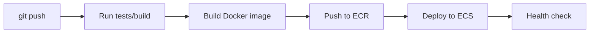
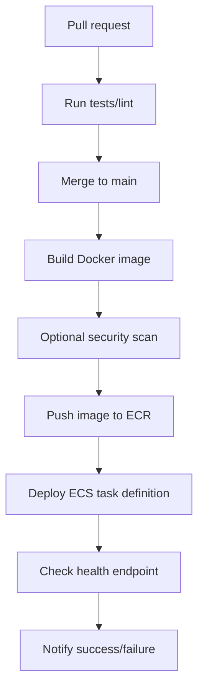

# CI CD Pipeline

## Complete notes

CI/CD means Continuous Integration and Continuous Deployment.

It automates testing, building, and deploying code.

## CI

Continuous Integration checks code when developer pushes.

Examples:

- install dependencies
- run lint
- run tests
- build app

## CD

Continuous Deployment sends successful build to production/staging.

## Pipeline diagram



## GitHub Actions example idea

```yaml

name: Deploy
on:
  push:
    branches: [main]

jobs:
  deploy:
    runs-on: ubuntu-latest
    steps:
      - uses: actions/checkout@v4
      - run: npm ci
      - run: npm test
      - run: docker build -t app .
```

## Important secrets

- `AWS_ACCESS_KEY_ID`
- `AWS_SECRET_ACCESS_KEY`
- `AWS_REGION`
- database URL
- Redis URL

## Common mistakes

- Deploying without tests.
- Putting secrets directly in repo.
- No rollback plan.
- No health check after deployment.
- Using latest tag without traceability.

## Quick revision

CI/CD = push code -> test -> build -> deploy automatically.

## Deep revision

### Complete CI/CD flow



### Stages

- CI validates code.
- Build creates deployable artifact.
- CD deploys artifact.
- Verification checks app is healthy.

### Good pipeline rules

- Fail fast.
- Keep secrets in GitHub secrets/AWS secrets.
- Use separate staging and production.
- Tag image with commit SHA.
- Run migrations carefully.
- Keep rollback plan.

### Common mistakes

- Deploying untested code.
- Running database migrations without backup.
- No health check after deploy.
- No logs when deploy fails.
- Too much manual clicking in console.
