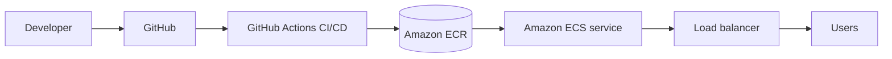

# Cloud Deployment Content Table

## Course topics from Part 2

- [[AWS Deployment]]
- [[CI CD Pipeline]]
- [[ECR and ECS]]
- [[Production Architecture]]

## Revision dashboard

Cloud deployment means running your backend in a production environment where real users can access it reliably.

## Study order

1. [[Production Architecture]]
2. [[AWS Deployment]]
3. [[ECR and ECS]]
4. [[CI CD Pipeline]]

## Big picture diagram

## Quick revision

- GitHub stores code.
- CI/CD builds and deploys automatically.
- ECR stores Docker images.
- ECS runs containers.
- Load balancer exposes app to users.

## Important additions

### Cloud deployment checklist

- App is dockerized.
- App has health check.
- Environment variables are configured.
- Secrets are secure.
- Logs are collected.
- Database/Redis are reachable.
- Domain and HTTPS work.
- CI/CD deploys repeatably.
- Rollback is possible.

### Common deployment environments

- Development: local machine.
- Staging: production-like test server.
- Production: real users.

Never test risky changes directly in production first.
