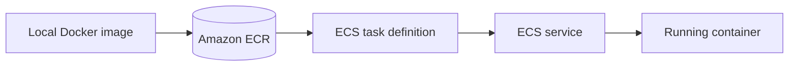
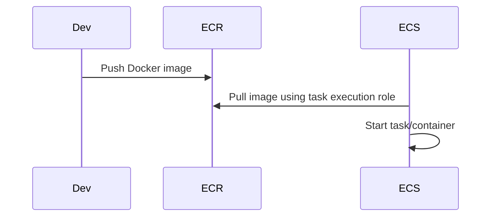

# ECR and ECS

## Complete notes

ECR means Elastic [[Docker_Image_Container|Container]] Registry.
It stores [[Docker Content Table|Docker]] images.

ECS means Elastic Container Service.
It runs Docker containers on [[AWS Deployment|AWS]].

## Easy explanation

ECR means Elastic Container Registry.

In simple words: if you can explain `ECR and ECS` with one real request, one failure case, and one metric, you understand the topic much better than just memorizing the definition.

## Simple example

Think of running your backend on cloud infrastructure with real users. This topic explains compute, networking, database/cache, monitoring, CI/CD, and rollback.

For `ECR and ECS`, ask yourself:

1. What is the normal happy path?
2. What can fail?
3. What is the tradeoff?
4. What would I monitor in production?

## Flow



## Important ECS terms

- Cluster: group where services/tasks run.
- Task definition: blueprint for container settings.
- Task: one running copy of task definition.
- Service: keeps desired number of tasks running.
- Fargate: serverless way to run containers.
- ALB: sends internet traffic to ECS tasks.

## ECR commands idea

```bash

aws ecr get-login-password --region ap-south-1
docker build -t my-api .
docker tag my-api:latest account.dkr.ecr.region.amazonaws.com/my-api:latest
docker push account.dkr.ecr.region.amazonaws.com/my-api:latest
```

## Real-life examples

### Easy real-life example

You deploy a backend API to cloud and expose it through a load balancer.

### Difficult production example

A production service runs on ECS/EKS/EC2 with CI/CD, secrets, IAM, private networking, RDS, cache, logs, metrics, alarms, autoscaling, and rollback.

### How to relate this topic

When reading `ECR and ECS`, connect it to:

- one user action
- one backend component
- one failure case
- one tradeoff
- one metric

## Important points

- Core idea: `ECR and ECS` must be understood through its production use case, not just its definition.
- When to use it: Focus on packaging, environment config, secrets, networking, compute, database/cache, CI/CD, health checks, rollback, monitoring, and cost.
- At scale: explain the bottleneck, failure path, operational owner, and rollback/fallback.
- What to monitor: deployment success, service health, 5xx, p95 latency, CPU/memory, restarts, DB connections, alarms, and cost.
- Interview rule: always give one concrete example, one tradeoff, one failure mode, and one metric.

## Common mistakes

- No health checks or rollback plan.
- Bad IAM/security group/env var configuration.
- No logs, metrics, or alerts before production.
- No backup or restore path.
- No cost monitoring.

## Quick revision

ECR stores image. ECS runs image as containers.

## Deep revision

### ECR to ECS flow



### ECS concepts

| Concept | Meaning |
|---|---|
| Cluster | logical group for running tasks |
| Task definition | blueprint for container |
| Task | running container instance |
| Service | keeps tasks running |
| Fargate | serverless container runtime |
| Task execution role | lets ECS pull image/logs |
| Task role | permissions for app inside container |

### Task definition contains

- image URL
- CPU/memory
- container port
- environment variables
- secrets
- log configuration
- health check

### Production tip

Use image tags based on Git commit SHA, not only `latest`, so [[Rollback Strategy|rollback]]/debugging is easier.


## Deep understanding checklist

To fully understand `ECR and ECS`, be able to answer:

1. Where does it sit in the architecture?
2. What production problem does it solve?
3. What is the simplest implementation?
4. What breaks when traffic or data grows?
5. What is the main failure mode?
6. What tradeoff does it introduce?
7. Which metric proves it is healthy?

Strong answer focus: Focus on packaging, environment config, secrets, networking, compute, database/cache, CI/CD, health checks, rollback, monitoring, and cost.

## Senior interview bank

These are topic-specific questions and strong answers for `ECR and ECS`.

### 1. How do you move a backend safely to cloud production?

Package the app, configure environment/secrets, provision compute/network/database/cache, add logs/metrics/alerts, deploy behind a load balancer, run health checks, and keep a rollback path.

### 2. What can fail after deployment?

Bad environment variables, missing IAM permissions, wrong security group, expired certificate, database connection exhaustion, bad image tag, unhealthy container, or no rollback plan.

### 3. How do you design CI/CD for this?

Build once, test, scan, push artifact, deploy to staging, run smoke tests, then deploy progressively to production using rolling/canary/blue-green strategy with automatic rollback signals.

### 4. What is the production readiness checklist?

Health checks, logs, metrics, alerts, secrets, backups, autoscaling, runbooks, rollback, cost monitoring, and clear ownership.

### 5. What should be monitored?

Deployment success, service health, 5xx rate, p95/p99 latency, CPU/memory, container restarts, database connections, queue lag, CloudWatch alarms, and cost.

## Topic-specific drill

### How would I answer `ECR and ECS` if the interviewer asks directly?

For `ECR and ECS`, I would explain the production deployment path, environment/secrets, infrastructure dependencies, health checks, rollback trigger, and the cloud metrics that prove it is stable.

### What is the trap question for `ECR and ECS`?

The trap is giving only a definition. A senior answer must include a concrete production example, a failure mode, a tradeoff, and a metric.

### What should I draw?

Draw the smallest flow that shows where `ECR and ECS` sits, then add the failure path next to the happy path.

## Reviewer checklist

- Can I explain this without reading the note?
- Can I draw the happy path and failure path?
- Can I name one concrete metric?
- Can I explain the tradeoff against a simpler option?
- Can I give a production example in under two minutes?
