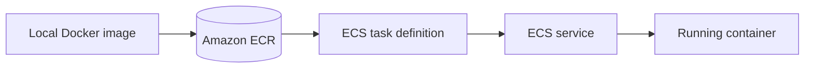
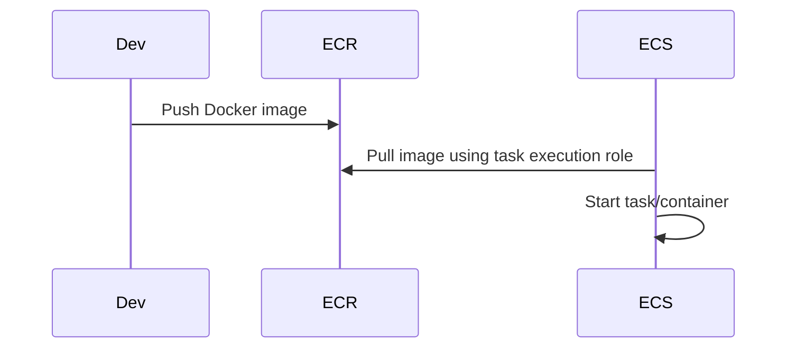

# ECR and ECS

## Complete notes

ECR means Elastic Container Registry.
It stores Docker images.

ECS means Elastic Container Service.
It runs Docker containers on AWS.

## Flow



## Important ECS terms

- Cluster: group where services/tasks run.
- Task definition: blueprint for container settings.
- Task: one running copy of task definition.
- Service: keeps desired number of tasks running.
- Fargate: serverless way to run containers.
- ALB: sends internet traffic to ECS tasks.

## ECR commands idea

```bash

aws ecr get-login-password --region ap-south-1
docker build -t my-api .
docker tag my-api:latest account.dkr.ecr.region.amazonaws.com/my-api:latest
docker push account.dkr.ecr.region.amazonaws.com/my-api:latest
```

## Common mistakes

- ECS task role and execution role confusion.
- Wrong image URL in task definition.
- Security group not allowing traffic.
- No health check.
- Forgetting environment variables.

## Quick revision

ECR stores image. ECS runs image as containers.

## Deep revision

### ECR to ECS flow



### ECS concepts

| Concept | Meaning |
|---|---|
| Cluster | logical group for running tasks |
| Task definition | blueprint for container |
| Task | running container instance |
| Service | keeps tasks running |
| Fargate | serverless container runtime |
| Task execution role | lets ECS pull image/logs |
| Task role | permissions for app inside container |

### Task definition contains

- image URL
- CPU/memory
- container port
- environment variables
- secrets
- log configuration
- health check

### Production tip

Use image tags based on Git commit SHA, not only `latest`, so rollback/debugging is easier.
