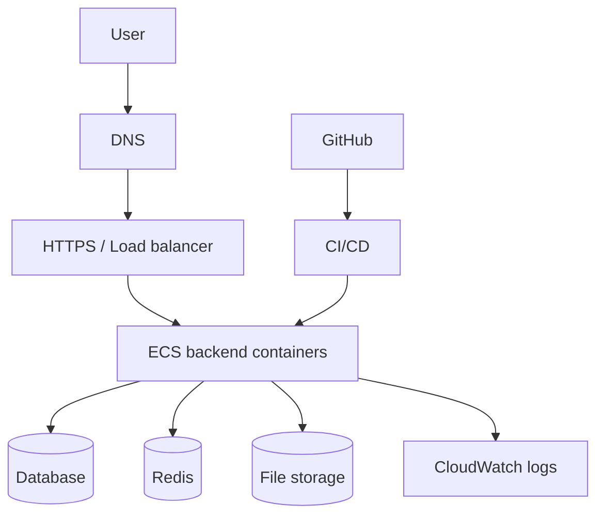
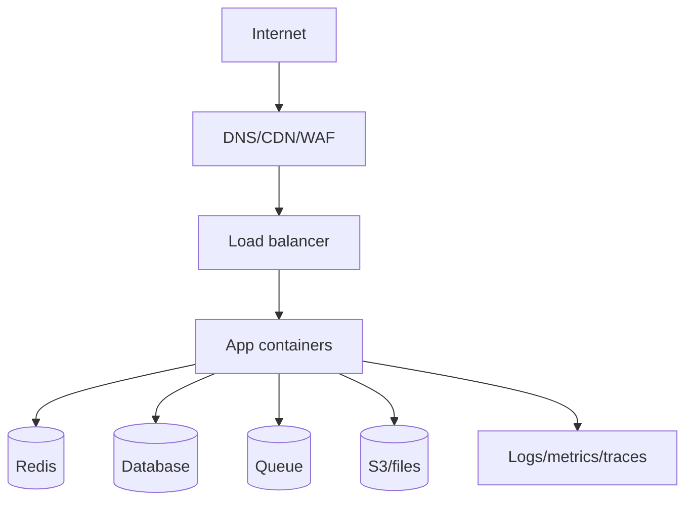

# Production Architecture

## Complete notes

Production architecture is the full setup used when real users use the app.

## Main parts

- Domain and DNS.
- HTTPS certificate.
- Load balancer.
- Backend containers.
- Database.
- Redis.
- File storage.
- Logs and metrics.
- CI/CD.
- Secrets management.

## Diagram

## Production checklist

- Health route exists.
- Logs are visible.
- Secrets are not in code.
- Database has backups.
- Redis has memory limit.
- App has rate limiting.
- App validates input.
- Deployment can rollback.
- Monitoring alerts are configured.

## Quick revision

Production architecture = all infrastructure pieces needed to run safely for real users.

## Deep revision

### Production backend layers

### Non-functional requirements

- Availability.
- Scalability.
- Security.
- Observability.
- Maintainability.
- Cost control.
- Recoverability.

### Production readiness checklist

- Rate limiting.
- Request validation.
- Error handling.
- Centralized logging.
- Monitoring alerts.
- DB backups.
- Secret management.
- CI/CD.
- Rollback.
- Load testing.

### Real interview phrasing

Production architecture is not only where the code runs. It includes networking, security, scaling, data storage, observability, deployment, and failure recovery.
