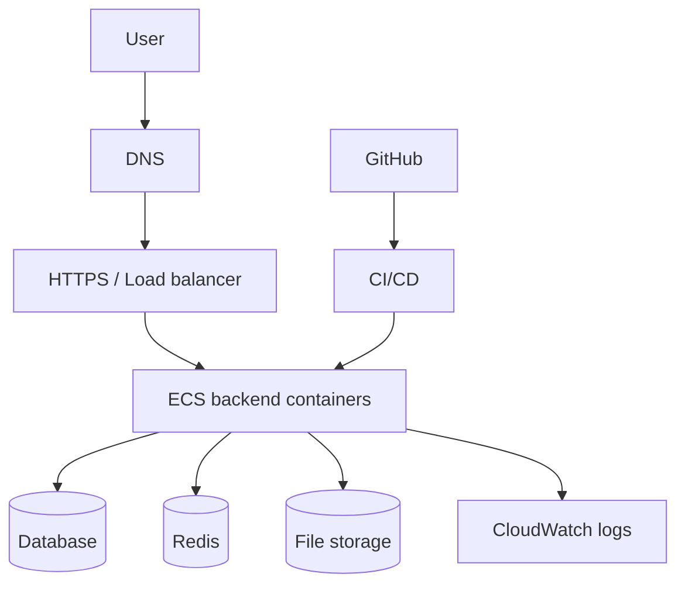
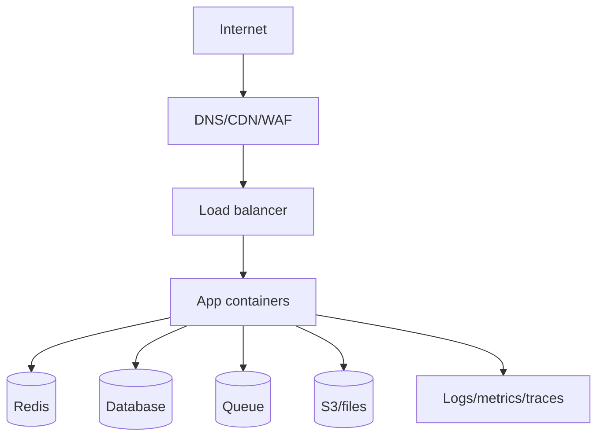

# Production Architecture

## Complete notes

Production architecture is the full setup used when real users use the app.

## Easy explanation

Production architecture is the full setup used when real users use the app.

In simple words: if you can explain `Production Architecture` with one real request, one failure case, and one metric, you understand the topic much better than just memorizing the definition.

## Simple example

Think of running your backend on cloud infrastructure with real users. This topic explains compute, networking, database/cache, monitoring, CI/CD, and rollback.

For `Production Architecture`, ask yourself:

1. What is the normal happy path?
2. What can fail?
3. What is the tradeoff?
4. What would I monitor in production?

## Main parts

- Domain and DNS.
- HTTPS certificate.
- Load balancer.
- Backend containers.
- Database.
- Redis.
- File storage.
- Logs and metrics.
- CI/CD.
- Secrets management.

## Diagram

## Production checklist

- Health route exists.
- Logs are visible.
- Secrets are not in code.
- Database has backups.
- Redis has memory limit.
- App has rate limiting.
- App validates input.
- Deployment can rollback.
- Monitoring alerts are configured.

## Real-life examples

### Easy real-life example

You deploy a backend API to cloud and expose it through a load balancer.

### Difficult production example

A production service runs on ECS/EKS/EC2 with CI/CD, secrets, IAM, private networking, RDS, cache, logs, metrics, alarms, autoscaling, and rollback.

### How to relate this topic

When reading `Production Architecture`, connect it to:

- one user action
- one backend component
- one failure case
- one tradeoff
- one metric

## Important points

- Core idea: `Production Architecture` must be understood through its production use case, not just its definition.
- When to use it: Focus on packaging, environment config, secrets, networking, compute, database/cache, CI/CD, health checks, rollback, monitoring, and cost.
- At scale: explain the bottleneck, failure path, operational owner, and rollback/fallback.
- What to monitor: deployment success, service health, 5xx, p95 latency, CPU/memory, restarts, DB connections, alarms, and cost.
- Interview rule: always give one concrete example, one tradeoff, one failure mode, and one metric.

## Common mistakes

- No health checks or rollback plan.
- Bad IAM/security group/env var configuration.
- No logs, metrics, or alerts before production.
- No backup or restore path.
- No cost monitoring.

## Quick revision

Production architecture = all infrastructure pieces needed to run safely for real users.

## Deep revision

### Production backend layers

### Non-functional requirements

- Availability.
- Scalability.
- Security.
- Observability.
- Maintainability.
- Cost control.
- Recoverability.

### Production readiness checklist

- Rate limiting.
- Request validation.
- Error handling.
- Centralized logging.
- Monitoring alerts.
- DB backups.
- Secret management.
- CI/CD.
- Rollback.
- Load testing.

### Real interview phrasing

Production architecture is not only where the code runs. It includes networking, security, [[Scaling Concepts|scaling]], data storage, observability, deployment, and failure recovery.

## Related notes

- [[Domain DNS HTTPS SSL TLS]] and [[whtat DNS|DNS]] explain how users reach production apps.
- [[AWS S3]], [[AWS RDS]], [[AWS ElastiCache]], [[AWS CloudWatch]], and [[AWS IAM]] explain AWS building blocks.
- [[CI CD Pipeline]], [[Blue Green Deployment]], [[Canary Deployment]], and [[Rollback Strategy]] explain release flow.
- [[Logs Metrics Traces]] and [[Monitoring and Alerting]] explain observability.

## Deep understanding checklist

To fully understand `Production Architecture`, be able to answer:

1. Where does it sit in the architecture?
2. What production problem does it solve?
3. What is the simplest implementation?
4. What breaks when traffic or data grows?
5. What is the main failure mode?
6. What tradeoff does it introduce?
7. Which metric proves it is healthy?

Strong answer focus: Focus on packaging, environment config, secrets, networking, compute, database/cache, CI/CD, health checks, rollback, monitoring, and cost.

## Senior interview bank

These are topic-specific questions and strong answers for `Production Architecture`.

### 1. How do you move a backend safely to cloud production?

Package the app, configure environment/secrets, provision compute/network/database/cache, add logs/metrics/alerts, deploy behind a load balancer, run health checks, and keep a rollback path.

### 2. What can fail after deployment?

Bad environment variables, missing IAM permissions, wrong security group, expired certificate, database connection exhaustion, bad image tag, unhealthy container, or no rollback plan.

### 3. How do you design CI/CD for this?

Build once, test, scan, push artifact, deploy to staging, run smoke tests, then deploy progressively to production using rolling/canary/blue-green strategy with automatic rollback signals.

### 4. What is the production readiness checklist?

Health checks, logs, metrics, alerts, secrets, backups, autoscaling, runbooks, rollback, cost monitoring, and clear ownership.

### 5. What should be monitored?

Deployment success, service health, 5xx rate, p95/p99 latency, CPU/memory, container restarts, database connections, queue lag, CloudWatch alarms, and cost.

## Topic-specific drill

### How would I answer `Production Architecture` if the interviewer asks directly?

For `Production Architecture`, I would explain the production deployment path, environment/secrets, infrastructure dependencies, health checks, rollback trigger, and the cloud metrics that prove it is stable.

### What is the trap question for `Production Architecture`?

The trap is giving only a definition. A senior answer must include a concrete production example, a failure mode, a tradeoff, and a metric.

### What should I draw?

Draw the smallest flow that shows where `Production Architecture` sits, then add the failure path next to the happy path.

## Reviewer checklist

- Can I explain this without reading the note?
- Can I draw the happy path and failure path?
- Can I name one concrete metric?
- Can I explain the tradeoff against a simpler option?
- Can I give a production example in under two minutes?
