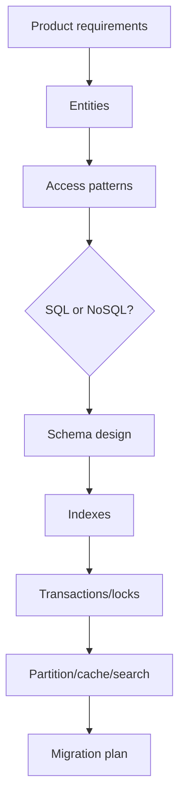

# Data Modeling Content Table

Data modeling is choosing how data is shaped, stored, queried, indexed, and evolved. It is one of the most important backend skills because bad models create slow queries, broken consistency, and painful migrations.

## Study order

1. [[SQL vs NoSQL]]
2. [[Schema Design]]
3. [[NoSQL Data Modeling]]
4. [[N Plus One Query Problem]]
5. [[Optimistic and Pessimistic Locking]]
6. [[Materialized Views]]
7. [[Search Indexes]]
8. [[Schema Registry]]

## Complete notes

A senior data model starts from access patterns, not only entities.

Ask:

1. What are the main objects?
2. What queries are most common?
3. What writes must be transactional?
4. What data must be strongly consistent?
5. What can be eventually consistent?
6. What grows fastest?
7. What needs indexes?
8. What must be retained for audit/compliance?
9. How will schema changes be rolled out safely?

## Modeling flow



## How this applies to InvoiceOps

InvoiceOps is mostly relational:

```text
users -> workspace_members -> workspaces
workspaces -> clients -> invoices -> invoice_items
invoices -> payments
workspaces -> audit_logs
```

Use SQL/Postgres first because invoices, payments, and memberships need constraints, joins, and transactions.

## Easy example

A client belongs to one workspace:

```text
clients(id, workspace_id, name, email, phone)
```

Every client query should filter by `workspace_id` to avoid data leaks.

## Difficult production example

Payment webhook processing needs consistency:

```text
webhook_events(provider, event_id) unique
payments(invoice_id, provider_ref)
invoices(paid_cents, status)
audit_logs(workspace_id, action)
```

These writes should happen in one transaction so duplicate events do not corrupt invoice state.

## Index checklist

- `users(email)` unique
- `workspace_members(user_id, workspace_id)` unique
- `clients(workspace_id)`
- `invoices(workspace_id, status)`
- `invoices(workspace_id, due_date)`
- `payments(invoice_id)`
- `webhook_events(provider, event_id)` unique
- `audit_logs(workspace_id, created_at)`

## Common mistakes

- modeling only entities, not queries
- missing `workspace_id` on tenant-owned records
- using MongoDB because it feels easier even when transactions/joins are needed
- no uniqueness constraint for idempotency keys
- no indexes for list/filter pages
- adding JSON blobs where relational constraints are required

## Senior interview bank

### 1. How do you choose SQL vs NoSQL?

Choose SQL when relationships, constraints, joins, and transactions are important. Choose NoSQL when access patterns are document/key-value oriented, schema varies, or scale pattern favors denormalized reads.

### 2. What is the most important rule for multi-tenant data?

Every tenant-owned table should carry `workspace_id` or equivalent tenant key, and authorization must check that key on every query.

### 3. How do you avoid N+1?

Use joins, batch loading, preloading, or query redesign so the system does not run one query per row.

## Reviewer checklist

- Can I list access patterns?
- Can I explain indexes?
- Can I identify transactional boundaries?
- Can I explain consistency tradeoffs?
- Can I migrate schema without downtime?

## Related storage models

- [[Cassandra and Wide Column Stores]]
- [[Vector Database Architecture]]
- [[Search Architecture]]
- [[Time Series and Analytics Storage]]
