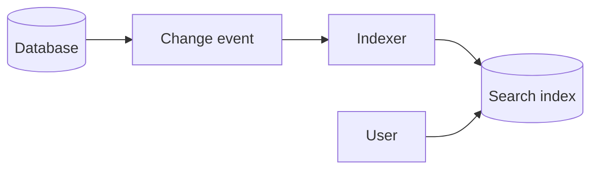

# Search Indexes

## Complete notes

Search indexes power full-text search, filters, and ranking beyond normal database indexes.

## Easy explanation

Search indexes power full-text search, filters, and ranking beyond normal database indexes.

In simple words: if you can explain `Search Indexes` with one real request, one failure case, and one metric, you understand the topic much better than just memorizing the definition.

## Simple example

Think of designing the shape of data before writing code. This topic decides what entities exist, how they connect, and which queries must be fast.

For `Search Indexes`, ask yourself:

1. What is the normal happy path?
2. What can fail?
3. What is the tradeoff?
4. What would I monitor in production?

## Real-life examples

### Easy real-life example

You design tables for users, orders, products, and payments before writing API code.

### Difficult production example

A news feed must support fast reads, ranking, likes, comments, privacy rules, search, materialized views, and denormalized data without creating inconsistent timelines.

### How to relate this topic

When reading `Search Indexes`, connect it to:

- one user action
- one backend component
- one failure case
- one tradeoff
- one metric

## Important points

- Core idea: `Search Indexes` must be understood through its production use case, not just its definition.
- When to use it: Focus on entities, relationships, access patterns, query shape, denormalization tradeoffs, materialized views, consistency, and indexing/search strategy.
- At scale: explain the bottleneck, failure path, operational owner, and rollback/fallback.
- What to monitor: query count, query latency, read/write ratio, storage growth, cache hit rate, and data consistency errors.
- Interview rule: always give one concrete example, one tradeoff, one failure mode, and one metric.

## Diagram

## SDE-3 interview angle

At SDE-3 level, do not only define this topic. Explain tradeoffs, failure modes, production debugging signals, and what you would choose under different requirements.

## Common mistakes

- Starting with tables before understanding access patterns.
- Ignoring cardinality and ownership boundaries.
- Creating N+1 queries or unbounded joins.
- Denormalizing without a consistency/update strategy.
- Not designing for the highest-volume read/write path.

## Quick revision

Search indexes power full-text search, filters, and ranking beyond normal database indexes.

## Deep understanding checklist

To fully understand `Search Indexes`, be able to answer:

1. Where does it sit in the architecture?
2. What production problem does it solve?
3. What is the simplest implementation?
4. What breaks when traffic or data grows?
5. What is the main failure mode?
6. What tradeoff does it introduce?
7. Which metric proves it is healthy?

Strong answer focus: Focus on entities, relationships, access patterns, query shape, denormalization tradeoffs, materialized views, consistency, and indexing/search strategy.

## Production example and edge cases

Example: for an ecommerce product model, reads may need product detail by id, search by filters, inventory by warehouse, and admin updates. The model should be chosen from these access patterns, not from generic normalization rules only.

For `Search Indexes`, the edge cases to always think about are:

- duplicate request or duplicate event
- dependency timeout or partial failure
- stale data or inconsistent state
- bad input or abusive client
- high traffic causing bottleneck
- rollback or replay after a bad deploy

Interview answer rule: after explaining the concept, immediately give one production example, one failure mode, one tradeoff, and one metric.

## Senior interview bank

These are topic-specific questions and strong answers for `Search Indexes`.

### 1. What is the first thing you ask?

Clarify requirements: users, core features, read/write ratio, scale, latency, availability, consistency, geography, security, and what is explicitly out of scope.

### 2. What design path should you follow?

Requirements -> scale estimate -> APIs -> data model -> high-level design -> deep dive -> failure modes -> observability -> tradeoffs.

### 3. What separates senior from mid-level?

Senior answers discuss tradeoffs, failure modes, ownership, rollout, metrics, and recovery. Mid-level answers often stop at listing components.

### 4. How do you choose the deep dive?

Pick the hardest product risk: feed fanout, payment idempotency, chat ordering, file upload consistency, search latency, or notification delivery.

### 5. How do you close the interview?

Summarize the design, name key tradeoffs, say what you would monitor, and mention the first bottleneck or future improvement.

## Topic-specific drill

### How would I answer `Search Indexes` if the interviewer asks directly?

For `Search Indexes`, I would explain the entities, relationships, main access patterns, read/write tradeoff, consistency need, and which query or data shape proves the model is correct.

### What is the trap question for `Search Indexes`?

The trap is giving only a definition. A senior answer must include a concrete production example, a failure mode, a tradeoff, and a metric.

### What should I draw?

Draw the smallest flow that shows where `Search Indexes` sits, then add the failure path next to the happy path.

## Reviewer checklist

- Can I explain this without reading the note?
- Can I draw the happy path and failure path?
- Can I name one concrete metric?
- Can I explain the tradeoff against a simpler option?
- Can I give a production example in under two minutes?
