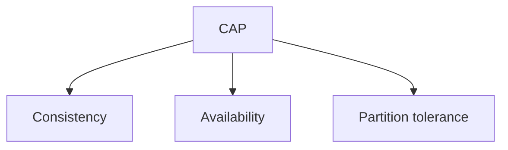

# CAP Theorem

## Complete notes

CAP theorem says distributed databases trade off Consistency, Availability, and Partition tolerance.

## Easy explanation

CAP theorem says distributed databases trade off Consistency, Availability, and Partition tolerance.

In simple words: if you can explain `CAP Theorem` with one real request, one failure case, and one metric, you understand the topic much better than just memorizing the definition.

## Simple example

Think of important product data that must be stored correctly and queried efficiently. This topic explains how the database keeps data correct, fast, and recoverable.

For `CAP Theorem`, ask yourself:

1. What is the normal happy path?
2. What can fail?
3. What is the tradeoff?
4. What would I monitor in production?

## Real-life examples

### Easy real-life example

A user places an order, and the order must be saved correctly so it is not lost after refresh or server restart.

### Difficult production example

A payment system needs transactions, indexes, migrations, backups, replication, connection pooling, query plans, and safe recovery from bad deploys or data corruption.

### How to relate this topic

When reading `CAP Theorem`, connect it to:

- one user action
- one backend component
- one failure case
- one tradeoff
- one metric

## Important points

- Core idea: `CAP Theorem` must be understood through its production use case, not just its definition.
- When to use it: Focus on data correctness, access patterns, indexes, query plans, transactions, isolation, migrations, replication, sharding, and recovery.
- At scale: explain the bottleneck, failure path, operational owner, and rollback/fallback.
- What to monitor: query latency, slow queries, lock waits, connection pool usage, replication lag, deadlocks, storage growth, and backup restore time.
- Interview rule: always give one concrete example, one tradeoff, one failure mode, and one metric.

## Diagram

## Common mistakes

- Adding indexes blindly without checking query plans.
- Ignoring write cost, lock contention, and migration risk.
- Choosing SQL/NoSQL without matching access patterns and consistency needs.
- Running large backfills without batching and monitoring.
- Not testing backup restore or rollback path.

## Quick revision

CAP theorem says distributed databases trade off Consistency, Availability, and Partition tolerance.

## SDE-3 depth notes

### Real production use

Use this topic when you need to choose behavior during network partitions in distributed databases and replicated systems.

### What to explain in interviews

- Where it sits in the architecture: client, API layer, service layer, data layer, infrastructure, or operations.
- Why it is chosen: what problem it solves better than the simpler alternative.
- Tradeoff: cost, complexity, latency, consistency, operability, or security.
- Failure mode: pretending you get strong consistency, high availability, and partition tolerance together.

### Example explanation

In a production ecommerce system, `CAP Theorem` is not just a definition. You should connect it to a concrete request path, data path, or deployment path. Explain what happens during normal traffic, what breaks during high load or partial failure, and how the team detects and recovers from it.

### Revision prompts

1. What problem does this solve?
2. What is the simplest version?
3. What changes at scale?
4. What can go wrong?
5. What metric or alert proves it is healthy?

## Deep understanding checklist

To fully understand `CAP Theorem`, be able to answer:

1. Where does it sit in the architecture?
2. What production problem does it solve?
3. What is the simplest implementation?
4. What breaks when traffic or data grows?
5. What is the main failure mode?
6. What tradeoff does it introduce?
7. Which metric proves it is healthy?

Strong answer focus: Focus on data correctness, access patterns, indexes, query plans, transactions, isolation, migrations, replication, sharding, and recovery.

## Senior interview bank

These are topic-specific questions and strong answers for `CAP Theorem`.

### 1. How would you debug this if the database is slow?

First check query latency, slow query logs, connection pool saturation, lock waits, and recent deploys/backfills. Then run `EXPLAIN ANALYZE` on representative queries using production-like data volume.

### 2. What index would you add and what is the cost?

Add indexes for selective filters, joins, ordering, and uniqueness. The cost is slower writes, more storage, more maintenance, and possible planner confusion if indexes are redundant or low-selectivity.

### 3. How do you migrate this without downtime?

Use expand-migrate-contract: add backward-compatible schema, deploy code that supports both versions, backfill in batches with checkpoints, verify, switch reads, then remove the old path later.

### 4. What consistency does the product need?

Payments, inventory, and auth usually need stronger consistency. Feeds, analytics, counters, and recommendations often tolerate eventual consistency. The answer should match product risk, not personal preference.

### 5. What can go wrong under high write load?

High write load can cause lock contention, index bloat, replication lag, deadlocks, connection exhaustion, hot partitions, and slow backfills. I would monitor write latency, locks, lag, and pool usage.

## Topic-specific drill

### How would I answer `CAP Theorem` if the interviewer asks directly?

For `CAP Theorem`, I would explain the data access pattern, correctness requirement, index/transaction impact, migration risk, and the query or storage metric that proves it works.

### What is the trap question for `CAP Theorem`?

The trap is giving only a definition. A senior answer must include a concrete production example, a failure mode, a tradeoff, and a metric.

### What should I draw?

Draw the smallest flow that shows where `CAP Theorem` sits, then add the failure path next to the happy path.

## Reviewer checklist

- Can I explain this without reading the note?
- Can I draw the happy path and failure path?
- Can I name one concrete metric?
- Can I explain the tradeoff against a simpler option?
- Can I give a production example in under two minutes?
