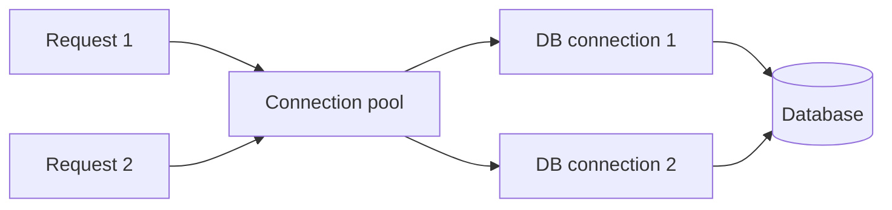
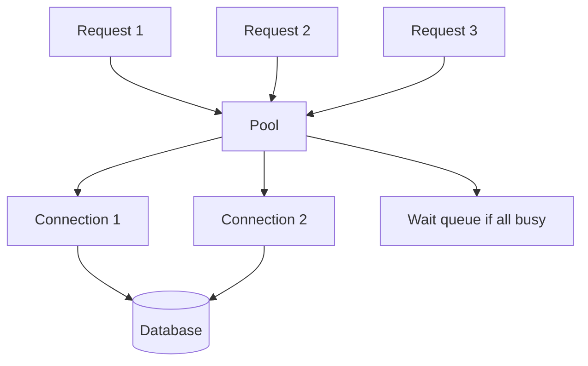

# Connection Pooling

## Complete notes

Connection pool reuses database connections instead of opening a new one for every request.

## Easy explanation

Connection pool reuses database connections instead of opening a new one for every request.

In simple words: if you can explain `Connection Pooling` with one real request, one failure case, and one metric, you understand the topic much better than just memorizing the definition.

## Simple example

Think of important product data that must be stored correctly and queried efficiently. This topic explains how the database keeps data correct, fast, and recoverable.

For `Connection Pooling`, ask yourself:

1. What is the normal happy path?
2. What can fail?
3. What is the tradeoff?
4. What would I monitor in production?

## Real-life examples

### Easy real-life example

A user places an order, and the order must be saved correctly so it is not lost after refresh or server restart.

### Difficult production example

A payment system needs transactions, indexes, migrations, backups, replication, connection pooling, query plans, and safe recovery from bad deploys or data corruption.

### How to relate this topic

When reading `Connection Pooling`, connect it to:

- one user action
- one backend component
- one failure case
- one tradeoff
- one metric

## Important points

- Core idea: `Connection Pooling` must be understood through its production use case, not just its definition.
- When to use it: Focus on data correctness, access patterns, indexes, query plans, transactions, isolation, migrations, replication, sharding, and recovery.
- At scale: explain the bottleneck, failure path, operational owner, and rollback/fallback.
- What to monitor: query latency, slow queries, lock waits, connection pool usage, replication lag, deadlocks, storage growth, and backup restore time.
- Interview rule: always give one concrete example, one tradeoff, one failure mode, and one metric.

## Diagram

## Common mistakes

- Adding indexes blindly without checking query plans.
- Ignoring write cost, lock contention, and migration risk.
- Choosing SQL/NoSQL without matching access patterns and consistency needs.
- Running large backfills without batching and monitoring.
- Not testing backup restore or rollback path.

## Quick revision

Connection pool reuses database connections instead of opening a new one for every request.

## Examples and deeper diagrams

### Why pool is needed

Opening a DB connection for every request is slow and expensive.

With pool:

### Example numbers

If database supports 100 max connections and you run 10 app containers, do not set each pool to 50. That can create 500 connections and overload DB.

### SDE-3 point

Pool size must be coordinated with number of app instances and database limits.

## Deep understanding checklist

To fully understand `Connection Pooling`, be able to answer:

1. Where does it sit in the architecture?
2. What production problem does it solve?
3. What is the simplest implementation?
4. What breaks when traffic or data grows?
5. What is the main failure mode?
6. What tradeoff does it introduce?
7. Which metric proves it is healthy?

Strong answer focus: Focus on data correctness, access patterns, indexes, query plans, transactions, isolation, migrations, replication, sharding, and recovery.

## Senior interview bank

These are topic-specific questions and strong answers for `Connection Pooling`.

### 1. How would you debug this if the database is slow?

First check query latency, slow query logs, connection pool saturation, lock waits, and recent deploys/backfills. Then run `EXPLAIN ANALYZE` on representative queries using production-like data volume.

### 2. What index would you add and what is the cost?

Add indexes for selective filters, joins, ordering, and uniqueness. The cost is slower writes, more storage, more maintenance, and possible planner confusion if indexes are redundant or low-selectivity.

### 3. How do you migrate this without downtime?

Use expand-migrate-contract: add backward-compatible schema, deploy code that supports both versions, backfill in batches with checkpoints, verify, switch reads, then remove the old path later.

### 4. What consistency does the product need?

Payments, inventory, and auth usually need stronger consistency. Feeds, analytics, counters, and recommendations often tolerate eventual consistency. The answer should match product risk, not personal preference.

### 5. What can go wrong under high write load?

High write load can cause lock contention, index bloat, replication lag, deadlocks, connection exhaustion, hot partitions, and slow backfills. I would monitor write latency, locks, lag, and pool usage.

## Topic-specific drill

### How would I answer `Connection Pooling` if the interviewer asks directly?

For `Connection Pooling`, I would explain the data access pattern, correctness requirement, index/transaction impact, migration risk, and the query or storage metric that proves it works.

### What is the trap question for `Connection Pooling`?

The trap is giving only a definition. A senior answer must include a concrete production example, a failure mode, a tradeoff, and a metric.

### What should I draw?

Draw the smallest flow that shows where `Connection Pooling` sits, then add the failure path next to the happy path.

## Reviewer checklist

- Can I explain this without reading the note?
- Can I draw the happy path and failure path?
- Can I name one concrete metric?
- Can I explain the tradeoff against a simpler option?
- Can I give a production example in under two minutes?
