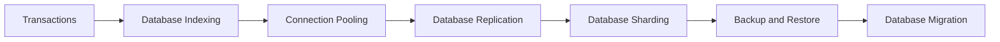

# Database Content Table

- [[Database Indexing]]
- [[Transactions]]
- [[Connection Pooling]]
- [[Database Migration]]
- [[Backup and Restore]]
- [[CAP Theorem]]
- [[Consistent Hashing]]

## Revision dashboard

Database engineering is about storing, querying, [[Scaling Concepts|scaling]], backing up, and protecting data.

## Visual topic map

Use this map like the Excalidraw roadmap: follow the arrows first, then open the linked notes.

## Color legend

- Blue = core concept
- Green = recommended pattern
- Red = risk or failure mode
- Purple = tradeoff
- Orange = current 2026 update

## Linked notes in this map

- [[Transactions]]
- [[Database Indexing]]
- [[Connection Pooling]]
- [[Database Replication]]
- [[Database Sharding]]
- [[Backup and Restore]]
- [[Database Migration]]

## Grill audit additions

- [[Query Plans and EXPLAIN]]
