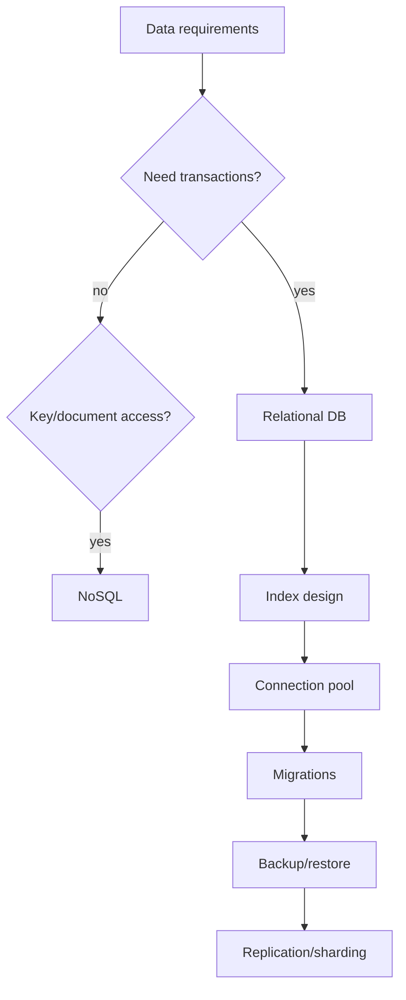

# Database Content Table

Database design covers storage, consistency, transactions, indexing, replication, migrations, backups, and query performance.

## Study order

1. [[Transactions]]
2. [[Database Indexing]]
3. [[Query Plans and EXPLAIN]]
4. [[Connection Pooling]]
5. [[Database Migration]]
6. [[Backup and Restore]]
7. [[Database Replication]]
8. [[Database Sharding]]
9. [[CAP Theorem]]
10. [[Consistent Hashing]]

## Complete notes

A database is not just where data is stored. It controls correctness, latency, durability, and recovery.

For every backend design, ask:

- what must be transactional?
- what must be unique?
- what are the common query filters?
- what indexes are required?
- what happens during migration?
- how is data backed up and restored?
- what happens if primary database fails?

## Database decision flow

## How this applies to InvoiceOps

Use Postgres for core data:

- users
- workspaces
- clients
- invoices
- invoice_items
- payments
- webhook_events
- audit_logs

Critical constraints:

- unique `users.email`
- unique `webhook_events(provider,event_id)`
- foreign keys for invoice/client/workspace relationships
- indexes for workspace-scoped lists

## Common mistakes

- no transaction around multi-row business updates
- no index on frequent filters
- no uniqueness constraint for idempotency
- migration changes that lock big tables
- connection pool too large or too small
- no tested restore process

## Senior interview bank

### 1. What belongs in a transaction?

All writes that must succeed or fail together. For InvoiceOps, payment webhook event insert, payment insert, invoice update, and audit log should be one transaction.

### 2. How do indexes help and hurt?

Indexes speed reads but cost extra storage and slow writes. Add them based on real query patterns.

### 3. Why is backup not enough?

You need restore testing. A backup that cannot be restored within required time is not useful.

## Reviewer checklist

- Are transactional boundaries clear?
- Are uniqueness constraints defined?
- Are indexes tied to queries?
- Are migrations safe?
- Is restore tested?
- Is replication/sharding justified by scale?

## Missing database scale and search topics

- [[Advanced Index Types]]
- [[Sharding Patterns]]
- [[Cassandra and Wide Column Stores]]
- [[Search Architecture]]
- [[Time Series and Analytics Storage]]
