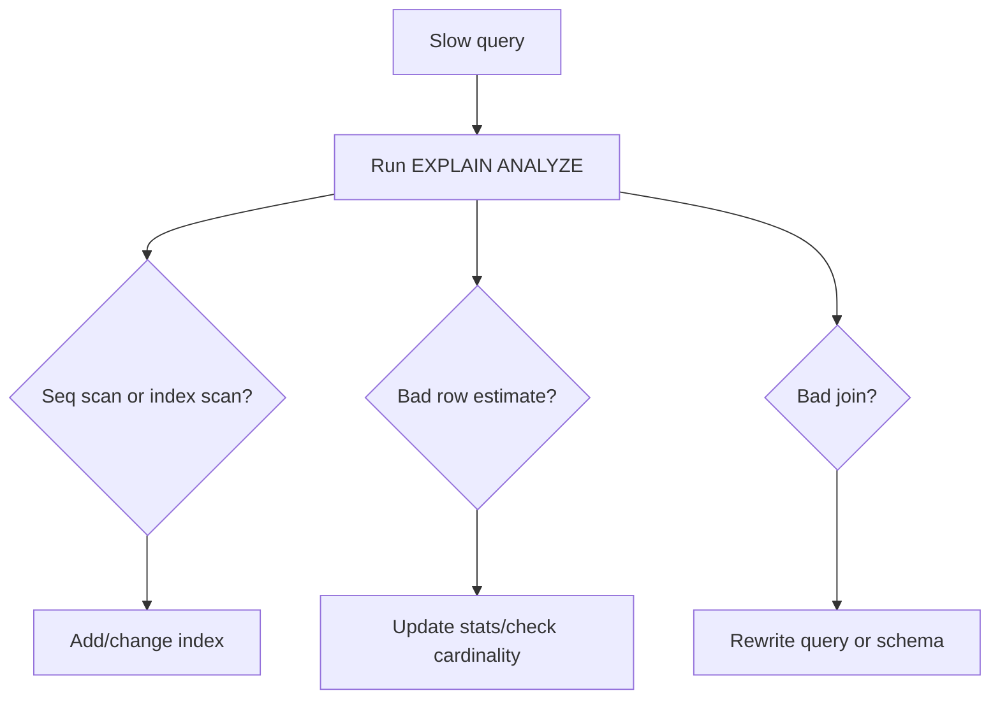

# Query Plans and EXPLAIN

## Complete notes

`EXPLAIN` shows how the database plans to execute a query: index scan, sequential scan, join strategy, estimated rows, actual rows, and cost.

## Easy explanation

`EXPLAIN` shows how the database plans to execute a query: index scan, sequential scan, join strategy, estimated rows, actual rows, and cost.

In simple words: if you can explain `Query Plans and EXPLAIN` with one real request, one failure case, and one metric, you understand the topic much better than just memorizing the definition.

## Simple example

Think of important product data that must be stored correctly and queried efficiently. This topic explains how the database keeps data correct, fast, and recoverable.

For `Query Plans and EXPLAIN`, ask yourself:

1. What is the normal happy path?
2. What can fail?
3. What is the tradeoff?
4. What would I monitor in production?

## Why it matters

Senior backend interviews often ask how you debug a slow database query. A strong answer mentions query plans, indexes, cardinality, and data distribution.

## What to check

- Is it using the expected index?
- Is the index selective?
- Are estimates close to actual rows?
- Is sorting spilling to disk?
- Is a join exploding row count?
- Is the query doing too much work because of missing filters?

## Common mistakes

- Adding indexes blindly without checking query plans.
- Ignoring write cost, lock contention, and migration risk.
- Choosing SQL/NoSQL without matching access patterns and consistency needs.
- Running large backfills without batching and monitoring.
- Not testing backup restore or rollback path.

## Quick revision

- One-line meaning: Query Plans and EXPLAIN is a database/storage topic. It should be understood as part of a real production backend, not only as a definition.
- Use it when: Use it when persistent data, correctness, query performance, or migrations matter.
- Failure to mention: partial failure, overload, bad config, stale data, or unsafe retries.
- Tradeoff to mention: simplicity vs production safety.
- Metric to mention: Watch query latency, slow queries, lock waits, connection pool usage, replication lag, and storage growth.

## Deep understanding checklist

To fully understand `Query Plans and EXPLAIN`, be able to answer:

1. Where does it sit in the architecture?
2. What production problem does it solve?
3. What is the simplest implementation?
4. What breaks when traffic or data grows?
5. What is the main failure mode?
6. What tradeoff does it introduce?
7. Which metric proves it is healthy?

Strong answer focus: Focus on data correctness, access patterns, indexes, query plans, transactions, isolation, migrations, replication, sharding, and recovery.

## Real-life examples

### Easy real-life example

A user places an order, and the order must be saved correctly so it is not lost after refresh or server restart.

### Difficult production example

A payment system needs transactions, indexes, migrations, backups, replication, connection pooling, query plans, and safe recovery from bad deploys or data corruption.

### How to relate this topic

When reading `Query Plans and EXPLAIN`, connect it to:

- one user action
- one backend component
- one failure case
- one tradeoff
- one metric

## Senior interview bank

These are topic-specific questions and strong answers for `Query Plans and EXPLAIN`.

### 1. How would you debug this if the database is slow?

First check query latency, slow query logs, connection pool saturation, lock waits, and recent deploys/backfills. Then run `EXPLAIN ANALYZE` on representative queries using production-like data volume.

### 2. What index would you add and what is the cost?

Add indexes for selective filters, joins, ordering, and uniqueness. The cost is slower writes, more storage, more maintenance, and possible planner confusion if indexes are redundant or low-selectivity.

### 3. How do you migrate this without downtime?

Use expand-migrate-contract: add backward-compatible schema, deploy code that supports both versions, backfill in batches with checkpoints, verify, switch reads, then remove the old path later.

### 4. What consistency does the product need?

Payments, inventory, and auth usually need stronger consistency. Feeds, analytics, counters, and recommendations often tolerate eventual consistency. The answer should match product risk, not personal preference.

### 5. What can go wrong under high write load?

High write load can cause lock contention, index bloat, replication lag, deadlocks, connection exhaustion, hot partitions, and slow backfills. I would monitor write latency, locks, lag, and pool usage.

## Topic-specific drill

### How would I answer `Query Plans and EXPLAIN` if the interviewer asks directly?

For `Query Plans and EXPLAIN`, I would explain the data access pattern, correctness requirement, index/transaction impact, migration risk, and the query or storage metric that proves it works.

### What is the trap question for `Query Plans and EXPLAIN`?

The trap is giving only a definition. A senior answer must include a concrete production example, a failure mode, a tradeoff, and a metric.

### What should I draw?

Draw the smallest flow that shows where `Query Plans and EXPLAIN` sits, then add the failure path next to the happy path.

## Reviewer checklist

- Can I explain this without reading the note?
- Can I draw the happy path and failure path?
- Can I name one concrete metric?
- Can I explain the tradeoff against a simpler option?
- Can I give a production example in under two minutes?
