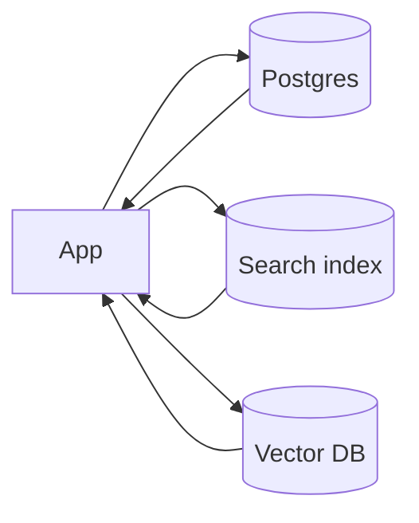
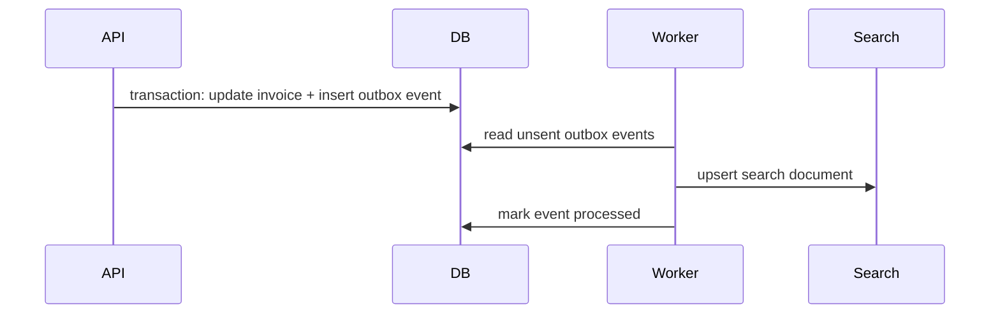

# Search Architecture

## Complete notes

Search architecture is how users find records by keyword, filters, ranking, and sometimes semantic meaning.

## Search types

| Type | Example | Tool |
|---|---|---|
| exact lookup | invoice id | database index |
| filtered list | overdue invoices | SQL index |
| full-text search | client notes contain words | Postgres FTS / Elasticsearch |
| autocomplete | client name prefix | search index/trie |
| semantic search | similar meaning | vector DB |
| hybrid search | keyword + semantic | search engine + vector DB |

## Basic flow



## Inverted index mental model

A search engine usually builds an inverted index:

```text
"invoice" -> doc1, doc7, doc9
"overdue" -> doc7, doc9
"payment" -> doc2, doc9
```

Instead of scanning every document, the search engine jumps to documents containing the searched terms and then ranks them.

## When DB search is enough

Use SQL indexes when:

- filters are simple
- data volume is moderate
- search is exact/prefix/simple text
- ranking is not complex

## When to add search engine

Add Elasticsearch/OpenSearch/Meilisearch/Typesense when:

- full-text relevance matters
- fuzzy matching matters
- autocomplete matters
- complex ranking/facets are needed
- search load should not hit primary DB

## Indexing data into search

Options:

- synchronous dual write: simple but risky
- async outbox pattern: safer
- CDC stream: scalable but more complex

## Outbox flow



This avoids the common bug where the database write succeeds but the search index update fails silently.

## InvoiceOps example

MVP:

- search clients by name/email using Postgres index
- filter invoices by status/due date

Later:

- full-text search invoice notes
- search uploaded contract text
- semantic search with vector DB

## Search result security

Search engines are often separate from the main database, so authorization must be designed carefully:

- index `workspace_id` and access fields
- always filter by tenant/user permissions
- re-check critical permissions in the API before returning records
- avoid indexing secrets that should never be searchable
- support deletion/reindex when access changes

## Ranking basics

Ranking may include:

- text relevance
- recency
- entity status
- popularity or click signals
- exact match boost
- business priority

Example: when searching `acme`, exact client name `Acme Ltd` should rank above an old note that only mentions acme once.

## Real-life example

Amazon search is not only text matching. It combines keyword match, category, availability, price, popularity, personalization, and sponsored ranking. Backend search architecture must separate retrieval from ranking so relevance can improve over time.

## Common mistakes

- adding Elasticsearch before SQL indexes are tried
- no plan for keeping search index in sync
- returning unauthorized records from search results
- no reindex strategy
- no ranking explanation

## Interview bank

### 1. When is database search enough?

When queries are simple filters/exact lookups and can be supported with normal indexes.

### 2. How do you keep search index consistent?

Use outbox or CDC so changes are reliably propagated and can be replayed.

### 3. What is hybrid search?

Combining keyword search with vector similarity to capture both exact terms and semantic meaning.

### 4. Why is dual write risky for search?

If the app writes to the database and search index separately, one write can succeed while the other fails. The user then sees stale or missing search results. Use outbox or CDC to make index updates replayable.

### 5. How would you design search for InvoiceOps first version?

Start with Postgres indexes for client name/email and invoice filters. Add full-text search only when notes/documents become important. Add vector search later for semantic document Q&A.

## Sources

- OpenSearch inverted index introduction: https://docs.opensearch.org/latest/getting-started/intro/
