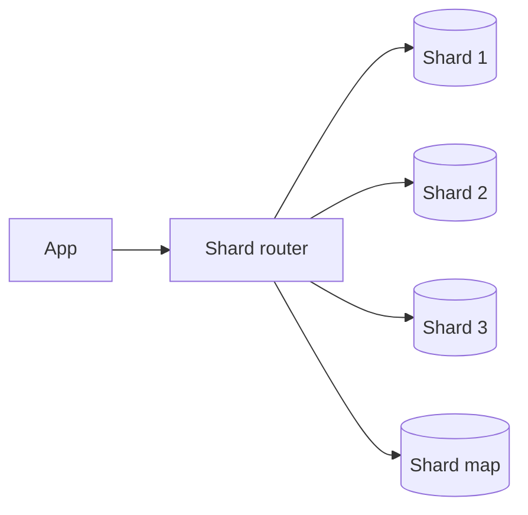

# Sharding Patterns

## Complete notes

Sharding splits data across multiple database nodes so one node does not hold all data or traffic. It is used when vertical scaling and read replicas are not enough.

## When to shard

Shard only when simpler options are not enough:

1. optimize queries and indexes
2. add caching
3. add read replicas
4. partition tables
5. shard across nodes

## Sharding strategies

| Strategy | How it works | Risk |
|---|---|---|
| Range sharding | shard by ranges | hot shard if recent range is busy |
| Hash sharding | hash key to shard | hard range queries |
| Directory-based | lookup table maps key to shard | directory service bottleneck |
| Geo sharding | shard by region | cross-region complexity |
| Tenant sharding | shard by workspace/customer | large tenants can become hot |

## Choosing shard key

A good shard key has:

- high cardinality
- even distribution
- appears in most queries
- avoids hot partitions
- supports data locality

Bad shard keys:

- boolean/status fields
- timestamp alone for high write traffic
- low-cardinality region only
- keys not present in common queries

## InvoiceOps example

MVP should not shard. But if huge scale arrives:

- tenant/workspace based sharding may work
- big enterprise workspaces may need dedicated shard
- invoices can be partitioned by workspace and time

## Sharding vs partitioning vs replication

| Technique | What it solves | Example |
|---|---|---|
| Replication | read scale and availability | read replicas for invoice list pages |
| Partitioning | manage one logical DB/table better | monthly partitions for audit logs |
| Sharding | split data across multiple DB nodes | workspace A on shard 1, workspace B on shard 2 |

Do not jump to sharding when partitioning or replicas are enough. Sharding changes the application architecture.

## Diagram

## Cross-shard problems

- joins across shards
- transactions across shards
- global unique IDs
- rebalancing data
- cross-shard analytics
- hot tenants
- backups/restores per shard

## Routing approaches

| Approach | How app finds shard | Tradeoff |
|---|---|---|
| Hash router | hash tenant id to shard | simple, hard to move tenants |
| Lookup/directory | shard map stores tenant -> shard | flexible, shard map becomes critical dependency |
| Range router | id/time ranges map to shards | easy range queries, hot recent ranges |
| Dedicated tenant | big customer gets own shard | isolation, more operations |

## Rebalancing

Rebalancing means moving data when one shard becomes too large or hot.

Safe migration steps:

1. Mark tenant as moving in shard map.
2. Copy historical data to target shard.
3. Dual write or pause writes briefly.
4. Verify counts/checksums.
5. Switch reads to new shard.
6. Stop old writes and clean old data later.

## IDs in sharded systems

Global IDs cannot rely on one database auto-increment sequence. Common options:

- UUID/ULID
- Snowflake-style IDs
- central ID service
- shard-prefixed IDs

For InvoiceOps, ULID is a good learning choice because it is globally unique and time sortable.

## Real-life example

Slack-style workspaces are a natural tenant boundary. Most queries already include workspace. But one huge enterprise workspace can become hot, so the design needs an escape path: move that tenant to a dedicated shard.

## Common mistakes

- sharding too early
- bad shard key
- ignoring rebalancing
- assuming distributed transactions are easy
- no plan for cross-shard queries
- no per-shard observability

## Interview bank

### 1. When should you shard?

When one database cannot handle storage/write/read load after indexes, caching, replicas, and partitioning have been exhausted.

### 2. What is the hardest part of sharding?

Choosing the shard key and handling cross-shard queries, transactions, and rebalancing.

### 3. How would you shard InvoiceOps?

Likely by workspace/tenant at very large scale, with special handling for very large tenants.

### 4. How do cross-shard transactions work?

Avoid them if possible. Design workflows so most operations stay inside one shard. For unavoidable cross-shard workflows, use saga/outbox patterns and compensate on failure instead of pretending it is one local transaction.

### 5. What metrics show sharding problems?

Per-shard CPU, storage, connection count, query latency, replication lag, hot keys/tenants, migration failures, and skew between biggest and smallest shard.
