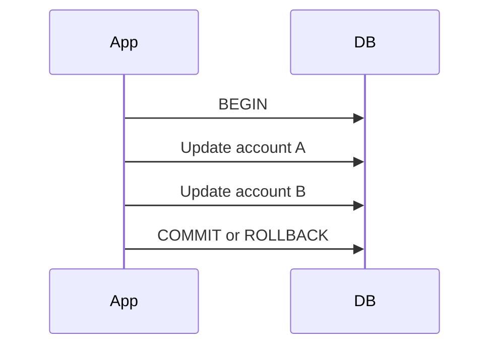
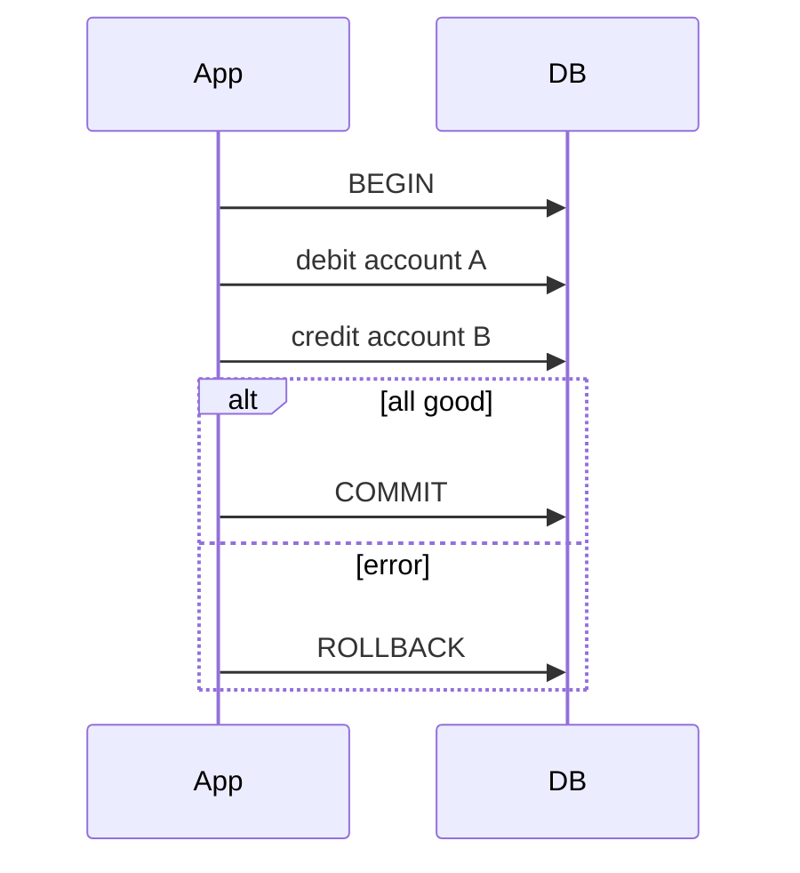

# Transactions

## Complete notes

Transaction groups database operations so they succeed together or fail together.

## Easy explanation

A transaction groups database changes so either all of them happen or none of them happen.

In simple words: if you can explain `Transactions` with one real request, one failure case, and one metric, you understand the topic much better than just memorizing the definition.

## Simple example

Imagine transferring money from account A to account B. A transaction ensures the debit and credit succeed together. If the credit fails, the debit is rolled back so money does not disappear.

For `Transactions`, ask yourself:

1. Which operations must succeed together?
2. What isolation level is needed?
3. What happens during concurrent updates?
4. Can deadlocks happen?
5. What lock/latency metrics should be watched?

## Real-life examples

### Easy real-life example

Money transfer debits one account and credits another. Both changes must succeed or both must roll back.

### Difficult production example

A ticket booking system prevents overselling with transactions, isolation, row locks/optimistic locking, deadlock handling, and monitoring lock waits.

### How to relate this topic

When reading `Transactions`, connect it to:

- one user action
- one backend component
- one failure case
- one tradeoff
- one metric

## Important points

- Core idea: `Transactions` must be understood through its production use case, not just its definition.
- When to use it: Focus on data correctness, access patterns, indexes, query plans, transactions, isolation, migrations, replication, sharding, and recovery.
- At scale: explain the bottleneck, failure path, operational owner, and rollback/fallback.
- What to monitor: query latency, slow queries, lock waits, connection pool usage, replication lag, deadlocks, storage growth, and backup restore time.
- Interview rule: always give one concrete example, one tradeoff, one failure mode, and one metric.

## Diagram



## Common mistakes

- Adding indexes blindly without checking query plans.
- Ignoring write cost, lock contention, and migration risk.
- Choosing SQL/NoSQL without matching access patterns and consistency needs.
- Running large backfills without batching and monitoring.
- Not testing backup restore or rollback path.

## Quick revision

Transaction groups database operations so they succeed together or fail together.

## Examples and deeper diagrams

### Payment transfer example

```sql
BEGIN;
UPDATE accounts SET balance = balance - 100 WHERE id = 'A';
UPDATE accounts SET balance = balance + 100 WHERE id = 'B';
COMMIT;
```

If second update fails, rollback prevents money disappearing.



### Isolation example

If two users buy the last ticket at the same time, transaction isolation helps prevent overselling.


## Deep understanding checklist

To fully understand `Transactions`, be able to answer:

1. Where does it sit in the architecture?
2. What production problem does it solve?
3. What is the simplest implementation?
4. What breaks when traffic or data grows?
5. What is the main failure mode?
6. What tradeoff does it introduce?
7. Which metric proves it is healthy?

Strong answer focus: Focus on data correctness, access patterns, indexes, query plans, transactions, isolation, migrations, replication, sharding, and recovery.

## Senior interview bank

These are topic-specific questions and strong answers for `Transactions`.

### 1. How would you debug this if the database is slow?

First check query latency, slow query logs, connection pool saturation, lock waits, and recent deploys/backfills. Then run `EXPLAIN ANALYZE` on representative queries using production-like data volume.

### 2. What index would you add and what is the cost?

Add indexes for selective filters, joins, ordering, and uniqueness. The cost is slower writes, more storage, more maintenance, and possible planner confusion if indexes are redundant or low-selectivity.

### 3. How do you migrate this without downtime?

Use expand-migrate-contract: add backward-compatible schema, deploy code that supports both versions, backfill in batches with checkpoints, verify, switch reads, then remove the old path later.

### 4. What consistency does the product need?

Payments, inventory, and auth usually need stronger consistency. Feeds, analytics, counters, and recommendations often tolerate eventual consistency. The answer should match product risk, not personal preference.

### 5. What can go wrong under high write load?

High write load can cause lock contention, index bloat, replication lag, deadlocks, connection exhaustion, hot partitions, and slow backfills. I would monitor write latency, locks, lag, and pool usage.

## Topic-specific drill

### How would I answer `Transactions` if the interviewer asks directly?

For `Transactions`, I would explain the data access pattern, correctness requirement, index/transaction impact, migration risk, and the query or storage metric that proves it works.

### What is the trap question for `Transactions`?

The trap is giving only a definition. A senior answer must include a concrete production example, a failure mode, a tradeoff, and a metric.

### What should I draw?

Draw the smallest flow that shows where `Transactions` sits, then add the failure path next to the happy path.

## Reviewer checklist

- Can I explain this without reading the note?
- Can I draw the happy path and failure path?
- Can I name one concrete metric?
- Can I explain the tradeoff against a simpler option?
- Can I give a production example in under two minutes?
