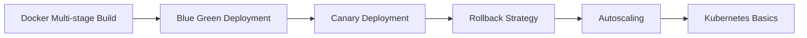

# Deployment Strategies Content Table

- [[Blue Green Deployment]]
- [[Canary Deployment]]
- [[Rollback Strategy]]
- [[Autoscaling]]
- [[Kubernetes Basics]]
- [[Docker Multi-stage Build]]

## Revision dashboard

Deployment strategy decides how new versions are released safely.

## Visual topic map

Use this map like the Excalidraw roadmap: follow the arrows first, then open the linked notes.

## Color legend

- Blue = core concept
- Green = recommended pattern
- Red = risk or failure mode
- Purple = tradeoff
- Orange = current 2026 update

## Linked notes in this map

- [[Docker Multi-stage Build]]
- [[Blue Green Deployment]]
- [[Canary Deployment]]
- [[Rollback Strategy]]
- [[Autoscaling]]
- [[Kubernetes Basics]]

## Additional SDE-3 topics

- [[Feature Flags]]
