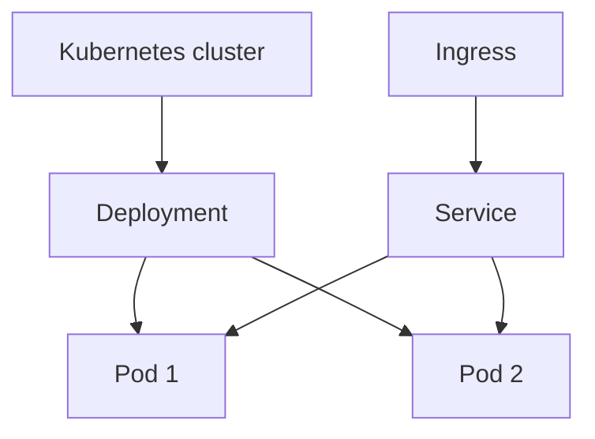
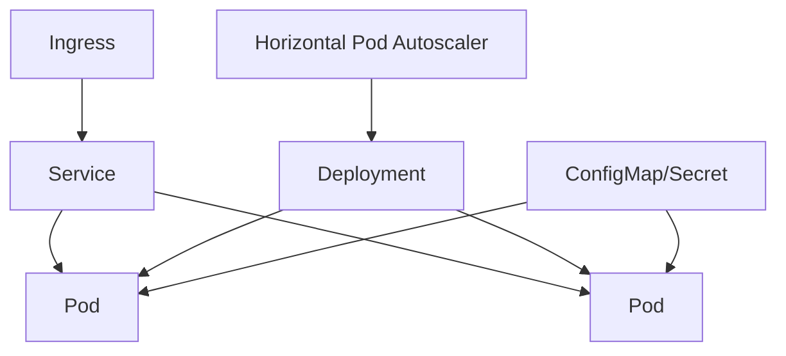

# Kubernetes Basics

## Complete notes

Kubernetes orchestrates [[Docker_Image_Container|containers]] across many machines.

## Easy explanation

Kubernetes runs containers across machines and keeps the desired number of healthy app instances running.

In simple words: if you can explain `Kubernetes Basics` with one real request, one failure case, and one metric, you understand the topic much better than just memorizing the definition.

## Simple example

Think of safely moving code from developer machine to production users. This topic explains rollout, rollback, health checks, config, and release safety.

For `Kubernetes Basics`, ask yourself:

1. What is the normal happy path?
2. What can fail?
3. What is the tradeoff?
4. What would I monitor in production?

## Real-life examples

### Easy real-life example

You release a small backend change and watch errors/latency to make sure users are not affected.

### Difficult production example

A high-risk payment change rolls out behind a feature flag with canary, rollback triggers, backward-compatible migration, health checks, and dashboards by version.

### How to relate this topic

When reading `Kubernetes Basics`, connect it to:

- one user action
- one backend component
- one failure case
- one tradeoff
- one metric

## Important points

- Core idea: `Kubernetes Basics` must be understood through its production use case, not just its definition.
- When to use it: Focus on safe rollout, feature flags, canary/blue-green/rolling deploys, health checks, rollback, config/secrets, and database migration compatibility.
- At scale: explain the bottleneck, failure path, operational owner, and rollback/fallback.
- What to monitor: deploy success, error rate by version, latency by version, health check failures, rollback count, and business KPI changes.
- Interview rule: always give one concrete example, one tradeoff, one failure mode, and one metric.

## Diagram

## Common mistakes

- Deploying schema changes that are not backward compatible.
- No canary, feature flag, health check, or rollback trigger.
- No separation between deploy and release.
- Secrets/config differ between staging and production.
- No monitoring by version during rollout.

## Quick revision

Kubernetes orchestrates containers across many machines.

## 2026 update: Kubernetes baseline

> [!important] SDE-3 expectation
> You do not need to memorize every Kubernetes object, but you should understand Deployment, Service, Ingress, ConfigMap, Secret, HPA, liveness/readiness probes, rolling update, and rollback.

## Deep understanding checklist

To fully understand `Kubernetes Basics`, be able to answer:

1. Where does it sit in the architecture?
2. What production problem does it solve?
3. What is the simplest implementation?
4. What breaks when traffic or data grows?
5. What is the main failure mode?
6. What tradeoff does it introduce?
7. Which metric proves it is healthy?

Strong answer focus: Focus on safe rollout, feature flags, canary/blue-green/rolling deploys, health checks, rollback, config/secrets, and database migration compatibility.

## Production example and edge cases

Example: for a risky feature, deploy code behind a feature flag, canary to a small percentage, watch error/latency/business metrics, then ramp up or instantly disable the flag.

For `Kubernetes Basics`, the edge cases to always think about are:

- duplicate request or duplicate event
- dependency timeout or partial failure
- stale data or inconsistent state
- bad input or abusive client
- high traffic causing bottleneck
- rollback or replay after a bad deploy

Interview answer rule: after explaining the concept, immediately give one production example, one failure mode, one tradeoff, and one metric.

## Senior interview bank

These are topic-specific questions and strong answers for `Kubernetes Basics`.

### 1. How do you release this safely?

Use small changes, automated tests, canary or rolling deploy, health checks, feature flags, dashboards, and rollback triggers. Database changes must be backward-compatible.

### 2. What can go wrong during rollout?

Bad config, incompatible schema, failed health checks, partial deploy, hidden dependency change, stale clients, or a feature flag targeting error. Watch metrics by version and region.

### 3. How do feature flags help?

Feature flags separate deployment from release. They allow canary, kill switch, tenant rollout, A/B tests, and fast rollback without redeploying.

### 4. How do you handle migrations?

Use expand-migrate-contract, avoid long locks, backfill in batches, monitor replication lag, and keep old/new code compatible during rollout.

### 5. What is the rollback plan?

Rollback code/config/flag quickly, but be careful with irreversible data changes. If schema changed, use compatibility or forward-fix with data repair.

## Topic-specific drill

### How would I answer `Kubernetes Basics` if the interviewer asks directly?

For `Kubernetes Basics`, I would explain rollout strategy, health checks, rollback trigger, feature-flag or migration risk, and how to prove the release is safe.

### What is the trap question for `Kubernetes Basics`?

The trap is giving only a definition. A senior answer must include a concrete production example, a failure mode, a tradeoff, and a metric.

### What should I draw?

Draw the smallest flow that shows where `Kubernetes Basics` sits, then add the failure path next to the happy path.

## Reviewer checklist

- Can I explain this without reading the note?
- Can I draw the happy path and failure path?
- Can I name one concrete metric?
- Can I explain the tradeoff against a simpler option?
- Can I give a production example in under two minutes?
