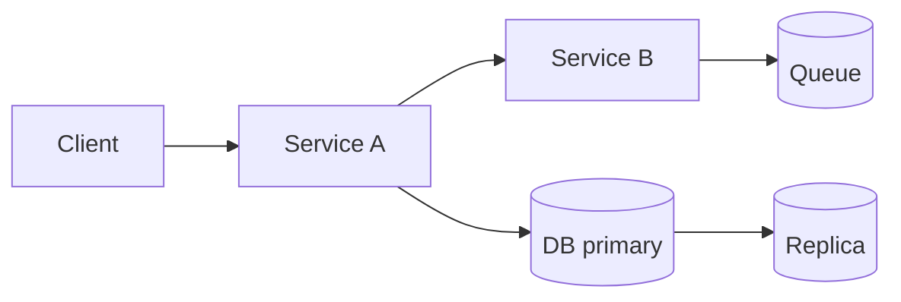
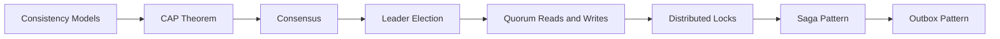

# Distributed Systems Content Table

- [[Consistency Models]]
- [[Quorum Reads and Writes]]
- [[Leader Election]]
- [[Consensus]]
- [[Distributed Locks]]
- [[Saga Pattern]]
- [[Outbox Pattern]]
- [[Event Sourcing]]
- [[CQRS]]
- [[High Availability and Failover]]

## Revision dashboard

Distributed systems are systems where multiple machines coordinate over unreliable networks.

## Visual topic map

Use this map like the Excalidraw roadmap: follow the arrows first, then open the linked notes.

## Color legend

- Blue = core concept
- Green = recommended pattern
- Red = risk or failure mode
- Purple = tradeoff
- Orange = current 2026 update

## Linked notes in this map

- [[Consistency Models]]
- [[CAP Theorem]]
- [[Consensus]]
- [[Leader Election]]
- [[Quorum Reads and Writes]]
- [[Distributed Locks]]
- [[Saga Pattern]]
- [[Outbox Pattern]]

## Additional SDE-3 topics

- [[Clock Skew and Time]]

## Grill audit additions

- [[Exactly Once Myth]]
- [[Multi Region Architecture]]
