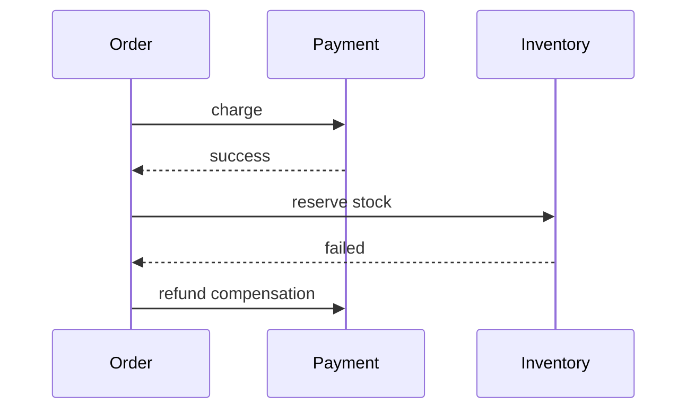
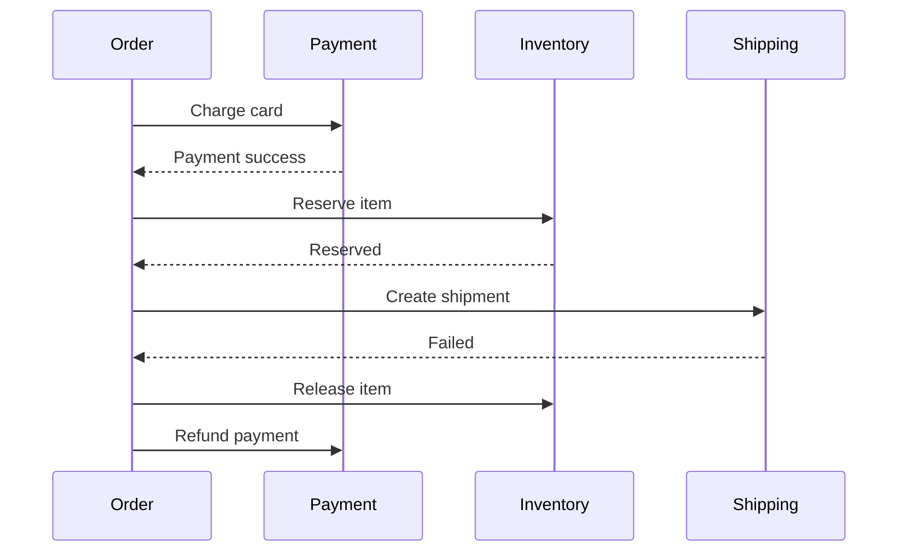

# Saga Pattern

## Complete notes

Saga coordinates a distributed transaction using multiple local transactions and compensating actions.

## Easy explanation

Saga is a way to complete a business workflow across multiple services by using local transactions and compensating actions.

In simple words: if you can explain `Saga Pattern` with one real request, one failure case, and one metric, you understand the topic much better than just memorizing the definition.

## Simple example

Think of multiple services or machines working together where one part can fail while others continue. This topic explains how to handle duplicates, delays, stale data, ordering, and recovery.

For `Saga Pattern`, ask yourself:

1. What is the normal happy path?
2. What can fail?
3. What is the tradeoff?
4. What would I monitor in production?

## Real-life examples

### Easy real-life example

If inventory reservation fails after payment succeeds, the system refunds the payment.

### Difficult production example

A distributed order workflow coordinates payment, inventory, shipment, notification, compensation, idempotency, event ordering, and reconciliation without one global DB transaction.

### How to relate this topic

When reading `Saga Pattern`, connect it to:

- one user action
- one backend component
- one failure case
- one tradeoff
- one metric

## Important points

- Core idea: `Saga Pattern` must be understood through its production use case, not just its definition.
- When to use it: Focus on consistency model, delivery guarantee, idempotency, ordering, quorum/consensus, leader failure, duplicate events, and reconciliation.
- At scale: explain the bottleneck, failure path, operational owner, and rollback/fallback.
- What to monitor: replication lag, duplicate event rate, consumer lag, leader changes, quorum failures, stale reads, and reconciliation errors.
- Interview rule: always give one concrete example, one tradeoff, one failure mode, and one metric.

## Diagram

## Types

- Orchestration: central coordinator tells services what to do.
- Choreography: services react to events.

## SDE-3 interview angle

At SDE-3 level, do not only define this topic. Explain tradeoffs, failure modes, production debugging signals, and what you would choose under different requirements.

## Common mistakes

- Claiming exactly-once behavior without explaining idempotency boundaries.
- Ignoring network partitions, duplicate messages, clock skew, or stale reads.
- Using distributed locks without fencing or timeout strategy.
- Assuming global ordering when only per-partition ordering exists.
- No reconciliation path after partial failure.

## Quick revision

Saga coordinates a distributed transaction using multiple local transactions and compensating actions.

## Examples and deeper diagrams

### Order flow example

### Why not normal DB transaction?

Services may have separate databases. A normal single-database transaction cannot cover all of them.

### Tradeoff

Saga gives availability and service independence, but business logic becomes more complex because every step needs compensation.

## Deep understanding checklist

To fully understand `Saga Pattern`, be able to answer:

1. Where does it sit in the architecture?
2. What production problem does it solve?
3. What is the simplest implementation?
4. What breaks when traffic or data grows?
5. What is the main failure mode?
6. What tradeoff does it introduce?
7. Which metric proves it is healthy?

Strong answer focus: Focus on consistency model, delivery guarantee, idempotency, ordering, quorum/consensus, leader failure, duplicate events, and reconciliation.

## Senior interview bank

These are topic-specific questions and strong answers for `Saga Pattern`.

### 1. What guarantee does this design actually provide?

State the real guarantee: at-least-once delivery, eventual consistency, per-key ordering, quorum consistency, or best-effort availability. Do not claim exactly-once unless you explain the boundary and idempotency strategy.

### 2. What happens during a network partition?

The system must choose between rejecting/pausing some operations or accepting divergence. I would explain whether the design favors consistency or availability for this product flow and how it reconciles afterward.

### 3. How do duplicates get handled?

Use idempotency keys, unique constraints, processed-event tables, dedup windows, and safe retries. Deduplication must survive process restarts, so memory-only dedup is not enough.

### 4. How do you handle ordering?

Avoid global ordering where possible. Use per-entity or per-partition ordering, sequence numbers, version checks, or reconciliation jobs. Explain what happens when messages arrive late.

### 5. What would an interviewer push on?

They will push on partial failure: crash after side effect, leader failover, stale reads, duplicate events, clock skew, and replay. A strong answer names the failure before being asked.

## Topic-specific drill

### How would I answer `Saga Pattern` if the interviewer asks directly?

For `Saga Pattern`, I would explain the real guarantee, what happens during partial failure, how duplicates or stale state are handled, and what reconciliation path exists.

### What is the trap question for `Saga Pattern`?

The trap is giving only a definition. A senior answer must include a concrete production example, a failure mode, a tradeoff, and a metric.

### What should I draw?

Draw the smallest flow that shows where `Saga Pattern` sits, then add the failure path next to the happy path.

## Reviewer checklist

- Can I explain this without reading the note?
- Can I draw the happy path and failure path?
- Can I name one concrete metric?
- Can I explain the tradeoff against a simpler option?
- Can I give a production example in under two minutes?
