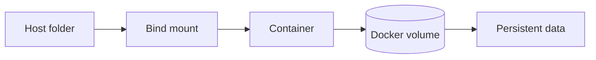

## Complete notes

DOCKER Volums is a Docker/container topic. It should be understood as part of a real production backend, not only as a definition. The goal is to know where it fits, when to use it, what can fail, and how to explain it in an interview.

![[Pasted image 20260908144307.png]]

## Easy explanation

DOCKER Volums is a Docker/container topic.

In simple words: if you can explain `DOCKER Volums` with one real request, one failure case, and one metric, you understand the topic much better than just memorizing the definition.

## Simple example

Think of packaging an app so it runs the same way on your laptop, CI, and production. This topic explains images, containers, networking, volumes, and runtime behavior.

For `DOCKER Volums`, ask yourself:

1. What is the normal happy path?
2. What can fail?
3. What is the tradeoff?
4. What would I monitor in production?

## bind mount

bind mount to store the dta in my local folder if the [[Docker Content Table|docker]] is deleted or stopped we haave a backup
so what ti [[Backup and Restore|backup]]
so if we create a folder in folder [[Docker_Image_Container|container]]

## named volume

using docker volume to store my new folder created

## Revision notes

### What it is

Docker volume stores data outside the container lifecycle.

If container is deleted, data inside container can disappear.
Volume keeps important data safe.

### Why volumes are used

- Persist database data.
- Share files between host and container.
- Share files between containers.
- Avoid losing data when container restarts.

### Types

- Named volume: managed by Docker.
- Bind mount: maps a host folder into container.
- Anonymous volume: created without custom name.

### Diagram



### Commands

```bash

docker volume create app-data
docker run -v app-data:/data redis
docker volume ls
docker volume inspect app-data
```

### Quick revision

Volume = persistent storage for containers.

## Important additions

### Named volume vs bind mount

| Type | Example | Use case |
|---|---|---|
| Named volume | `app-data:/data` | database/data persistence |
| Bind mount | `./src:/app/src` | local development |

### Database example

```yaml

services:
  mongo:
    image: mongo
    volumes:
      - mongo-data:/data/db

volumes:
  mongo-data:
```

Without volume, deleting the DB container can delete database files.

## Real-life examples

### Easy real-life example

You package a Node.js app into a Docker image so it runs the same way on your laptop and server.

### Difficult production example

A production container build uses multi-stage images, non-root user, `.dockerignore`, health checks, secrets outside images, pinned dependencies, and controlled networking/volumes.

### How to relate this topic

When reading `DOCKER Volums`, connect it to:

- one user action
- one backend component
- one failure case
- one tradeoff
- one metric

## Important points

- Core idea: `DOCKER Volums` must be understood through its production use case, not just its definition.
- When to use it: Focus on image vs container, Dockerfile layers, build cache, networking, volumes, security, health checks, image size, and production runtime behavior.
- At scale: explain the bottleneck, failure path, operational owner, and rollback/fallback.
- What to monitor: image size, build time, startup failures, restart count, CPU/memory, health-check failures, port errors, and log errors.
- Interview rule: always give one concrete example, one tradeoff, one failure mode, and one metric.

## Common mistakes

- Running containers as root.
- Building huge images with secrets or unnecessary files.
- Not using `.dockerignore` or multi-stage builds.
- Confusing image, container, volume, and network behavior.
- No health check or clear port/env configuration.


## Deep understanding checklist

To fully understand `DOCKER Volums`, be able to answer:

1. Where does it sit in the architecture?
2. What production problem does it solve?
3. What is the simplest implementation?
4. What breaks when traffic or data grows?
5. What is the main failure mode?
6. What tradeoff does it introduce?
7. Which metric proves it is healthy?

Strong answer focus: Focus on image vs container, Dockerfile layers, build cache, networking, volumes, security, health checks, image size, and production runtime behavior.

## Senior interview bank

These are topic-specific questions and strong answers for `DOCKER Volums`.

### 1. How does Docker actually run an application?

Docker builds an image from a Dockerfile, stores it in layers, and starts a container as an isolated process using Linux namespaces/cgroups. The app still uses the host kernel, but gets isolated filesystem, process, network, and environment views.

### 2. What is the difference between image and container?

An image is the immutable packaged artifact. A container is a running instance of that image with its own writable layer, process, environment variables, network settings, and mounted volumes.

### 3. What can go wrong in production Docker usage?

Common issues are huge images, running as root, secrets baked into images, wrong port mapping, missing health checks, broken volume assumptions, slow builds, and different environment variables between local and production.

### 4. How do you make Docker builds production-ready?

Use small base images, multi-stage builds, pinned dependencies, non-root users, `.dockerignore`, cached dependency layers, health checks, and no secrets in the image.

### 5. What should you monitor for containers?

Monitor container restarts, CPU, memory, disk, network, startup time, health-check failures, logs, image version, and whether the service is accepting traffic correctly.

## Topic-specific drill

### How would I answer `DOCKER Volums` if the interviewer asks directly?

For `DOCKER Volums`, I would explain the image/container flow, Dockerfile or runtime behavior, networking/volumes if relevant, what can fail in production, and what container metric or health check proves it works.

### What is the trap question for `DOCKER Volums`?

The trap is giving only a definition. A senior answer must include a concrete production example, a failure mode, a tradeoff, and a metric.

### What should I draw?

Draw the smallest flow that shows where `DOCKER Volums` sits, then add the failure path next to the happy path.

## Reviewer checklist

- Can I explain this without reading the note?
- Can I draw the happy path and failure path?
- Can I name one concrete metric?
- Can I explain the tradeoff against a simpler option?
- Can I give a production example in under two minutes?
