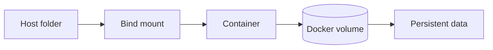

![[Pasted image 20260908144307.png]]

## bind mount

bind mount to store the dta in my local folder if the docker is deleted or stopped we haave a backup
so what ti backup
so if we create a folder in folder container

## named volume

using docker volume to store my new folder created

## Revision notes

### What it is

Docker volume stores data outside the container lifecycle.

If container is deleted, data inside container can disappear.
Volume keeps important data safe.

### Why volumes are used

- Persist database data.
- Share files between host and container.
- Share files between containers.
- Avoid losing data when container restarts.

### Types

- Named volume: managed by Docker.
- Bind mount: maps a host folder into container.
- Anonymous volume: created without custom name.

### Diagram



### Commands

```bash

docker volume create app-data
docker run -v app-data:/data redis
docker volume ls
docker volume inspect app-data
```

### Quick revision

Volume = persistent storage for containers.

## Important additions

### Named volume vs bind mount

| Type | Example | Use case |
|---|---|---|
| Named volume | `app-data:/data` | database/data persistence |
| Bind mount | `./src:/app/src` | local development |

### Database example

```yaml

services:
  mongo:
    image: mongo
    volumes:
      - mongo-data:/data/db

volumes:
  mongo-data:
```

Without volume, deleting the DB container can delete database files.
