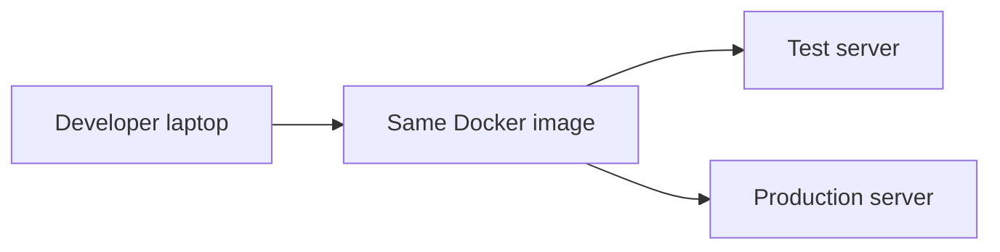

so i have a project that is setup in my form 2024 and now i give this project to some one so he has to download the dependency
ex

- node
- toster
- react

so he will download the lates version but my project is old and it has older version so it will  creates a issue

so we make docker as it make a container so a person can build the container so we will add al the dependency int he code and will install that
so will make a container

to is is Environment Replication is the problem

## How Docker Help

so it make a container and we can share that container

![[Pasted image 20260907165423.png]]

so here we have made a container and we will share that container

## Docker is Isolated

so what is happening   in Docker will not affect the code

![[Pasted image 20260907170401.png]]

## Revision notes

### Why Docker is used

Docker solves the problem of app working on one machine but failing on another.

### Benefits

- Same environment for every developer.
- Easy deployment.
- Isolated dependencies.
- Easy to run database/Redis locally.
- Good for CI/CD.
- App can be shipped as image.

### Diagram

### Without Docker

- Node version mismatch.
- Missing system package.
- Different environment variables.
- Database setup differs.

### With Docker

The app and dependencies are packaged together.

### Quick revision

Docker makes environment consistent from development to production.
