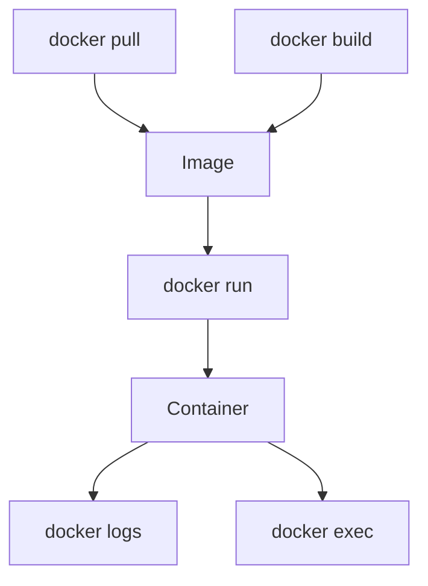

to run the docker in our system
we need command

docker run -it (image name )
example

- docker run -it ubantu

so where we get the image ubuntu
so we get it form the docker hub

## to add folder in the docker container

![[Pasted image 20260907171158.png]]

to check which container is running

- docker ps

to show all container

- docker ps
- docker images to show all images

docker run node just install the node image. it do not start the container
docker run -it node will install the node image. and also run that image

to execute any command inside a container

- docker exec -it (name of the container)unbandtu (commnad).

![[Pasted image 20260908115350.png]]

![[Pasted image 20260908115442.png]]

## Revision notes

### Important Docker commands

```bash

docker --version
docker pull redis
docker images
docker ps
docker ps -a
docker run redis
docker stop container_id
docker rm container_id
docker rmi image_id
```

### Build commands

```bash

docker build -t my-api .
docker run -p 3000:3000 my-api
```

### Debug commands

```bash

docker logs container_id
docker exec -it container_id sh
docker inspect container_id
```

### Clean up

```bash

docker system prune
docker volume ls
docker network ls
```

### Diagram



### Quick revision

Most Docker work is build image, run container, check logs, enter container, stop/remove.
