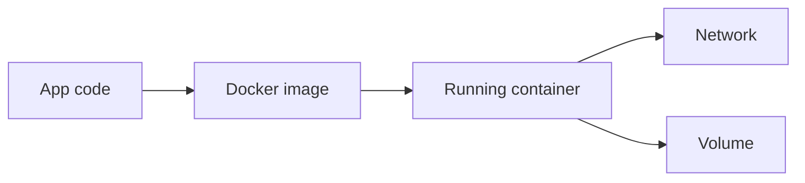

- What Docker is [[DOCKER WHY ]]
- Docker Image and container[[Docker_Image_Container]]
- DOCKER CODE [[DOCKER_CODE]]
- HOW Docker Work[[how docker Works]]
- How to dockerize[[ how to dockerize]]
- Port mapping[[Porting mapping ]]
- Dokcer compose[[docker comnpose]]
- Dokcer Network[[Docker Network]]
- Docker volums[[DOCKER Volums]]

# Docker Content Table

- [[DOCKER WHY]]
- [[how docker Works]]
- [[Docker_Image_Container]]
- [[DOCKER_CODE]]
- [[Porting mapping]]
- [[Docker Network]]
- [[DOCKER Volums]]
- [[docker comnpose]]
- [[how to dockerize]]

## Revision dashboard

Docker packages an app with its dependencies so it runs consistently on different machines.

## Quick revision

- Image is the blueprint.
- Container is the running process.
- Port mapping exposes container ports to host.
- Volume persists data outside container.
- Compose runs multiple services together.

## Important additions

### Docker learning checklist

- I know why Docker is used.
- I can explain image vs container.
- I can write a basic Dockerfile.
- I can build and run an image.
- I understand port mapping.
- I can use Docker Compose.
- I know when to use volumes.
- I know container-to-container networking.

### Production Docker checklist

- Use `.dockerignore`.
- Do not copy `.env` into image.
- Use small base image.
- Run only needed command.
- Expose correct port.
- Log to stdout/stderr.
