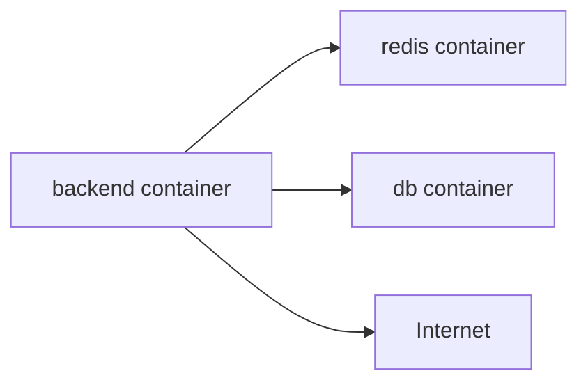

# Docker Network

![[Pasted image 20260908142833.png]]

![[Pasted image 20260908143026.png]]

how to cretae ouw own neteork

![[Pasted image 20260908143624.png]]

![[Pasted image 20260908144113.png]]

![[Pasted image 20260908144132.png]]

![[Pasted image 20260908144144.png]]

## Revision notes

### What it is

Docker network lets containers communicate with each other and with outside systems.

### Common network types

- Bridge: default for normal containers on one host.
- Host: container uses host network directly.
- None: no network.
- Overlay: connects containers across multiple hosts.

### Compose networking

Docker Compose creates a default network.
Services can talk using service name.

Example:

```text

backend -> redis:6379
backend -> db:5432
```

### Diagram



### Common mistakes

- Using `localhost` inside container to connect another container.
- Forgetting that service name works in Compose.
- Publishing internal database ports unnecessarily.

### Quick revision

Inside Compose, use service name, not localhost, to talk to another container.

## Important additions

### Localhost confusion

Inside a container, `localhost` means the same container.

If backend wants Redis in another container, use service/container name.

```text

redis://redis:6379
```

### Compose network example

```yaml

services:
  api:
    build: .
    depends_on:
      - redis
  redis:
    image: redis:7
```

The API can connect to host `redis`.
