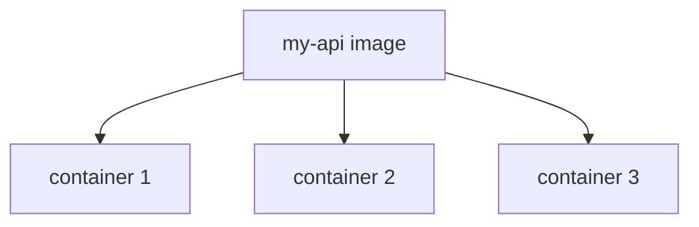

# Docker_Image_Container

so to run the docker container we need a docker image

i Image can have multiple Container

## Revision notes

### What it is

Docker image is a blueprint.
Docker container is the running instance of that image.

### Image

- Read-only template.
- Built from a Dockerfile.
- Contains app code, runtime, libraries, and dependencies.
- Can be pushed to registry like Docker Hub.

### Container

- Running process created from image.
- Has isolated filesystem, network, and environment.
- Can be started, stopped, removed, and recreated.

### Diagram


### Commands

```bash

docker build -t my-app .
docker images
docker run my-app
docker ps
docker stop container_id
```

### Quick revision

Image = recipe/blueprint.
Container = running app made from image.

## Important additions

### Image vs container table

| Concept | Image | Container |
|---|---|---|
| Meaning | blueprint | running instance |
| State | read-only | running/writable layer |
| Created by | docker build / pull | docker run |
| Stored in | local image cache/registry | Docker runtime |
| Can run? | no | yes |

### One image many containers



Same image can run multiple containers on different ports or servers.
