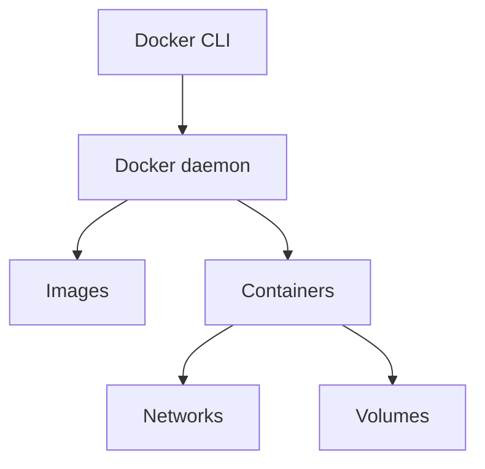

# how docker Works

![[Pasted image 20260908115634.png]]

![[Pasted image 20260908115828.png]]

## Revision notes

### What it is

Docker runs apps in containers using OS-level isolation.

### How it works

1. You write a Dockerfile.
2. Docker builds an image in layers.
3. Docker runs a container from the image.
4. Container runs as an isolated process.
5. Networking and volumes connect the container to outside world.

### Diagram



### Important parts

- Docker CLI: command line tool.
- Docker daemon: background service that manages Docker.
- Image: packaged app.
- Container: running image.
- Registry: place to store/share images.

### Quick revision

Docker works by building image layers and running them as isolated containers.

## Important additions

### Docker layers

Docker image is built in layers.
Each Dockerfile instruction can create a layer.

Layer caching makes builds faster.

### Build cache example

Copy `package.json` before full source code, so dependency install is cached.

```dockerfile

COPY package*.json ./
RUN npm install
COPY . .
```

### Container isolation

Container has isolated:

- filesystem
- process list
- network
- environment variables

### Important command flow


