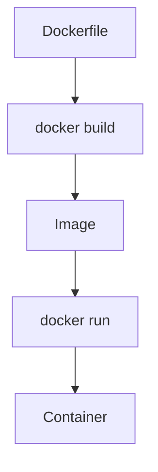

![[Pasted image 20260908121110.png]]

# how to dockerize

## Complete notes

Dockerizing means creating a Docker image for your app.

## Steps

1. Create `Dockerfile`.
2. Choose base image.
3. Copy package files.
4. Install dependencies.
5. Copy source code.
6. Expose app port.
7. Add start command.
8. Build image.
9. Run container.

## Node.js Dockerfile example

```dockerfile

FROM node:20-alpine

WORKDIR /app

COPY package*.json ./
RUN npm install

COPY . .

EXPOSE 3000

CMD ["npm", "start"]
```

## Build and run

```bash

docker build -t my-api .
docker run -p 3000:3000 my-api
```

## Diagram



## Good practices

- Use `.dockerignore`.
- Copy package files before source code for better caching.
- Do not store secrets in image.
- Use environment variables.
- Use smaller base images when possible.
