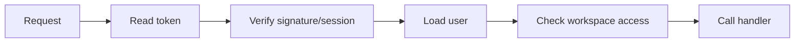

# Go Auth JWT Sessions

## What to build

Build auth for InvoiceOps:

- signup
- login
- refresh token/session refresh
- logout
- current user
- workspace membership authorization

## JWT vs session

JWT is stateless for access checks but harder to revoke immediately unless you use short expiry and refresh-token storage. Server sessions are easier to revoke but require storage.

## Practical recommendation for this project

Use:

- short-lived access token
- refresh token stored server-side hashed
- refresh token rotation
- logout revokes refresh token
- middleware loads user/workspace

## Middleware flow

## Security checklist

- hash passwords
- never log tokens
- short token expiry
- refresh token rotation
- object-level authorization
- rate limit login
- audit login/logout/security events

## Connect to notes

- [[Auth Security Content Table]]
- [[JWT]]
- [[Refresh Token and Access Token]]
- [[Sessions and Cookies]]
- [[API Abuse and Bot Protection]]
- [[Go Password Hashing]]

## Coding task

Write auth middleware that rejects missing/invalid tokens and adds `userID` and `workspaceID` to request context.
