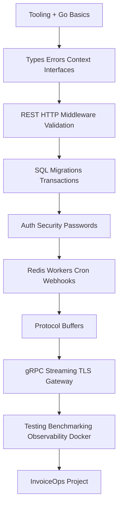
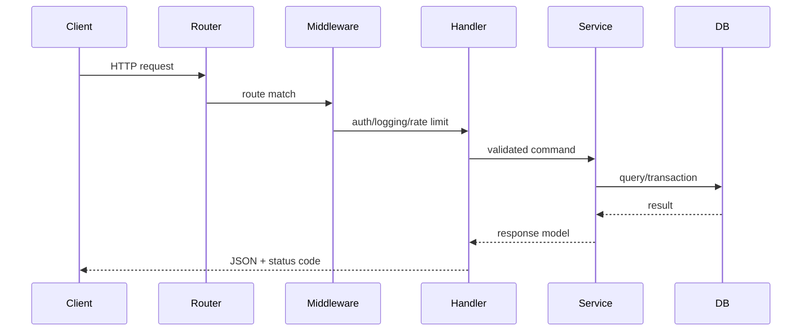
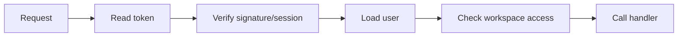
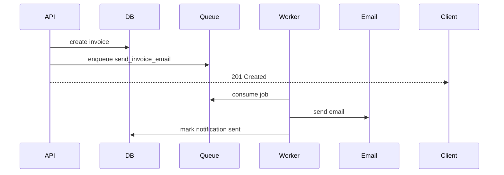
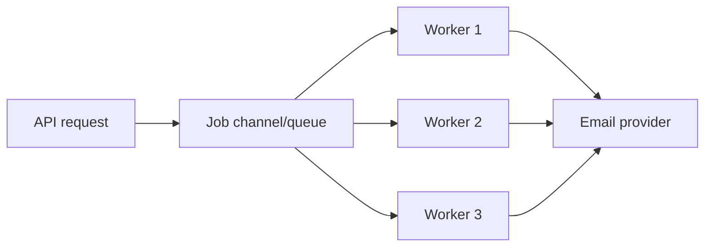
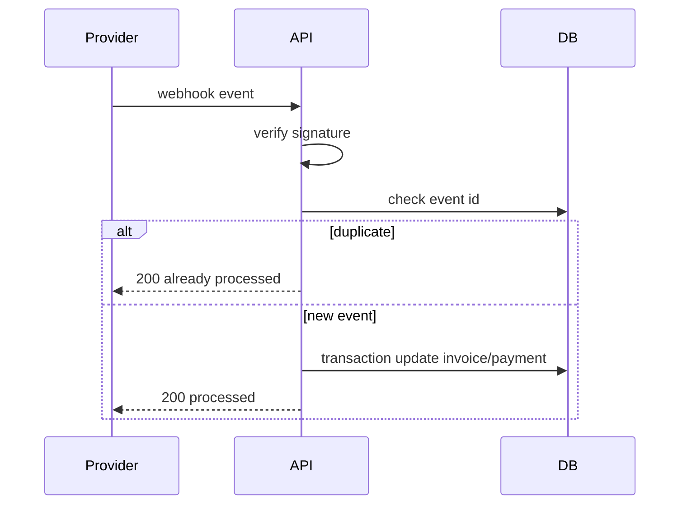
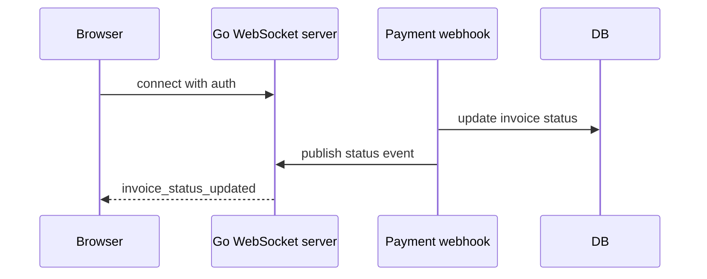
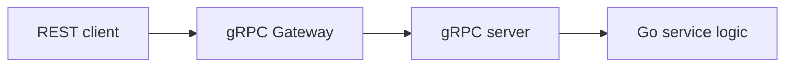
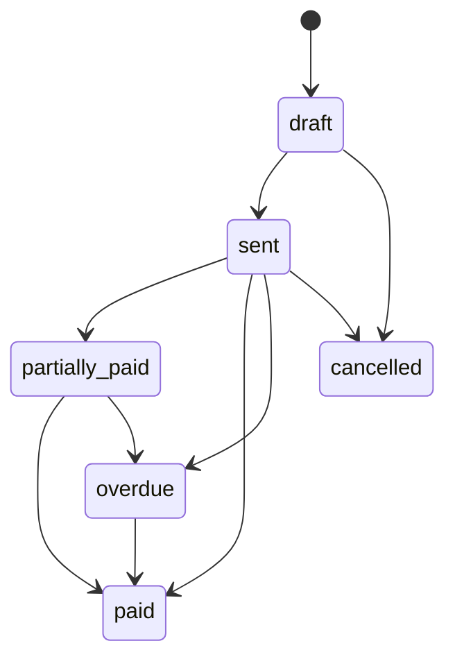

# Go Backend Complete Notes

This is the one-page master revision note for Go backend development. Follow this page from top to bottom when revising or coding InvoiceOps.

The smaller notes still exist for linking, but this note clubs the full Go path together so you do not need to jump around while studying.

## How to use this note

1. Read one section.
2. Code the matching InvoiceOps task.
3. Add one test.
4. Explain the topic out loud in interview style.
5. Move to the next section.

## Correct study flow

Do not start with the coverage map or checklist. Those are reference/planning pages. Study in this order:

1. **Go foundation**: tooling, syntax, data structures, functions, pointers, structs, interfaces, errors, context.
2. **Backend foundation**: modules, config, HTTP server, REST, middleware, validation, OpenAPI.
3. **Data and security**: SQL, migrations, transactions, auth, password hashing, security.
4. **Async and integrations**: Redis, workers, cron, concurrency, webhooks, files, external APIs.
5. **Advanced APIs**: WebSocket, GraphQL, Protocol Buffers, gRPC, streaming, TLS, gateway.
6. **Production**: HTTPS/HTTP2, testing, benchmarking, logs, traces, graceful shutdown, Docker.
7. **Project**: build InvoiceOps using the sections above.

## Master table of contents

1. [[Go Developer Tooling Git VSCode CLI]]
2. [[Go Language Basics]]
3. [[Go Deep Basics Functions Defer Panic Recover]]
4. [[Go Pointers Memory Values]]
5. [[Go Strings Runes Time Files]]
6. [[Go Types Structs Interfaces]]
7. [[Go Error Handling]]
8. [[Go Context Package]]
9. [[Go Generics Reflection Runtime]]
10. [[Go Project Structure and Modules]]
11. [[Go Configuration Environment]]
12. [[Go HTTP Server]]
13. [[Go REST API Coding]]
14. [[Go Middleware]]
15. [[Go JSON Validation DTOs]]
16. [[Go OpenAPI Documentation]]
17. [[Go Database SQL]]
18. [[Go Database Migrations]]
19. [[Go Transactions and Repository Pattern]]
20. [[Go SQL NoSQL API Practice]]
21. [[Go Auth JWT Sessions]]
22. [[Go Password Hashing]]
23. [[Go Security for Backend]]
24. [[Go Redis Cache Queue Rate Limit]]
25. [[Go Worker Queues and Background Jobs]]
26. [[Go Cron Scheduled Jobs]]
27. [[Go Concurrency Goroutines Channels]]
28. [[Go Webhooks Idempotency]]
29. [[Go File Uploads]]
30. [[Go API Client External Calls]]
31. [[Go WebSocket Realtime]]
32. [[Go GraphQL Backend]]
33. [[Go Protocol Buffers Deep Dive]]
34. [[Go Proto Versioning Best Practices]]
35. [[Go Protoc Code Generation]]
36. [[Go Protobuf Validation]]
37. [[Go gRPC Services]]
38. [[Go gRPC Deep Dive]]
39. [[Go gRPC Streaming Patterns]]
40. [[Go gRPC TLS Metadata Deadlines]]
41. [[Go gRPC Gateway REST Combo API]]
42. [[Go gRPC Testing Tools Postman grpcurl]]
43. [[Go HTTPS HTTP2 TLS Server]]
44. [[Go Testing]]
45. [[Go Benchmarking wrk h2load ghz pprof]]
46. [[Go Logging Observability]]
47. [[Go OpenTelemetry Metrics Tracing]]
48. [[Go Graceful Shutdown]]
49. [[Go Deployment Docker]]
50. [[Go Source Code Reading Debugging]]
51. [[Go YouTube Topic Links]]
52. [[Go Backend Coding Roadmap]]
53. [[Go Bootcamp Coding Checklist]]
54. [[Go Bootcamp Course Coverage Map]]
55. [[InvoiceOps Golang Project Plan]]

## Video and Resource Map By Topic

Use these links while studying the matching sections below. Prefer official docs for exact APIs and videos for intuition.

| Topic area | Best link |
|---|---|
| Go official docs | https://go.dev/doc/ |
| Effective Go | https://go.dev/doc/effective_go |
| Go setup/tooling/modules | https://go.dev/doc/code |
| Go language tour | https://go.dev/tour/ |
| Go concurrency patterns video | https://www.youtube.com/watch?v=f6kdp27TYZs |
| Advanced Go concurrency patterns video | https://www.youtube.com/watch?v=QDDwwePbDtw |
| Go context article | https://go.dev/blog/context |
| Go database/sql docs | https://go.dev/doc/database/ |
| Go REST API with Gin official tutorial | https://go.dev/doc/tutorial/web-service-gin |
| Go 1.22+ HTTP routing | https://go.dev/doc/go1.22 |
| Protocol Buffers Go tutorial | https://protobuf.dev/getting-started/gotutorial/ |
| gRPC Go docs | https://grpc.io/docs/languages/go/ |
| gRPC Go quick start | https://grpc.io/docs/languages/go/quickstart/ |
| gRPC Go basics tutorial | https://grpc.io/docs/languages/go/basics/ |
| Google gRPC Go codelab | https://codelabs.developers.google.com/grpc/getting-started-grpc-go |
| Tech School gRPC playlist/article | https://dev.to/techschoolguru/the-complete-grpc-course-protobuf-go-java-2af6 |
| gRPC intro video from Tech School | https://www.youtube.com/watch?v=VtX9w8uKvEk |
| Docker with Go | https://docs.docker.com/guides/golang/ |
| OpenTelemetry Go | https://opentelemetry.io/docs/languages/go/ |
| OpenTelemetry Go instrumentation libraries | https://opentelemetry.io/docs/languages/go/libraries/ |
| Go benchmarking and pprof video | https://www.youtube.com/watch?v=TbdtTm6FCQU |

### How to use the links

1. Read the matching section in this master note.
2. Open the link only if the concept is unclear.
3. Code the InvoiceOps task immediately after.
4. Do not watch videos passively; pause and implement.

## Big picture



## Go Developer Tooling Git VSCode CLI

Source note: [[Go Developer Tooling Git VSCode CLI]]

### Complete notes

A Go backend developer must be comfortable with the Go toolchain, Git, editor integration, and CLI workflow.

### Go commands

```bash
go version
go env
go mod init github.com/yourname/invoiceops
go mod tidy
go run ./cmd/api
go build ./cmd/api
go test ./...
go test -race ./...
go test -bench=. ./...
go fmt ./...
go vet ./...
```

### Git workflow

```bash
git init
git status
git add .
git commit -m "initial invoiceops setup"
git branch -M main
git remote add origin git@github.com:yourname/invoiceops.git
git push -u origin main
```

### VS Code essentials

- Go extension
- format on save
- `gopls`
- test explorer
- debugger
- error lens or equivalent

### Coding task

Create InvoiceOps repo locally, run `go test ./...`, and make the first commit.

---

## Go Language Basics

Source note: [[Go Language Basics]]

### Complete notes

Go is a compiled, statically typed language designed for simple, readable, production-friendly software. For backend work, Go is popular because it builds to a single binary, has a strong standard library, handles concurrency well, and is easy to deploy.

### What you must know first

Before backend coding, be comfortable with:

- package and import
- `main` function
- variables and constants
- basic types
- control flow
- arrays, slices, and maps
- functions and multiple return values
- structs and methods
- errors
- modules and commands

### Hello world

```go
package main

import "fmt"

func main() {
    fmt.Println("Hello, InvoiceOps")
}
```

Run it:

```bash
go run main.go
```

Build it:

```bash
go build -o invoiceops .
```

### Packages

Every Go file starts with a package name.

- `package main` creates an executable program.
- other package names create reusable code.

Backend example:

```text
cmd/api        -> package main
internal/auth  -> package auth
internal/store -> package store
```

### Variables

```go
var name string = "InvoiceOps"
var port int = 8080
active := true
```

Use `:=` inside functions when the type is obvious.

### Constants

```go
const DefaultCurrency = "INR"
const MaxPageSize = 100
```

Use constants for fixed values like statuses, limits, and config defaults.

### Basic types

Common types:

- `string`
- `bool`
- `int`, `int64`
- `float64`
- `byte`
- `rune`
- `error`

Backend examples:

```go
type InvoiceStatus string

const (
    InvoiceDraft InvoiceStatus = "draft"
    InvoicePaid  InvoiceStatus = "paid"
)
```

### Control flow

#### if

```go
if amount <= 0 {
    return errors.New("amount must be positive")
}
```

#### for

Go has only `for`, but it covers normal loops, while-style loops, and range loops.

```go
for i := 0; i < 3; i++ {
    fmt.Println(i)
}
```

```go
for _, item := range items {
    total += item.Price
}
```

#### switch

```go
switch status {
case "draft":
    // allow edit
case "paid":
    // lock invoice
 default:
    return errors.New("unknown status")
}
```

### Arrays, slices, and maps

#### Array

Fixed length. Less common in backend request code.

```go
var nums [3]int
```

#### Slice

Dynamic view over an array. Very common.

```go
items := []string{"invoice", "payment", "client"}
items = append(items, "reminder")
```

#### Map

Key-value lookup.

```go
headers := map[string]string{
    "Content-Type": "application/json",
}
```

Backend uses:

- request metadata
- config lookup
- grouping records
- idempotency checks in memory tests

### Functions

Go functions can return multiple values. This is why errors are usually returned explicitly.

```go
func divide(a, b int) (int, error) {
    if b == 0 {
        return 0, errors.New("divide by zero")
    }
    return a / b, nil
}
```

### Multiple return values

Backend code often returns `(value, error)`.

```go
invoice, err := service.GetInvoice(ctx, id)
if err != nil {
    return err
}
```

### Zero values

Every type has a zero value:

| Type | Zero value |
|---|---|
| string | `""` |
| int | `0` |
| bool | `false` |
| pointer | `nil` |
| slice | `nil` |
| map | `nil` |
| struct | all fields zero |

This matters because missing values can silently become zero values if you do not validate requests.

### Exported vs unexported names

Names starting with capital letters are exported outside the package.

```go
type InvoiceService struct{} // exported
func calculateTotal() {}     // unexported
```

Use unexported names for package internals.

### Comments

Exported names should have useful comments when they are part of public package API.

```go
// InvoiceService contains invoice business logic.
type InvoiceService struct{}
```

### Go commands you will use daily

```bash
go mod init github.com/yourname/invoiceops
go mod tidy
go fmt ./...
go test ./...
go test -race ./...
go run ./cmd/api
go build ./cmd/api
```


### `make` vs `new`

This is an important Go basic.

#### `make`

Use `make` for slices, maps, and channels because these types need runtime initialization.

```go
items := make([]string, 0, 10) // length 0, capacity 10
counts := make(map[string]int)
jobs := make(chan string, 100)
```

Backend examples:

```go
errorsByField := make(map[string]string)
invoiceItems := make([]InvoiceItem, 0, len(req.Items))
```

#### `new`

`new(T)` allocates zero value of type `T` and returns `*T`.

```go
p := new(int)
fmt.Println(*p) // 0
```

In backend code, you usually use struct literals more often than `new`:

```go
svc := &InvoiceService{repo: repo}
```

#### Rule

- use `make` for `slice`, `map`, `chan`
- use `&Struct{}` for structs
- use `new` rarely, mostly when you specifically want pointer to zero value

### `nil`

`nil` means no value for pointers, slices, maps, channels, functions, and interfaces.

```go
var items []string        // nil slice
var counts map[string]int // nil map
var ch chan string        // nil channel
```

Important difference:

```go
var items []string
items = append(items, "a") // ok

var counts map[string]int
counts["paid"] = 1 // panic: assignment to entry in nil map
```

So initialize maps before writing:

```go
counts := make(map[string]int)
counts["paid"] = 1
```

### Slice length and capacity

A slice has:

- pointer to array
- length
- capacity

```go
items := make([]string, 0, 3)
fmt.Println(len(items)) // 0
fmt.Println(cap(items)) // 3
```

Append can reuse capacity or allocate a new backing array.

```go
items = append(items, "a")
items = append(items, "b")
```

Backend tip: if you know expected size, preallocate to reduce allocations.

```go
responses := make([]InvoiceResponse, 0, len(invoices))
```

### Map basics

Maps are key-value collections.

```go
statusCount := map[string]int{
    "draft": 2,
    "paid":  5,
}
```

Check if key exists:

```go
count, ok := statusCount["overdue"]
if !ok {
    count = 0
}
```

Delete key:

```go
delete(statusCount, "draft")
```

Backend uses:

- counting invoices by status
- validation errors by field
- lookup tables
- test fakes

### `range`

Use `range` to loop over slices, maps, strings, and channels.

```go
for i, item := range items {
    fmt.Println(i, item)
}
```

For maps:

```go
for status, count := range statusCount {
    fmt.Println(status, count)
}
```

For strings, range gives rune index and rune value:

```go
for i, r := range "भारत" {
    fmt.Println(i, r)
}
```

Common mistake: taking address of range variable in old code patterns. Prefer copying value inside loop when storing pointers.

### Type conversion

Go does not do many implicit conversions. Convert explicitly.

```go
var cents int64 = 1000
rupees := float64(cents) / 100
```

String/int conversion:

```go
n, err := strconv.Atoi("42")
s := strconv.Itoa(42)
```

Backend uses:

- parse query params
- convert DB numeric values
- parse IDs/counts/page numbers

### Common built-in functions

| Function | Use |
|---|---|
| `len` | length of string/slice/map/channel |
| `cap` | capacity of slice/channel |
| `append` | add to slice |
| `copy` | copy slice data |
| `delete` | delete map key |
| `make` | initialize slice/map/channel |
| `new` | allocate zero value and return pointer |
| `close` | close channel |
| `panic` | unrecoverable failure |
| `recover` | recover from panic inside deferred function |

### `init` function

`init` runs before `main` when package is initialized.

```go
func init() {
    fmt.Println("package initialized")
}
```

Use it sparingly. Do not hide important production setup inside `init`. Prefer explicit setup in `main`.

### Type aliases and custom types

Custom type:

```go
type InvoiceID string
type MoneyCents int64
```

This improves meaning and avoids mixing unrelated strings/ints.

```go
func GetInvoice(id InvoiceID) {}
```

Alias:

```go
type MyString = string
```

Aliases are less common in app code; custom types are more useful for domain clarity.

### Struct tags basics

Struct tags provide metadata used by encoders, validators, ORMs, and reflection.

```go
type CreateInvoiceRequest struct {
    ClientID string `json:"client_id"`
    DueDate  string `json:"due_date"`
}
```

Common backend tags:

- `json`
- `db`
- `validate`

### Basic input/output packages

Common packages:

- `fmt`: formatting and printing
- `strconv`: string conversion
- `strings`: string helpers
- `errors`: simple errors
- `os`: files/env/process
- `io`: readers/writers
- `bufio`: buffered IO
- `time`: time and duration

Backend examples:

```go
port := os.Getenv("PORT")
if port == "" {
    port = "8080"
}
```

### Mini practice: basics before backend

Before starting REST APIs, you should be able to code these without looking:

1. Create a slice with `make`, append values, print len/cap.
2. Create a map with `make`, add values, check missing key with `ok`.
3. Convert query string value `page=2` to int using `strconv.Atoi`.
4. Define custom type `InvoiceStatus` with constants.
5. Define request struct with JSON tags.
6. Loop over invoice items with `range` and calculate total.
7. Return `(int64, error)` from a function.
8. Use `os.Getenv` with a default value.

### Backend mental model

In InvoiceOps, Go basics show up as:

- `struct` for invoices, clients, users
- `slice` for invoice line items
- `map` for headers/config/test fakes
- `function` for validation and business rules
- `error` for failure handling
- `package` for separating auth, invoice, payment, reminder

### Common beginner mistakes

- ignoring errors with `_`
- using `panic` for normal API errors
- not validating zero values from JSON
- using maps when structs would be clearer
- putting all code in `main.go`
- using globals for everything
- not running `go fmt`

### Practice tasks

1. Create `hello.go` and print app name.
2. Create an `InvoiceStatus` type with constants.
3. Create an `InvoiceItem` struct and calculate total.
4. Create a slice of invoice items and loop over it.
5. Create a map of status labels.
6. Write a function that returns `(total int64, err error)`.
7. Run `go test ./...` after adding one test.

### Interview answer

Go is a good backend language because it is simple, compiled, statically typed, fast enough for high-throughput services, has excellent standard-library networking support, has explicit error handling, and supports concurrency with goroutines and channels.

---

## Go Deep Basics Functions Defer Panic Recover

Source note: [[Go Deep Basics Functions Defer Panic Recover]]

### Functions

Functions are first-class values in Go. They can be passed around, returned, and used as closures.

### Variadic function

```go
func sum(nums ...int) int {
    total := 0
    for _, n := range nums {
        total += n
    }
    return total
}
```

### Defer

`defer` runs when the surrounding function returns. It is used for cleanup.

```go
f, err := os.Open(name)
if err != nil { return err }
defer f.Close()
```

Deferred calls run in LIFO order.

### Panic and recover

Use panic for programmer bugs or unrecoverable states. Do not use it for normal request errors.

In backend code, recover belongs in middleware:

```go
func Recover(next http.Handler) http.Handler {
    return http.HandlerFunc(func(w http.ResponseWriter, r *http.Request) {
        defer func() {
            if rec := recover(); rec != nil {
                http.Error(w, "internal error", http.StatusInternalServerError)
            }
        }()
        next.ServeHTTP(w, r)
    })
}
```

### Coding task

Add recovery middleware to InvoiceOps and write a test handler that panics. The API should return `500` without crashing the process.

---

## Go Pointers Memory Values

Source note: [[Go Pointers Memory Values]]

### Complete notes

A pointer stores the address of a value. Use pointers when a function needs to mutate a value, avoid copying a large struct, or represent optional/nil state.

### Example

```go
func markPaid(inv *Invoice) {
    inv.Status = "paid"
}
```

### Value vs pointer receiver

Use pointer receiver when:

- method mutates receiver
- struct is large
- consistency matters because some methods need pointers

Use value receiver when:

- small immutable value
- method does not mutate receiver

### Backend examples

- `*sql.DB` is shared database handle/pool
- `*http.Server` is controlled for shutdown
- request DTO can be value
- repository/service structs are usually pointers

### Common mistakes

- returning pointer to reused loop variable
- nil pointer dereference
- pointer everywhere without reason
- confusing mutation with reassignment

### Coding task

Write invoice status transition methods and decide pointer vs value receivers.

---

## Go Strings Runes Time Files

Source note: [[Go Strings Runes Time Files]]

### Strings and runes

Go strings are bytes. A `rune` is a Unicode code point.

Use runes when working with user-visible characters, especially names and international text.

### Time

Go uses the reference layout:

```go
time.Parse("2006-01-02", "2026-10-01")
```

Backend use:

- invoice due dates
- reminder schedules
- token expiry
- audit timestamps

### Files

Use `os`, `io`, `bufio`, and `path/filepath`.

Security rule: never trust user-provided paths directly.

### Coding task

For InvoiceOps:

- parse invoice due date
- reject invalid date
- generate safe file path for invoice attachment
- write an uploaded file to local storage

---

## Go Types Structs Interfaces

Source note: [[Go Types Structs Interfaces]]

### Complete notes

Go uses structs to model data and interfaces to describe behavior.

### Structs

```go
type Invoice struct {
    ID        string
    ClientID  string
    Amount    int64
    Currency  string
    Status    string
}
```

Use structs for domain models, database rows, request DTOs, and response DTOs. Do not force one struct to serve all purposes.

### Interfaces

Interfaces are satisfied implicitly. A type does not need to declare that it implements an interface.

```go
type InvoiceRepository interface {
    Create(ctx context.Context, inv Invoice) error
    FindByID(ctx context.Context, id string) (Invoice, error)
}
```

### Backend use

- handlers depend on services
- services depend on repositories
- repositories depend on DB clients
- tests can replace repositories with fakes

### Real-life example

Invoice service should not know whether invoices are stored in Postgres, MySQL, or a fake test store. It should depend on behavior.

### Common mistakes

- creating interfaces for every struct too early
- returning huge interfaces
- mixing database tags and JSON tags on the same domain struct without purpose
- using `interface{}` or `any` when a real type is known

### Interview answer

Use interfaces at package boundaries where they improve testing or decouple business logic from infrastructure. Keep interfaces small and define them near the consumer.

---

## Go Error Handling

Source note: [[Go Error Handling]]

### Complete notes

Go handles normal failure through explicit `error` return values.

### Basic pattern

```go
invoice, err := svc.GetInvoice(ctx, id)
if err != nil {
    return err
}
```

### Wrapping errors

```go
return fmt.Errorf("create invoice: %w", err)
```

Wrapping keeps context while allowing `errors.Is` and `errors.As`.

### Backend error categories

- validation error: client sent bad input
- authentication error: user is not logged in
- authorization error: user cannot access resource
- not found error: resource does not exist
- conflict error: duplicate or invalid state transition
- dependency error: database/payment/email failed
- internal error: unknown backend failure

### HTTP mapping

| Error | HTTP |
|---|---|
| validation | 400 |
| unauthenticated | 401 |
| forbidden | 403 |
| not found | 404 |
| conflict | 409 |
| rate limited | 429 |
| internal | 500 |

### Common mistakes

- ignoring errors with `_`
- returning raw database errors to clients
- losing context by returning only `err`
- using panic instead of returning errors
- inconsistent error response shapes

### Interview answer

In Go backend code, I create domain-level errors, wrap lower-level errors for logs, map errors to stable HTTP responses at the edge, and avoid leaking internal details to clients.

---

## Go Context Package

Source note: [[Go Context Package]]

### Complete notes

`context.Context` carries cancellation, deadlines, and request-scoped values across API boundaries.

In backend services, every request should have a context. Pass it from handler to service to repository to external calls.

### Example

```go
func (s *InvoiceService) Get(ctx context.Context, id string) (Invoice, error) {
    return s.repo.FindByID(ctx, id)
}
```

### What context is for

- cancel work when client disconnects
- enforce request timeout
- pass request id or trace id carefully
- stop database/external calls when deadline expires

### What context is not for

- not for optional function parameters
- not for storing big objects
- not for passing business data everywhere
- not for hiding dependencies

### Production example

If an invoice export request takes too long and the client disconnects, the context can cancel database queries and file generation so the server does not waste CPU.

### Common mistakes

- using `context.Background()` inside request logic
- not passing context to SQL queries
- storing user models or database handles in context
- ignoring cancellation in goroutines

### Interview answer

Context lets the request lifecycle control downstream work. I pass it through every blocking operation and use deadlines/timeouts to avoid stuck requests and resource leaks.

---

## Go Generics Reflection Runtime

Source note: [[Go Generics Reflection Runtime]]

### Generics

Generics let you write reusable typed functions and data structures.

Use them when the type relationship matters. Do not use generics just to avoid writing two functions.

### Example

```go
func Ptr[T any](v T) *T {
    return &v
}
```

### Reflection

Reflection inspects types/values at runtime.

Backend uses:

- reading struct tags
- validation libraries
- serializers
- ORMs
- gRPC/protobuf tooling internals

Reflection is powerful but less explicit and can be slower/harder to read.

### Runtime

Important runtime topics:

- goroutine scheduling
- garbage collection
- stack growth
- race detector
- pprof profiling

### Coding task

Write a small reflection helper that prints JSON tags from a request DTO. Then write why you should not use reflection for normal business logic.

---

## Go Project Structure and Modules

Source note: [[Go Project Structure and Modules]]

### Complete notes

A Go module is the unit of dependency management. It is defined by `go.mod`.

For backend services, keep the structure simple. Do not copy huge enterprise layouts unless the project needs them.

### Recommended InvoiceOps structure

```text
invoiceops/
  cmd/api/main.go
  internal/config/
  internal/http/
  internal/middleware/
  internal/auth/
  internal/invoice/
  internal/client/
  internal/payment/
  internal/reminder/
  internal/store/
  internal/queue/
  internal/observability/
  migrations/
  api/
  Dockerfile
  go.mod
```

### Meaning

- `cmd/api`: executable entry point.
- `internal`: app code that should not be imported by other modules.
- `config`: env/config parsing.
- `http`: router and server setup.
- feature packages: invoice, client, payment, reminder.
- `store`: shared database setup.
- `migrations`: SQL migrations.
- `api`: OpenAPI docs or API contracts.

### Module commands

```bash
go mod init github.com/yourname/invoiceops
go mod tidy
go test ./...
go run ./cmd/api
```

### Easy example

Put invoice business logic in `internal/invoice`, not inside `main.go`.

### Difficult example

Payment webhook handling may need `payment`, `invoice`, `store`, `queue`, and `observability`. Keep `main.go` wiring dependencies, while each package owns its own behavior.

### Common mistakes

- making one giant `utils` package
- putting all code in `main.go`
- using interfaces before there are multiple implementations
- creating circular imports between feature packages
- exposing internal business types as API DTOs without thinking

---

## Go Configuration Environment

Source note: [[Go Configuration Environment]]

### What to build

Create app config loaded from environment variables.

### Config fields

```text
APP_ENV
HTTP_ADDR
DATABASE_URL
REDIS_ADDR
JWT_SECRET
RAZORPAY_WEBHOOK_SECRET
LOG_LEVEL
```

### Rules

- fail fast if required config is missing
- never commit secrets
- keep config typed
- pass config through dependencies
- different config for local/test/prod

### Common mistakes

- reading env vars everywhere
- hardcoding secrets
- no validation on startup
- using production secrets locally

### Connect to notes

- [[Secrets Management]]
- [[Go Deployment Docker]]
- [[Docker Content Table]]

### Coding task

Build `internal/config` with `Load()` and tests for missing required config.

---

## Go HTTP Server

Source note: [[Go HTTP Server]]

### Complete notes

Go has a strong standard library HTTP server in `net/http`. Frameworks like Gin, Echo, Fiber, and Chi can help routing, but understanding `net/http` is important.

### Handler model

```go
func createInvoice(w http.ResponseWriter, r *http.Request) {
    if r.Method != http.MethodPost {
        http.Error(w, "method not allowed", http.StatusMethodNotAllowed)
        return
    }
}
```

### Request flow



### Production server settings

Use timeouts:

- read timeout
- write timeout
- idle timeout
- graceful shutdown

### Common mistakes

- starting server with no timeouts
- writing response twice
- decoding huge request bodies without limits
- not setting content type
- handling business logic directly in handlers

### Interview answer

A Go HTTP handler should decode input, validate it, call a service, map errors to HTTP, and encode response. Timeouts and graceful shutdown matter in production.

---

## Go REST API Coding

Source note: [[Go REST API Coding]]

### What to build

Build InvoiceOps REST endpoints using `net/http` first. You can later compare with Chi/Gin, but standard library knowledge matters.

### Go 1.22+ routing idea

Go's standard `http.ServeMux` supports method-aware patterns and path wildcards in modern Go.

```go
mux := http.NewServeMux()
mux.HandleFunc("GET /health", healthHandler)
mux.HandleFunc("POST /clients", createClientHandler)
mux.HandleFunc("GET /clients/{id}", getClientHandler)
```

Inside handler:

```go
id := r.PathValue("id")
```

### InvoiceOps endpoints to code

```text
POST /clients
GET /clients?page=1&limit=20
GET /clients/{id}
PATCH /clients/{id}

POST /invoices
GET /invoices?status=overdue&page=1
GET /invoices/{id}
POST /invoices/{id}/send
```

### Handler checklist

1. limit body size
2. decode JSON
3. reject invalid fields if you choose strict mode
4. validate request DTO
5. get auth/workspace from context
6. call service
7. map service error to HTTP error
8. write JSON response

### Code practice

Write:

- `writeJSON(w, status, data)`
- `readJSON(r, dst)`
- `writeError(w, status, code, message)`
- handler tests using `httptest`

### Connect to notes

- [[REST API]]
- [[API Contract Design]]
- [[API Error Handling]]
- [[Pagination]]
- [[Go HTTP Server]]
- [[Go JSON Validation DTOs]]

### Interview answer

In Go, I keep handlers thin. They decode, validate, call service, and encode. Business rules live in services. SQL lives in repositories. HTTP errors are mapped at the edge.

---

## Go Middleware

Source note: [[Go Middleware]]

### Complete notes

Middleware wraps handlers to add cross-cutting behavior.

### Common middleware

- request id
- structured logging
- panic recovery
- authentication
- authorization
- rate limiting
- CORS
- body size limit
- metrics/tracing

### Simple shape

```go
func Logging(next http.Handler) http.Handler {
    return http.HandlerFunc(func(w http.ResponseWriter, r *http.Request) {
        // before
        next.ServeHTTP(w, r)
        // after
    })
}
```

### InvoiceOps example

`POST /invoices` should pass through request id, logging, auth, workspace authorization, and rate limit middleware before the handler creates an invoice.

### Common mistakes

- doing database business logic in middleware
- swallowing errors without logging
- putting auth after the handler
- not preserving request context
- panicking without recovery/logging

### Interview answer

Middleware is for repeated request concerns around handlers. I keep it small and predictable: auth, logging, rate limit, metrics, recovery, and request metadata.

---

## Go JSON Validation DTOs

Source note: [[Go JSON Validation DTOs]]

### Complete notes

Backend APIs should separate request DTOs, domain models, and response DTOs.

### Request DTO

```go
type CreateInvoiceRequest struct {
    ClientID string `json:"client_id"`
    DueDate  string `json:"due_date"`
    Items    []CreateInvoiceItemRequest `json:"items"`
}
```

### Response DTO

```go
type InvoiceResponse struct {
    ID     string `json:"id"`
    Status string `json:"status"`
    Total  int64  `json:"total"`
}
```

### Validation checklist

- required fields
- string length
- numeric ranges
- enum values
- date format
- duplicate line items
- authorization against workspace/client id
- body size limit
- unknown field policy if needed

### Common mistakes

- trusting JSON input directly
- allowing client to set server-owned fields like `status`, `user_id`, or `workspace_id`
- mixing DB models with API responses
- returning different error shapes for each endpoint

### Interview answer

I decode into request DTOs, validate them, convert to domain commands, call the service, and return response DTOs. I never let clients set trusted server-owned fields directly.

---

## Go OpenAPI Documentation

Source note: [[Go OpenAPI Documentation]]

### Why learn this

OpenAPI documents REST APIs so frontend, QA, and other services know the contract.

### What to document

- endpoint path
- method
- auth requirement
- request body
- response body
- error response
- status codes
- pagination/query params
- examples

### InvoiceOps endpoints to document first

- `POST /auth/login`
- `POST /clients`
- `GET /clients`
- `POST /invoices`
- `GET /invoices/{id}`
- `POST /payments/webhooks/razorpay`

### Tools

Options:

- write `openapi.yaml` manually
- generate docs using annotations/tools
- use type-first API libraries if you choose them later

### Common mistakes

- docs do not match code
- missing error responses
- missing auth info
- no examples
- no versioning plan

### Connect to notes

- [[API Contract Design]]
- [[API Design Content Table]]
- [[Go REST API Coding]]

### Coding task

Create `api/openapi.yaml` for the MVP endpoints before writing all handlers. Treat it as a contract.

---

## Go Database SQL

Source note: [[Go Database SQL]]

### Complete notes

Go's standard database entry point is `database/sql`. It works with drivers for Postgres, MySQL, SQLite, SQL Server, and others.

`sql.DB` is not a single connection. It represents a pool of database connections.

### Query example

```go
row := db.QueryRowContext(ctx, `
    SELECT id, status, total
    FROM invoices
    WHERE id = $1 AND workspace_id = $2
`, id, workspaceID)
```

### Safe SQL rules

- use query parameters, not string concatenation
- pass context to queries
- check `sql.ErrNoRows`
- close rows
- scan into explicit fields
- set connection pool limits
- use transactions for multi-step writes

### Connection pool knobs

- max open connections
- max idle connections
- max connection lifetime
- max idle time

### Common mistakes

- SQL injection by string concatenation
- forgetting `rows.Close()`
- treating `sql.DB` as one connection
- no indexes for common filters
- no context timeout for queries
- returning raw SQL errors to clients

### Interview answer

I use `database/sql` or a thin helper with parameterized queries, context-aware methods, explicit transactions, connection pool tuning, and indexes for production query paths.

---

## Go Database Migrations

Source note: [[Go Database Migrations]]

### Why learn this

Database schema changes must be versioned and repeatable.

### What to build

Create migrations for:

- users
- workspaces
- workspace_members
- clients
- invoices
- invoice_items
- payments
- webhook_events
- audit_logs

### Migration rules

- migrations are committed
- each migration has up/down if tool supports it
- avoid destructive changes without backfill plan
- add indexes for common filters
- use transactions where possible

### InvoiceOps indexes

```text
clients(workspace_id)
invoices(workspace_id, status)
invoices(workspace_id, due_date)
payments(invoice_id)
webhook_events(provider, event_id) unique
audit_logs(workspace_id, created_at)
```

### Connect to notes

- [[Database Indexing]]
- [[Data Modeling Content Table]]
- [[Go Database SQL]]

### Coding task

Pick a migration tool, add initial schema, and write repository tests against a test database.

---

## Go Transactions and Repository Pattern

Source note: [[Go Transactions and Repository Pattern]]

### Complete notes

Use transactions when multiple database changes must succeed or fail together.

### InvoiceOps transaction example

When a payment webhook arrives:

1. insert webhook event id for idempotency
2. insert payment record
3. update invoice paid amount
4. update invoice status
5. enqueue follow-up job or outbox event
6. commit

If any step fails, rollback.

### Transaction shape

```go
tx, err := db.BeginTx(ctx, nil)
if err != nil { return err }
defer tx.Rollback()

// execute statements with tx

if err := tx.Commit(); err != nil {
    return err
}
```

### Repository pattern

Repository hides SQL details from business logic.

Service should say:

```go
repo.CreateInvoice(ctx, invoice)
```

not:

```go
db.ExecContext(ctx, "INSERT ...")
```

### Common mistakes

- forgetting rollback
- doing network calls inside DB transactions
- making transactions too long
- hiding all database behavior behind vague `Save()` methods
- no idempotency table for webhook events

### Interview answer

Transactions protect invariants. I keep them short, avoid external calls inside them, use idempotency keys for retries/webhooks, and keep SQL in repositories so services stay focused on business rules.

---

## Go SQL NoSQL API Practice

Source note: [[Go SQL NoSQL API Practice]]

### SQL

Use SQL for relational invoice data:

- users
- workspaces
- clients
- invoices
- payments

Good for joins, constraints, transactions, and reporting.

### NoSQL

Use NoSQL when flexible document structure or high-scale key/document access fits better.

Example optional use:

- webhook raw payload archive
- audit/event document store
- user preferences

### Course mentions SQL and NoSQL

For InvoiceOps, use Postgres/MariaDB-style SQL as primary. Add a MongoDB-style note/example only after the SQL core works.

### Coding task

Implement the same `AuditLogRepository` interface with:

1. SQL implementation
2. in-memory fake
3. optional MongoDB-style design note

### Connect

- [[Database Content Table]]
- [[Data Modeling Content Table]]
- [[Go Database SQL]]

---

## Go Auth JWT Sessions

Source note: [[Go Auth JWT Sessions]]

### What to build

Build auth for InvoiceOps:

- signup
- login
- refresh token/session refresh
- logout
- current user
- workspace membership authorization

### JWT vs session

JWT is stateless for access checks but harder to revoke immediately unless you use short expiry and refresh-token storage. Server sessions are easier to revoke but require storage.

### Practical recommendation for this project

Use:

- short-lived access token
- refresh token stored server-side hashed
- refresh token rotation
- logout revokes refresh token
- middleware loads user/workspace

### Middleware flow



### Security checklist

- hash passwords
- never log tokens
- short token expiry
- refresh token rotation
- object-level authorization
- rate limit login
- audit login/logout/security events

### Connect to notes

- [[Auth Security Content Table]]
- [[JWT]]
- [[Refresh Token and Access Token]]
- [[Sessions and Cookies]]
- [[API Abuse and Bot Protection]]
- [[Go Password Hashing]]

### Coding task

Write auth middleware that rejects missing/invalid tokens and adds `userID` and `workspaceID` to request context.

---

## Go Password Hashing

Source note: [[Go Password Hashing]]

### Complete notes

Never store plain passwords. Store password hashes.

### Common choices

- bcrypt
- argon2id
- scrypt

For learning, bcrypt is simple. For modern high-security systems, Argon2id is often preferred.

### Flow

```text
signup: password -> hash -> store hash
login: password + stored hash -> compare -> success/fail
```

### Rules

- never log password
- never return hash in API
- use strong minimum password policy
- rate limit login
- audit failed login bursts
- support password reset safely later

### Common mistakes

- SHA256 password hashing without salt/work factor
- storing passwords in logs
- leaking whether email exists
- no rate limit on login

### Connect to notes

- [[Auth Security Content Table]]
- [[API Abuse and Bot Protection]]
- [[Go Auth JWT Sessions]]

### Coding task

Implement password hashing and comparison. Add tests that verify correct password passes and wrong password fails.

---

## Go Security for Backend

Source note: [[Go Security for Backend]]

### Complete notes

Security in a Go backend is mostly about safe API design, safe storage, safe crypto usage, and safe operational defaults.

### Must know

- validate input
- use parameterized SQL
- verify authentication
- enforce object-level authorization
- hash passwords with a strong password hashing algorithm
- do not write custom crypto
- verify webhook signatures
- limit request body size
- rate limit public endpoints
- keep secrets in environment/secret manager
- avoid logging sensitive data
- set secure cookies correctly if using cookies

### Webhook security

For payment webhooks:

1. read raw body
2. verify signature
3. parse event
4. check event id/idempotency
5. process transactionally
6. return stable response

### Common mistakes

- trusting `user_id` from request body
- no authorization check on resource ownership
- string-building SQL
- long-lived tokens without revocation
- no rate limit on login
- logging tokens
- no CSRF protection with cookie auth

### Interview answer

I treat auth and authorization separately, validate every request, verify ownership at the database/service layer, use parameterized SQL, verify webhooks, and make sensitive operations idempotent and auditable.

---

## Go Redis Cache Queue Rate Limit

Source note: [[Go Redis Cache Queue Rate Limit]]

### Why learn this

Redis appears in backend systems for caching, rate limiting, sessions, locks, queues, and pub/sub.

### What to build

In InvoiceOps:

- cache dashboard summary for 30 seconds
- rate limit login and webhook endpoints
- enqueue reminder jobs
- publish invoice status events for WebSocket fanout

### Cache example idea

```text
GET /dashboard/summary
check Redis key dashboard:{workspace_id}
if hit: return cached response
if miss: query DB, set Redis with TTL, return response
```

### Rate limit idea

Use Redis counters or token bucket style keys:

```text
rate:login:{ip}
rate:webhook:{provider}
```

### Queue idea

Use Redis list/stream for learning:

```text
reminder_jobs -> worker consumes -> send email -> update job status
```

### Production checklist

- TTL for cache keys
- cache invalidation after invoice/payment changes
- idempotent jobs
- retry count
- dead-letter queue
- rate limit by user, IP, workspace, or API key depending on endpoint

### Connect to notes

- [[redis Content table]]
- [[API Caching with Redis]]
- [[Rate limiting with Redis]]
- [[Message Queue with Redis]]
- [[Go Worker Queues and Background Jobs]]
- [[Go WebSocket Realtime]]

### Coding task

Implement Redis in three places: dashboard cache, login rate limit, and reminder queue.

---

## Go Worker Queues and Background Jobs

Source note: [[Go Worker Queues and Background Jobs]]

### Complete notes

Background jobs are work that should not block the HTTP request.

### InvoiceOps examples

- send invoice email
- send payment reminders
- generate invoice PDF
- retry failed webhook processing
- reconcile payments
- export reports

### Simple architecture



### Queue options

- simple in-process worker for learning
- Redis list/stream for small systems
- RabbitMQ for message broker needs
- Kafka for high-throughput event streams
- cloud queues like SQS/Pub/Sub

### Production concerns

- retries
- dead-letter queue
- idempotency
- job status
- backoff
- worker concurrency
- visibility timeout
- observability

### Common mistakes

- sending email inside request path
- retrying non-idempotent jobs blindly
- no dead-letter path
- no logs per job id
- no timeout for external providers

### Interview answer

I move slow or unreliable work to a queue. Workers process jobs with retries, idempotency, backoff, dead-letter handling, and metrics so the API stays fast and reliable.

---

## Go Cron Scheduled Jobs

Source note: [[Go Cron Scheduled Jobs]]

### What to build

Scheduled jobs for InvoiceOps:

- mark invoices overdue
- send due soon reminders
- retry failed reminder jobs
- cleanup expired refresh tokens
- reconcile pending payments

### Simple approach

Start with a ticker:

```go
ticker := time.NewTicker(1 * time.Minute)
defer ticker.Stop()
for {
    select {
    case <-ctx.Done():
        return
    case <-ticker.C:
        runJob(ctx)
    }
}
```

### Production checklist

- avoid duplicate job execution across multiple replicas
- use locks or a scheduler
- make jobs idempotent
- log job id/start/end/error
- expose job metrics
- handle graceful shutdown

### Connect to notes

- [[Go Worker Queues and Background Jobs]]
- [[Reliability Content Table]]
- [[Observability Content Table]]

### Coding task

Create an overdue scanner that runs every minute locally and updates invoices whose due date has passed.

---

## Go Concurrency Goroutines Channels

Source note: [[Go Concurrency Goroutines Channels]]

### Complete notes

Go concurrency is based on goroutines and channels. A goroutine is a lightweight concurrent function execution.

### Goroutine

```go
go sendReminder(ctx, invoiceID)
```

### Channel

```go
jobs := make(chan Job)
jobs <- Job{ID: "1"}
job := <-jobs
```

### Backend uses

- background workers
- parallel API calls
- fan-out/fan-in
- streaming
- async notifications
- graceful shutdown

### Diagram



### Risks

- goroutine leaks
- data races
- unbounded goroutine creation
- deadlocks
- blocked sends/receives
- ignoring context cancellation

### Common rules

- know who closes the channel
- use context for cancellation
- use worker pools for bounded work
- run `go test -race` for race detection
- protect shared memory with mutexes or communicate through channels

### Interview answer

Goroutines are cheap but not free. I bound concurrency, pass context, avoid shared mutable state where possible, and use the race detector for concurrent code.

---

## Go Webhooks Idempotency

Source note: [[Go Webhooks Idempotency]]

### Why learn this

Payment providers retry webhooks. Your backend must handle duplicate delivery safely.

### What to build

`POST /payments/webhooks/razorpay`

Flow:

1. read raw body
2. verify signature
3. parse event
4. check event id in `webhook_events`
5. if already processed, return success
6. start transaction
7. insert event id
8. update payment/invoice
9. create audit log
10. commit

### Diagram



### Common mistakes

- processing duplicate webhook twice
- doing slow email work before responding
- no signature verification
- no transaction
- no audit log
- returning 500 after processing succeeded

### Connect to notes

- [[Webhooks]]
- [[Webhook Processing]]
- [[Go Transactions and Repository Pattern]]
- [[Go Security for Backend]]

### Coding task

Write webhook handler and a test that sends the same event twice. The invoice should update only once.

---

## Go File Uploads

Source note: [[Go File Uploads]]

### What to build

Allow users to upload invoice PDFs, contracts, and payment proof.

### Endpoint idea

```text
POST /invoices/{id}/attachments
```

### Backend flow

1. authenticate user
2. authorize invoice/workspace
3. limit request size
4. parse multipart form
5. validate file type and size
6. generate safe storage key
7. store file locally or object storage
8. save metadata in DB
9. return attachment id/url

### Security checklist

- do not trust original filename
- validate content type/extension
- size limit
- virus scan in real production if needed
- private files should not be public URLs by default
- signed URLs for downloads

### Connect to notes

- [[File Upload Architecture]]
- [[Go Security for Backend]]
- [[AWS S3]]

### Coding task

Build local-disk upload first with metadata table. Later replace storage implementation with S3-style adapter.

---

## Go API Client External Calls

Source note: [[Go API Client External Calls]]

### What to build

InvoiceOps may call external APIs:

- payment provider
- email provider
- file storage
- SMS/WhatsApp provider

### Rules for external calls

- use context timeout
- configure HTTP client timeout
- retry only safe operations
- add idempotency key where provider supports it
- log provider request id
- map provider errors to internal error categories
- never block DB transaction on slow external API unless absolutely required

### Common mistakes

- default HTTP client with no timeout
- retrying payment creation blindly
- leaking provider errors directly to user
- no circuit breaker/backoff for failing provider

### Connect to notes

- [[Reliability Content Table]]
- [[API Error Handling]]
- [[Go Context Package]]
- [[Go Webhooks Idempotency]]

### Coding task

Create an email client interface and fake implementation. Then add a real HTTP client shape with timeout, even if you do not call a real provider yet.

---

## Go WebSocket Realtime

Source note: [[Go WebSocket Realtime]]

### Why learn this

WebSocket keeps a long-lived two-way connection open. Use it for live status updates, chat, collaboration, dashboards, and notifications.

### What to build

In InvoiceOps, build live invoice status updates:

```text
Browser connects to /ws/invoices
Server authenticates connection
When payment webhook updates invoice
Server pushes invoice_status_updated event
Browser updates dashboard
```

### Architecture



### Production checklist

- authenticate connection
- heartbeat/ping-pong
- read/write deadlines
- max message size
- reconnect strategy on client
- backpressure handling
- fanout through Redis pub/sub or broker for many instances
- connection cleanup on disconnect

### Library choice

Go standard library does not provide first-class WebSocket server support. Common choices are `gorilla/websocket` and `coder/websocket`/`nhooyr.io/websocket`. Pick one and understand its API.

### Common mistakes

- one goroutine leak per disconnected client
- no heartbeat
- no write deadline
- unbounded outbound message queue
- storing all state only in one process

### Connect to notes

- [[WEBSOCKET]]
- [[Go Concurrency Goroutines Channels]]
- [[Go Redis Cache Queue Rate Limit]]
- [[Observability Content Table]]

### Coding task

Add `/ws/invoices` and broadcast fake invoice status changes first. Then connect it to real payment webhook events.

---

## Go GraphQL Backend

Source note: [[Go GraphQL Backend]]

### Why learn this

GraphQL is useful when the frontend needs flexible nested data. Do not use it just because it is popular.

### What to build

Optional InvoiceOps dashboard GraphQL API:

```graphql
query {
  dashboard {
    totalPaid
    totalOverdue
    recentInvoices {
      id
      clientName
      status
      total
    }
  }
}
```

### Go libraries

Common Go GraphQL libraries include `gqlgen` and `graphql-go`. For serious typed schema-first work, `gqlgen` is common.

### Production checklist

- query depth limit
- query complexity limit
- resolver timeout
- DataLoader/batching for N+1 prevention
- object-level authorization
- schema versioning/deprecation
- metrics per resolver

### Common mistakes

- frontend can ask for unlimited nested data
- N+1 database queries
- auth only at endpoint level, not object/field level
- no persisted queries for public clients

### Connect to notes

- [[GRAPHQL]]
- [[Go Database SQL]]
- [[Go Security for Backend]]
- [[API Design Content Table]]

### Coding task

Keep InvoiceOps main write APIs as REST. Add one read-only GraphQL endpoint for dashboard data so you can compare REST vs GraphQL.

---

## Go Protocol Buffers Deep Dive

Source note: [[Go Protocol Buffers Deep Dive]]

### What Protocol Buffers are

Protocol Buffers define structured messages in `.proto` files and generate typed code for languages like Go.

They are compact, fast to serialize, and good for API contracts between services.

### Basic proto

```proto
syntax = "proto3";

package invoice.v1;

option go_package = "github.com/yourname/invoiceops/proto/invoice/v1;invoicev1";

message Invoice {
  string id = 1;
  string client_id = 2;
  int64 total_cents = 3;
  string currency = 4;
  InvoiceStatus status = 5;
}

enum InvoiceStatus {
  INVOICE_STATUS_UNSPECIFIED = 0;
  INVOICE_STATUS_DRAFT = 1;
  INVOICE_STATUS_SENT = 2;
  INVOICE_STATUS_PAID = 3;
}
```

### Field numbers matter

The binary format uses field numbers. Never casually change field numbers after clients exist.

### Common proto types

- `string`
- `bool`
- `int32`, `int64`
- `double`
- `bytes`
- `repeated`
- `map`
- `enum`
- nested `message`

### Coding task

Create `proto/invoice/v1/invoice.proto` for InvoiceOps and generate Go code.

### Links

- [[Go Proto Versioning Best Practices]]
- [[Go Protoc Code Generation]]
- [[Go gRPC Deep Dive]]

---

## Go Proto Versioning Best Practices

Source note: [[Go Proto Versioning Best Practices]]

### Why this matters

Protobuf is a contract. Bad changes can break old clients or servers.

### Rules

- never reuse field numbers
- reserve deleted field numbers and names
- add new fields instead of renaming old fields
- keep enum zero value as unspecified
- prefer clear package versions like `invoice.v1`
- use comments for service and field meaning
- avoid huge deeply nested messages
- keep messages focused

### Example

```proto
message Invoice {
  reserved 6, 7;
  reserved "old_status", "legacy_total";
}
```

### Breaking changes

- changing field number
- changing field type incompatibly
- removing field without reserving
- changing package/go_package carelessly
- changing semantic meaning while keeping same name

### Coding task

Add one deprecated field to a sample proto, reserve it, regenerate code, and explain what stays compatible.

---

## Go Protoc Code Generation

Source note: [[Go Protoc Code Generation]]

### Tools

Install:

```bash
go install google.golang.org/protobuf/cmd/protoc-gen-go@latest
go install google.golang.org/grpc/cmd/protoc-gen-go-grpc@latest
```

Generate:

```bash
protoc \
  --go_out=. --go_opt=paths=source_relative \
  --go-grpc_out=. --go-grpc_opt=paths=source_relative \
  proto/invoice/v1/invoice.proto
```

### Generated files

- `.pb.go`: message types and serialization
- `_grpc.pb.go`: service interfaces, client stubs, server registration

### Common mistakes

- missing `go_package`
- plugin not in PATH
- generated files committed inconsistently
- editing generated files manually
- proto package and Go package confusion

### Coding task

Generate InvoiceOps proto code and register a gRPC service using the generated server interface.

---

## Go Protobuf Validation

Source note: [[Go Protobuf Validation]]

### Why validation matters

Generated protobuf types prove shape, not business correctness.

Example: a string field can still be empty; an amount can still be negative unless validation exists.

### Validation layers

1. proto-level validation for shape constraints
2. service-level validation for business rules
3. database constraints for final protection

### Examples

- invoice id required
- amount greater than zero
- currency length is 3
- due date valid
- status enum known

### Tools

Common options include validation plugins such as protoc-gen-validate or newer protovalidate-style tooling. Pick one based on project compatibility.

### Common mistakes

- assuming proto schema is enough
- validating only client-side
- returning generic internal error for validation failure
- not testing invalid proto messages

### Coding task

Add validation for `CreateInvoiceRequest`: client id required, currency required, total greater than zero.

---

## Go gRPC Services

Source note: [[Go gRPC Services]]

### Why learn this

gRPC is common for internal service-to-service communication. It uses Protocol Buffers for strongly typed contracts.

Use this after REST. REST is good for public APIs; gRPC is good for internal APIs where both sides are controlled by your system.

### What to build

Create a tiny internal Invoice service:

```proto
service InvoiceService {
  rpc GetInvoice(GetInvoiceRequest) returns (InvoiceResponse);
  rpc MarkInvoicePaid(MarkInvoicePaidRequest) returns (InvoiceResponse);
}
```

### Steps

1. install `protoc`
2. install Go protobuf plugins
3. write `.proto`
4. generate Go code
5. implement server
6. write client
7. add deadline/context timeout
8. add error mapping

### Commands

```bash
go install google.golang.org/protobuf/cmd/protoc-gen-go@latest
go install google.golang.org/grpc/cmd/protoc-gen-go-grpc@latest
```

### Production checklist

- deadlines on every call
- retries only where safe
- protobuf backward compatibility
- structured errors/status codes
- authentication/mTLS for internal traffic
- tracing across services
- load balancing/service discovery

### Common mistakes

- no deadline, causing stuck calls
- changing field numbers in proto
- deleting fields instead of reserving them
- retrying non-idempotent operations
- exposing gRPC directly to browsers without a plan

### Connect to notes

- [[GRPC]]
- [[Go Context Package]]
- [[Go OpenTelemetry Metrics Tracing]]
- [[Distributed Systems Content Table]]

### Coding task

For InvoiceOps, keep the public API REST, but create a separate gRPC server for internal invoice read/update calls. Then write a small Go client that calls it with a timeout.

### Deep follow-up notes

For course-level depth, continue with:

- [[Go Protocol Buffers Deep Dive]]
- [[Go Proto Versioning Best Practices]]
- [[Go Protoc Code Generation]]
- [[Go gRPC Deep Dive]]
- [[Go gRPC Streaming Patterns]]
- [[Go gRPC TLS Metadata Deadlines]]
- [[Go gRPC Gateway REST Combo API]]
- [[Go gRPC Testing Tools Postman grpcurl]]
- [[Go Protobuf Validation]]
- [[Go Benchmarking wrk h2load ghz pprof]]

---

## Go gRPC Deep Dive

Source note: [[Go gRPC Deep Dive]]

### What gRPC is

gRPC is an RPC framework that commonly uses HTTP/2 for transport and Protocol Buffers for contracts.

### Core pieces

- `.proto` service definition
- generated client stub
- generated server interface
- server implementation
- client connection
- context deadlines
- status errors

### Unary RPC

```proto
service InvoiceService {
  rpc GetInvoice(GetInvoiceRequest) returns (GetInvoiceResponse);
}
```

### Server idea

```go
type InvoiceServer struct {
    invoicev1.UnimplementedInvoiceServiceServer
}
```

### Production checklist

- deadlines/timeouts
- status codes
- interceptors
- metadata auth
- TLS/mTLS
- reflection in dev
- health checks
- metrics/tracing
- backward-compatible proto evolution

### Coding task

Build `GetInvoice` unary RPC for InvoiceOps. Call it from a separate Go client with a 2-second deadline.

### Connect

- [[GRPC]]
- [[Go gRPC TLS Metadata Deadlines]]
- [[Go gRPC Streaming Patterns]]
- [[Go gRPC Gateway REST Combo API]]

---

## Go gRPC Streaming Patterns

Source note: [[Go gRPC Streaming Patterns]]

### Types of gRPC calls

1. unary: one request, one response
2. server streaming: one request, many responses
3. client streaming: many requests, one response
4. bidirectional streaming: many requests, many responses

### Server streaming example

Use when client asks for invoice events and server streams updates.

```proto
rpc WatchInvoice(WatchInvoiceRequest) returns (stream InvoiceEvent);
```

### Client streaming example

Use when client uploads many payment events and server returns summary.

```proto
rpc ImportPayments(stream PaymentEvent) returns (ImportSummary);
```

### Bidirectional streaming example

Use for live chat/support or live collaboration.

```proto
rpc Chat(stream ChatMessage) returns (stream ChatMessage);
```

### Production issues

- flow control/backpressure
- cancellation
- send/receive goroutine coordination
- ordering
- timeouts
- partial failure
- client disconnects

### Coding task

Implement `WatchInvoice` server streaming RPC that sends fake status updates every second until context is cancelled.

---

## Go gRPC TLS Metadata Deadlines

Source note: [[Go gRPC TLS Metadata Deadlines]]

### TLS

TLS encrypts gRPC traffic. In production, internal service traffic often uses TLS or mTLS.

### Metadata

Metadata is key-value data sent with gRPC calls. Use it for request ids, auth tokens, and tracing context.

### Deadlines

Every gRPC client call should have a deadline.

```go
ctx, cancel := context.WithTimeout(context.Background(), 2*time.Second)
defer cancel()
```

### Headers and trailers

gRPC can send headers before response and trailers after response. They are useful for request ids, rate-limit metadata, or debug information.

### Common mistakes

- insecure credentials in production
- no deadline
- putting secrets in logs
- sending huge metadata
- not propagating request id/trace id

### Coding task

Add metadata `authorization` and `x-request-id` to the InvoiceOps gRPC client. Server should read it and reject missing auth.

---

## Go gRPC Gateway REST Combo API

Source note: [[Go gRPC Gateway REST Combo API]]

### What it is

gRPC Gateway exposes REST/JSON endpoints that translate to gRPC services.

This lets you define one proto contract and serve:

- gRPC for internal services
- REST/JSON for browser/mobile/external clients

### Flow



### Example annotation idea

```proto
rpc GetInvoice(GetInvoiceRequest) returns (GetInvoiceResponse) {
  option (google.api.http) = {
    get: "/v1/invoices/{id}"
  };
}
```

### Tradeoff

Good:

- one contract
- REST and gRPC together
- typed internal API

Cost:

- more tooling
- generated code complexity
- debugging translation layer
- not always needed for small systems

### Coding task

After basic gRPC works, expose `GET /v1/invoices/{id}` through gRPC Gateway.

---

## Go gRPC Testing Tools Postman grpcurl

Source note: [[Go gRPC Testing Tools Postman grpcurl]]

### grpcurl

`grpcurl` is like curl for gRPC.

Useful commands:

```bash
grpcurl -plaintext localhost:50051 list
grpcurl -plaintext localhost:50051 describe invoice.v1.InvoiceService
grpcurl -plaintext -d '{"id":"inv_123"}' localhost:50051 invoice.v1.InvoiceService/GetInvoice
```

For this to work easily, enable gRPC reflection in development.

### Postman

Postman can test unary and streaming gRPC calls. It can import proto files and send metadata.

### What to test

- unary success
- not found
- invalid request
- auth metadata missing
- deadline exceeded
- streaming cancellation
- TLS connection

### Coding task

Enable reflection locally and test `GetInvoice` with grpcurl. Save the command in your project README.

---

## Go HTTPS HTTP2 TLS Server

Source note: [[Go HTTPS HTTP2 TLS Server]]

### HTTPS

HTTPS is HTTP over TLS. It protects traffic from eavesdropping and tampering.

### HTTP/2

HTTP/2 supports multiplexing, header compression, and efficient long-lived connections. gRPC commonly uses HTTP/2.

### Go server

```go
srv := &http.Server{
    Addr:         ":8443",
    Handler:      mux,
    ReadTimeout:  5 * time.Second,
    WriteTimeout: 10 * time.Second,
    IdleTimeout:  60 * time.Second,
}

err := srv.ListenAndServeTLS("server.crt", "server.key")
```

### Production reality

Often TLS is terminated by a load balancer/reverse proxy, but backend engineers still need to understand certificates, SANs, private keys, and secure transport.

### Common mistakes

- self-signed cert in production
- missing SAN in local cert
- weak TLS config
- no timeouts
- logging private key or secrets

### Coding task

Run InvoiceOps locally with HTTPS and document how TLS changes curl commands.

---

## Go Testing

Source note: [[Go Testing]]

### Complete notes

Go has built-in testing with the `testing` package.

### Test types

- unit tests for services
- handler tests with `httptest`
- repository tests against test database
- integration tests for full flows
- race tests for concurrency
- fuzz tests for edge cases/security-sensitive parsing

### Unit test shape

```go
func TestCreateInvoice(t *testing.T) {
    // arrange
    // act
    // assert
}
```

### Handler testing

Use `net/http/httptest` to test API handlers without starting a real server.

### What to test in InvoiceOps

- invoice total calculation
- invoice status transitions
- webhook idempotency
- auth middleware
- validation errors
- repository queries
- reminder scheduling

### Common mistakes

- only testing happy paths
- tests depending on execution order
- using real external providers in tests
- not testing duplicate webhook delivery
- not running race tests for concurrent workers

### Interview answer

I test business logic with unit tests, HTTP handlers with `httptest`, repositories with integration tests, and concurrency-sensitive code with the race detector. For payment/webhook flows, idempotency tests are mandatory.

---

## Go Benchmarking wrk h2load ghz pprof

Source note: [[Go Benchmarking wrk h2load ghz pprof]]

### Benchmarking types

- Go benchmark tests: measure function performance
- `pprof`: CPU/memory profiling
- `wrk`: HTTP load testing
- `h2load`: HTTP/2 benchmarking
- `ghz`: gRPC benchmarking

### Go benchmark

```bash
go test -bench=. ./...
```

### Race detector

```bash
go test -race ./...
```

### pprof

Use pprof to find CPU/memory bottlenecks. Do not guess performance problems.

### HTTP benchmark

```bash
wrk -t4 -c100 -d30s http://localhost:8080/health
```

### gRPC benchmark

```bash
ghz --insecure --proto proto/invoice/v1/invoice.proto \
  --call invoice.v1.InvoiceService.GetInvoice \
  -d '{"id":"inv_123"}' localhost:50051
```

### Common mistakes

- benchmarking debug builds only
- no warmup
- testing local laptop and calling it production truth
- ignoring p95/p99 latency
- comparing REST and gRPC with different business logic

### Coding task

Benchmark InvoiceOps health endpoint with `wrk` and gRPC `GetInvoice` with `ghz`. Record throughput, p50, p95, p99.

---

## Go Logging Observability

Source note: [[Go Logging Observability]]

### Complete notes

Observability helps you understand what the Go service is doing in production.

### Three pillars

- logs: what happened
- metrics: how much/how often/how slow
- traces: where time went across services

### What to log

- request id
- method and path
- user/workspace id when safe
- status code
- latency
- error category
- payment/webhook event id
- job id for workers

### What not to log

- passwords
- full tokens
- secret keys
- card details
- sensitive personal data

### InvoiceOps metrics

- request latency
- error rate
- webhook duplicate count
- payment update failures
- reminder job retries
- invoice creation rate
- database query latency

### Common mistakes

- logging only plain strings
- no request id
- logging secrets
- no metrics for workers
- no trace across API and job processing

### Interview answer

For Go services, I use structured logs, request ids, metrics for latency/error/retry counts, and tracing for request-to-database or request-to-queue flows. Observability must cover workers too, not just HTTP.

---

## Go OpenTelemetry Metrics Tracing

Source note: [[Go OpenTelemetry Metrics Tracing]]

### Why learn this

OpenTelemetry gives a standard way to collect traces, metrics, and logs from Go services.

### What to instrument

- HTTP requests
- database queries
- Redis calls
- worker jobs
- payment webhook processing
- external API calls

### Useful metrics

- request latency
- request count by status
- error rate
- database query latency
- webhook duplicate count
- worker retry count
- queue length

### Trace example

```text
POST /payments/webhooks/razorpay
  verify_signature
  db.check_webhook_event
  db.update_invoice
  queue.publish_invoice_status
```

### Common mistakes

- only logging errors, no metrics
- no request id correlation
- no worker instrumentation
- high-cardinality labels like raw user email
- tracing secrets or full payloads

### Connect to notes

- [[Observability Content Table]]
- [[Go Logging Observability]]
- [[Go Webhooks Idempotency]]

### Coding task

Add request duration metric and trace spans around webhook processing. Even if you start with logs only, design the span names now.

---

## Go Graceful Shutdown

Source note: [[Go Graceful Shutdown]]

### Why learn this

Production services must stop cleanly during deploys, restarts, and crashes.

### What should happen

When the process receives shutdown signal:

1. stop accepting new HTTP requests
2. allow in-flight requests to finish for a short timeout
3. stop workers from taking new jobs
4. finish or requeue current jobs
5. close database/redis connections
6. flush logs/traces if needed

### Go tools

- `os/signal`
- `context.WithTimeout`
- `http.Server.Shutdown`
- worker cancellation through context

### Common mistakes

- using `ListenAndServe` without shutdown handling
- killing workers mid-job
- no timeout, so shutdown hangs forever
- not propagating context cancellation

### Connect to notes

- [[Go HTTP Server]]
- [[Go Worker Queues and Background Jobs]]
- [[Deployment Strategies Content Table]]

### Coding task

Add graceful shutdown to InvoiceOps API and worker process. Test by starting server and stopping it with Ctrl+C.

---

## Go Deployment Docker

Source note: [[Go Deployment Docker]]

### Complete notes

Go is easy to deploy because it builds to a single binary.

### Build

```bash
go build -o invoiceops ./cmd/api
```

### Docker idea

Use a multi-stage Dockerfile:

1. build binary in Go image
2. copy binary into small runtime image
3. run as non-root user
4. pass config through environment variables

### Production checklist

- environment config
- health endpoint
- readiness endpoint
- graceful shutdown
- database migrations
- logs to stdout/stderr
- metrics endpoint
- Docker image scanning
- non-root container
- resource limits

### Common mistakes

- baking secrets into image
- no graceful shutdown
- no health checks
- using latest tag blindly
- not running migrations safely
- huge images with unnecessary tools

### Interview answer

I build Go as a small binary, package it in a minimal container, configure with environment variables, expose health/readiness endpoints, handle graceful shutdown, and ship logs/metrics for production debugging.

---

## Go Source Code Reading Debugging

Source note: [[Go Source Code Reading Debugging]]

### Why this matters

The course mentions learning how to read Go source code and find solutions. This is a real senior skill.

### How to read source

1. start from public API
2. jump to type definition
3. read comments
4. inspect interface boundaries
5. trace one happy path
6. trace one error path
7. run a tiny experiment

### Good packages to inspect

- `net/http`
- `context`
- `database/sql`
- `encoding/json`
- `sync`
- `time`

### Debugging tools

- logs
- debugger
- `go test -run`
- `go test -race`
- `go test -bench`
- `pprof`
- `go doc`
- `go env`

### Coding task

Read `net/http.Server.Shutdown` docs/source enough to explain graceful shutdown in your own words.

---

## Go YouTube Topic Links

Source note: [[Go YouTube Topic Links]]

These are topic links to watch alongside the notes. Prefer official docs first, then videos.

### Go concurrency

- Google I/O 2012 - Go Concurrency Patterns: https://www.youtube.com/watch?v=f6kdp27TYZs
- Google I/O 2013 - Advanced Go Concurrency Patterns: https://www.youtube.com/watch?v=QDDwwePbDtw

### gRPC and Protocol Buffers

- Official gRPC Go docs: https://grpc.io/docs/languages/go/
- gRPC Go quick start: https://grpc.io/docs/languages/go/quickstart/
- gRPC Go basics tutorial: https://grpc.io/docs/languages/go/basics/
- Protocol Buffer Go tutorial: https://protobuf.dev/getting-started/gotutorial/
- Google codelab for gRPC Go: https://codelabs.developers.google.com/grpc/getting-started-grpc-go

### Go official docs

- Go documentation: https://go.dev/doc/
- Effective Go: https://go.dev/doc/effective_go
- Go database docs: https://go.dev/doc/database/
- Go 1.22 routing release notes: https://go.dev/doc/go1.22

### Observability

- OpenTelemetry Go docs: https://opentelemetry.io/docs/languages/go/

### How to use these links

For each video/doc:

1. watch/read only the topic you need
2. implement the matching InvoiceOps code task
3. write one interview answer in your own words

---

## Go Backend Coding Roadmap

Source note: [[Go Backend Coding Roadmap]]

This is the coding-first roadmap. Do not only read theory. For every topic, build one small thing inside [[InvoiceOps Golang Project Plan]].

### Phase 0: setup

Build:

- Go module
- folder structure
- health endpoint
- config loader
- logger
- graceful shutdown

Revise:

- [[Go Project Structure and Modules]]
- [[Go Configuration Environment]]
- [[Go Graceful Shutdown]]

### Phase 1: REST API

Build:

- `POST /clients`
- `GET /clients`
- `POST /invoices`
- `GET /invoices/{id}`
- validation and error response
- pagination/filtering

Revise:

- [[Go REST API Coding]]
- [[REST API]]
- [[API Contract Design]]
- [[API Error Handling]]
- [[Pagination]]

### Phase 2: database

Build:

- migrations
- repositories
- transactions
- indexes

Revise:

- [[Go Database Migrations]]
- [[Go Database SQL]]
- [[Go Transactions and Repository Pattern]]
- [[Database Content Table]]

### Phase 3: auth/security

Build:

- signup/login
- password hashing
- access/refresh token flow or secure session flow
- workspace authorization
- rate limit login

Revise:

- [[Go Auth JWT Sessions]]
- [[Go Password Hashing]]
- [[Auth Security Content Table]]
- [[JWT]]
- [[Sessions and Cookies]]
- [[Rate limiting with Redis]]

### Phase 4: async backend

Build:

- reminder queue
- email worker
- retry + dead-letter behavior
- scheduled overdue invoice scanner

Revise:

- [[Go Worker Queues and Background Jobs]]
- [[Go Redis Cache Queue Rate Limit]]
- [[Go Cron Scheduled Jobs]]
- [[Message Queue with Redis]]

### Phase 5: integrations

Build:

- payment webhook endpoint
- webhook signature verification
- idempotency table
- file upload endpoint

Revise:

- [[Go Webhooks Idempotency]]
- [[Go File Uploads]]
- [[Webhooks]]
- [[Webhook Processing]]
- [[File Upload Architecture]]

### Phase 6: advanced API styles

Build:

- small gRPC internal invoice service
- WebSocket live invoice status updates
- optional GraphQL read-only dashboard endpoint

Revise:

- [[Go gRPC Services]]
- [[Go WebSocket Realtime]]
- [[Go GraphQL Backend]]
- [[GRPC]]
- [[WEBSOCKET]]
- [[GRAPHQL]]

### Phase 7: production

Build:

- OpenAPI docs
- structured logs
- metrics/traces
- Dockerfile
- tests
- CI command list

Revise:

- [[Go OpenAPI Documentation]]
- [[Go OpenTelemetry Metrics Tracing]]
- [[Go Testing]]
- [[Go Deployment Docker]]
- [[Observability Content Table]]

### Rule

For every note, write code for the InvoiceOps project. If there is no code task, the note is incomplete.

---

## Go Bootcamp Coding Checklist

Source note: [[Go Bootcamp Coding Checklist]]

Use this as your coding tracker.

### Foundation tasks

- [ ] install Go and confirm `go version`
- [ ] create module with `go mod init`
- [ ] configure VS Code Go extension
- [ ] create Git repo and first commit
- [ ] write `hello.go`
- [ ] run `go run`, `go build`, `go test`

### Go language tasks

- [ ] write examples for arrays, slices, maps
- [ ] write struct + method example
- [ ] write interface + fake implementation
- [ ] write pointer mutation example
- [ ] write defer/panic/recover middleware example
- [ ] write generic helper function
- [ ] write reflection example that reads struct tags
- [ ] write file read/write examples
- [ ] write time parsing/formatting examples

### Backend tasks

- [ ] build REST health endpoint
- [ ] build clients CRUD
- [ ] build invoices CRUD
- [ ] add middleware from scratch
- [ ] add SQL repository
- [ ] add NoSQL-style repository note/example if needed
- [ ] add auth middleware
- [ ] add file upload
- [ ] add Redis cache/rate-limit/queue

### Protocol Buffers tasks

- [ ] install `protoc`
- [ ] install Go protobuf plugins
- [ ] write invoice `.proto`
- [ ] generate Go code
- [ ] marshal/unmarshal protobuf message
- [ ] add enums
- [ ] add nested messages
- [ ] add reserved fields

### gRPC tasks

- [ ] build unary gRPC server
- [ ] build unary gRPC client
- [ ] add deadlines/timeouts
- [ ] add metadata auth token
- [ ] add TLS
- [ ] add server streaming
- [ ] add client streaming
- [ ] add bidirectional streaming
- [ ] enable reflection
- [ ] test with `grpcurl`
- [ ] test with Postman
- [ ] add validation
- [ ] add gRPC gateway
- [ ] benchmark with `ghz`

### Production tasks

- [ ] add `pprof` locally
- [ ] run Go benchmark tests
- [ ] benchmark HTTP with `wrk`
- [ ] benchmark HTTP/2 with `h2load`
- [ ] benchmark gRPC with `ghz`
- [ ] add OpenTelemetry plan
- [ ] Dockerize app

---

## Go Bootcamp Course Coverage Map

Source note: [[Go Bootcamp Course Coverage Map]]

This note maps the Udemy course `Go Bootcamp: With gRPC and Protocol Buffers (HTTP/S, HTTP2)` to your own notes and InvoiceOps coding tasks.

Important: the full paid videos are not directly accessible here. This map is based on the public Udemy curriculum plus official Go, Protocol Buffers, gRPC, and OpenTelemetry docs.

### Course-level topics visible from the curriculum

- Go setup, Go playground, VS Code, Git/GitHub
- Go basics: syntax, variables, functions, arrays/slices/maps, defer/panic/recover
- Intermediate Go: closures, recursion, pointers, strings/runes, formatting, structs, interfaces, embedding, generics, templates, regex, time, random, files/directories, URL parsing, base64, hashing
- Advanced Go: goroutines, channels, context, timers/tickers, worker pools, wait groups, mutexes, atomics, testing, benchmarking, pprof, OS processes, reflect
- REST API in Go with planning, folder structure, middleware, SQL and NoSQL
- HTTPS, HTTP/2, TLS/SSL
- Protocol Buffers: proto syntax, fields, types, messages, serialization, services/RPC, versioning, best practices, protoc generation
- gRPC: server/client, TLS, proto packages, streaming, deadlines, metadata, headers/trailers, reflection, grpcurl, Postman, validation, gateway, combo REST + gRPC API
- Benchmarking tools: `wrk`, `h2load`, `ghz`

### Notes added for this course

- [[Go Bootcamp Coding Checklist]]
- [[Go Developer Tooling Git VSCode CLI]]
- [[Go Deep Basics Functions Defer Panic Recover]]
- [[Go Pointers Memory Values]]
- [[Go Strings Runes Time Files]]
- [[Go Generics Reflection Runtime]]
- [[Go Protocol Buffers Deep Dive]]
- [[Go Proto Versioning Best Practices]]
- [[Go Protoc Code Generation]]
- [[Go gRPC Deep Dive]]
- [[Go gRPC Streaming Patterns]]
- [[Go gRPC TLS Metadata Deadlines]]
- [[Go gRPC Gateway REST Combo API]]
- [[Go gRPC Testing Tools Postman grpcurl]]
- [[Go Protobuf Validation]]
- [[Go Benchmarking wrk h2load ghz pprof]]
- [[Go HTTPS HTTP2 TLS Server]]
- [[Go SQL NoSQL API Practice]]
- [[Go Source Code Reading Debugging]]
- [[Go YouTube Topic Links]]

### How to study

1. Read one topic note.
2. Code the task in InvoiceOps.
3. Write one small test.
4. Link the code concept back to your backend/system-design notes.
5. Explain the topic in interview style.

### Main issue found

Earlier notes covered the names of topics, but not enough depth for course-level practice. The missing layer was:

- exact commands
- exact code artifact to build
- failure modes
- interview answer
- link to InvoiceOps
- link to existing REST/gRPC/WebSocket/system-design notes

---

## InvoiceOps Golang Project Plan

Source note: [[InvoiceOps Golang Project Plan]]

InvoiceOps is the Go backend project for practicing the complete backend notes.

### Product description

InvoiceOps helps freelancers and small businesses create invoices, manage clients, track partial payments, process payment webhooks, send reminders, and see overdue/payment dashboards.

### Backend modules

- auth
- workspace
- users
- clients
- invoices
- invoice line items
- payments
- payment webhooks
- reminders
- files
- audit logs
- dashboard
- background workers

### MVP API list

```text
POST   /auth/signup
POST   /auth/login
POST   /auth/refresh
POST   /auth/logout

POST   /workspaces
GET    /workspaces/current

POST   /clients
GET    /clients
GET    /clients/{id}
PATCH  /clients/{id}
DELETE /clients/{id}

POST   /invoices
GET    /invoices
GET    /invoices/{id}
PATCH  /invoices/{id}
POST   /invoices/{id}/send
POST   /invoices/{id}/cancel

POST   /payments/webhooks/razorpay
GET    /payments

GET    /dashboard/summary
GET    /audit-logs
```

### Status lifecycle



### Database tables

- users
- workspaces
- workspace_members
- clients
- invoices
- invoice_items
- payments
- webhook_events
- reminder_jobs
- file_attachments
- audit_logs

### What each Go topic teaches in this project

- [[Go HTTP Server]]: routes and handlers
- [[Go Middleware]]: auth, logging, rate limits
- [[Go JSON Validation DTOs]]: clean request/response contracts
- [[Go Database SQL]]: repositories and queries
- [[Go Transactions and Repository Pattern]]: payment webhook and invoice updates
- [[Go Concurrency Goroutines Channels]]: worker pool
- [[Go Worker Queues and Background Jobs]]: reminders and emails
- [[Go Testing]]: service, handler, repository tests
- [[Go Logging Observability]]: request id, metrics, tracing
- [[Go Security for Backend]]: auth, webhook signature, object authorization
- [[Go Deployment Docker]]: Docker and production run

### Development milestones

1. create Go module and folder structure
2. build health endpoint
3. add config and logger
4. add database connection and migrations
5. build auth
6. build clients
7. build invoices
8. add invoice status lifecycle
9. add payment webhook
10. add idempotency table
11. add reminder worker
12. add dashboard queries
13. add tests
14. add Dockerfile
15. add observability and rate limiting

### Senior interview story

This project is not only CRUD. The real senior parts are idempotent payment webhooks, partial payment lifecycle, worker retries, audit logs, authorization per workspace, database indexes, and observability around failed payments/reminders.

### Advanced coding modules to add

- REST API MVP with [[Go REST API Coding]]
- OpenAPI contract with [[Go OpenAPI Documentation]]
- gRPC internal service with [[Go gRPC Services]]
- WebSocket live invoice updates with [[Go WebSocket Realtime]]
- optional GraphQL dashboard with [[Go GraphQL Backend]]
- Redis cache/rate limit/queue with [[Go Redis Cache Queue Rate Limit]]
- auth with [[Go Auth JWT Sessions]] and [[Go Password Hashing]]
- webhook idempotency with [[Go Webhooks Idempotency]]
- migrations with [[Go Database Migrations]]
- file uploads with [[Go File Uploads]]
- scheduled jobs with [[Go Cron Scheduled Jobs]]
- graceful shutdown with [[Go Graceful Shutdown]]
- external API client with [[Go API Client External Calls]]
- telemetry with [[Go OpenTelemetry Metrics Tracing]]

### Code checkpoints

1. `go test ./...` passes
2. each endpoint has request/response examples
3. each database write has a clear transaction boundary
4. duplicate webhook test passes
5. login rate limit works
6. worker retries are idempotent
7. WebSocket disconnect does not leak goroutines
8. gRPC call has timeout/deadline
9. Docker container starts with health endpoint
10. logs include request id and workspace id where safe

---
