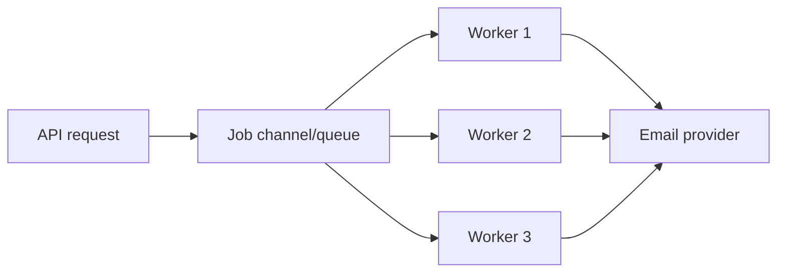

# Go Concurrency Goroutines Channels

## Complete notes

Go concurrency is based on goroutines and channels. A goroutine is a lightweight concurrent function execution.

## Goroutine

```go
go sendReminder(ctx, invoiceID)
```

## Channel

```go
jobs := make(chan Job)
jobs <- Job{ID: "1"}
job := <-jobs
```

## Backend uses

- background workers
- parallel API calls
- fan-out/fan-in
- streaming
- async notifications
- graceful shutdown

## Diagram



## Risks

- goroutine leaks
- data races
- unbounded goroutine creation
- deadlocks
- blocked sends/receives
- ignoring context cancellation

## Common rules

- know who closes the channel
- use context for cancellation
- use worker pools for bounded work
- run `go test -race` for race detection
- protect shared memory with mutexes or communicate through channels

## Interview answer

Goroutines are cheap but not free. I bound concurrency, pass context, avoid shared mutable state where possible, and use the race detector for concurrent code.
