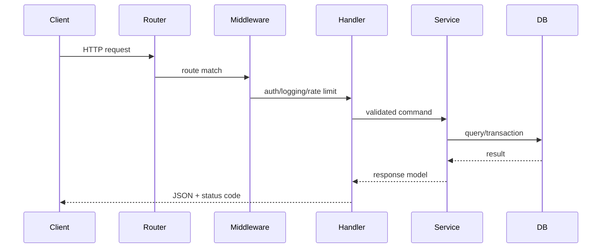

# Go HTTP Server

## Complete notes

Go has a strong standard library HTTP server in `net/http`. Frameworks like Gin, Echo, Fiber, and Chi can help routing, but understanding `net/http` is important.

## Handler model

```go
func createInvoice(w http.ResponseWriter, r *http.Request) {
    if r.Method != http.MethodPost {
        http.Error(w, "method not allowed", http.StatusMethodNotAllowed)
        return
    }
}
```

## Request flow



## Production server settings

Use timeouts:

- read timeout
- write timeout
- idle timeout
- graceful shutdown

## Common mistakes

- starting server with no timeouts
- writing response twice
- decoding huge request bodies without limits
- not setting content type
- handling business logic directly in handlers

## Interview answer

A Go HTTP handler should decode input, validate it, call a service, map errors to HTTP, and encode response. Timeouts and graceful shutdown matter in production.
