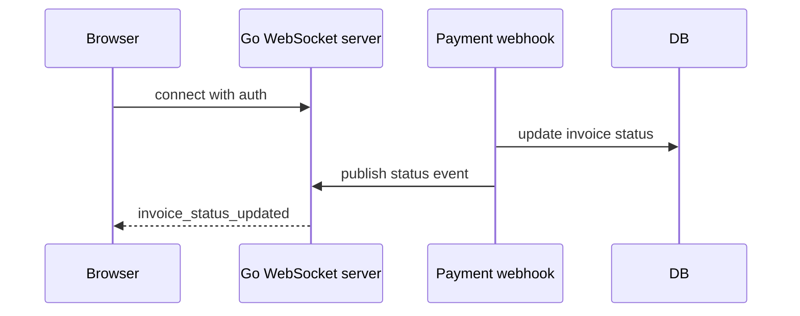

# Go WebSocket Realtime

## Why learn this

WebSocket keeps a long-lived two-way connection open. Use it for live status updates, chat, collaboration, dashboards, and notifications.

## What to build

In InvoiceOps, build live invoice status updates:

```text
Browser connects to /ws/invoices
Server authenticates connection
When payment webhook updates invoice
Server pushes invoice_status_updated event
Browser updates dashboard
```

## Architecture



## Production checklist

- authenticate connection
- heartbeat/ping-pong
- read/write deadlines
- max message size
- reconnect strategy on client
- backpressure handling
- fanout through Redis pub/sub or broker for many instances
- connection cleanup on disconnect

## Library choice

Go standard library does not provide first-class WebSocket server support. Common choices are `gorilla/websocket` and `coder/websocket`/`nhooyr.io/websocket`. Pick one and understand its API.

## Common mistakes

- one goroutine leak per disconnected client
- no heartbeat
- no write deadline
- unbounded outbound message queue
- storing all state only in one process

## Connect to notes

- [[WEBSOCKET]]
- [[Go Concurrency Goroutines Channels]]
- [[Go Redis Cache Queue Rate Limit]]
- [[Observability Content Table]]

## Coding task

Add `/ws/invoices` and broadcast fake invoice status changes first. Then connect it to real payment webhook events.
