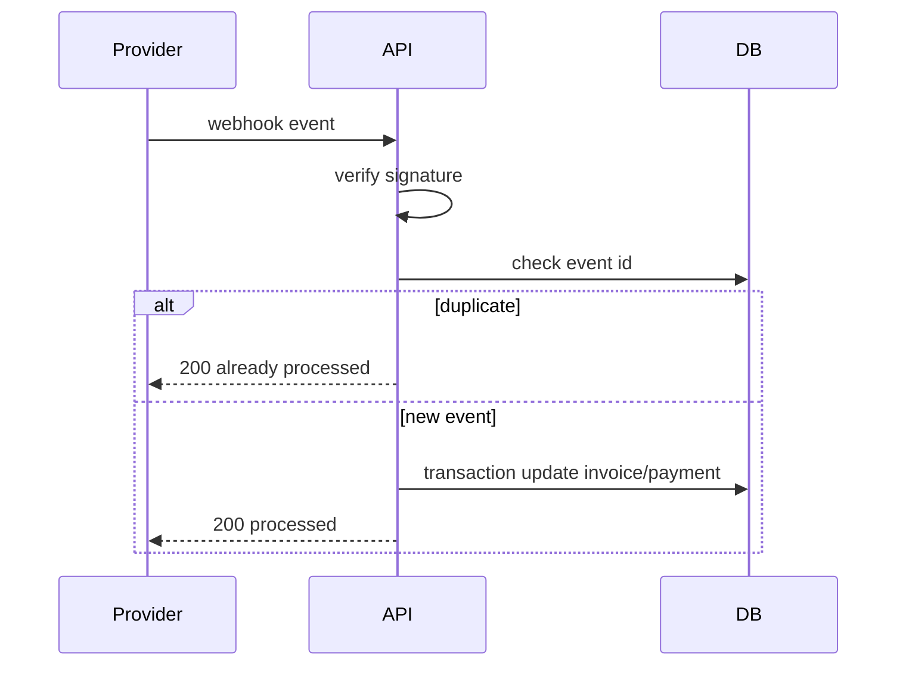

# Go Webhooks Idempotency

## Why learn this

Payment providers retry webhooks. Your backend must handle duplicate delivery safely.

## What to build

`POST /payments/webhooks/razorpay`

Flow:

1. read raw body
2. verify signature
3. parse event
4. check event id in `webhook_events`
5. if already processed, return success
6. start transaction
7. insert event id
8. update payment/invoice
9. create audit log
10. commit

## Diagram

## Common mistakes

- processing duplicate webhook twice
- doing slow email work before responding
- no signature verification
- no transaction
- no audit log
- returning 500 after processing succeeded

## Connect to notes

- [[Webhooks]]
- [[Webhook Processing]]
- [[Go Transactions and Repository Pattern]]
- [[Go Security for Backend]]

## Coding task

Write webhook handler and a test that sends the same event twice. The invoice should update only once.
