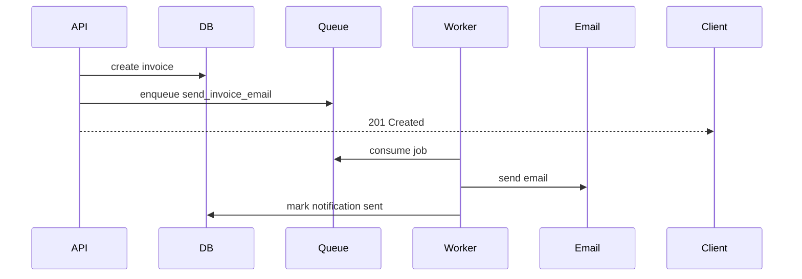

# Go Worker Queues and Background Jobs

## Complete notes

Background jobs are work that should not block the HTTP request.

## InvoiceOps examples

- send invoice email
- send payment reminders
- generate invoice PDF
- retry failed webhook processing
- reconcile payments
- export reports

## Simple architecture

## Queue options

- simple in-process worker for learning
- Redis list/stream for small systems
- RabbitMQ for message broker needs
- Kafka for high-throughput event streams
- cloud queues like SQS/Pub/Sub

## Production concerns

- retries
- dead-letter queue
- idempotency
- job status
- backoff
- worker concurrency
- visibility timeout
- observability

## Common mistakes

- sending email inside request path
- retrying non-idempotent jobs blindly
- no dead-letter path
- no logs per job id
- no timeout for external providers

## Interview answer

I move slow or unreliable work to a queue. Workers process jobs with retries, idempotency, backoff, dead-letter handling, and metrics so the API stays fast and reliable.
