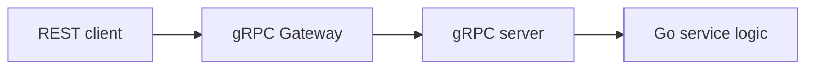

# Go gRPC Gateway REST Combo API

## What it is

gRPC Gateway exposes REST/JSON endpoints that translate to gRPC services.

This lets you define one proto contract and serve:

- gRPC for internal services
- REST/JSON for browser/mobile/external clients

## Flow



## Example annotation idea

```proto
rpc GetInvoice(GetInvoiceRequest) returns (GetInvoiceResponse) {
  option (google.api.http) = {
    get: "/v1/invoices/{id}"
  };
}
```

## Tradeoff

Good:

- one contract
- REST and gRPC together
- typed internal API

Cost:

- more tooling
- generated code complexity
- debugging translation layer
- not always needed for small systems

## Coding task

After basic gRPC works, expose `GET /v1/invoices/{id}` through gRPC Gateway.
