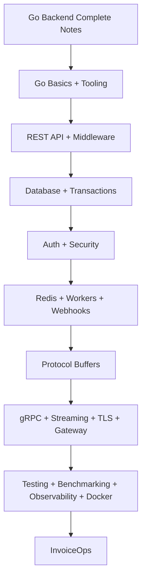

# Golang Backend Content Table

Use this section to revise Go specifically for backend development and for the [[InvoiceOps Golang Project Plan]].

## One-note revision path

- [[Go Backend Complete Notes]]

## How to use this

Open [[Go Backend Complete Notes]] and follow it from top to bottom. The smaller Go notes still exist as source notes/backlinks, but this content table intentionally stays clean so you have one main path.

## What this covers

- Go language basics and tooling
- REST API coding
- SQL/NoSQL, migrations, transactions
- auth, sessions, JWT, password hashing
- Redis cache, queues, rate limiting
- workers, cron, webhooks, idempotency
- Protocol Buffers and gRPC
- gRPC streaming, TLS, metadata, gateway, grpcurl/Postman
- benchmarking, pprof, HTTP/2, HTTPS
- observability, Docker, deployment
- InvoiceOps coding plan

## Visual path

## Coding rule

For every section in [[Go Backend Complete Notes]], write code in InvoiceOps, add one test, and explain the concept out loud.
