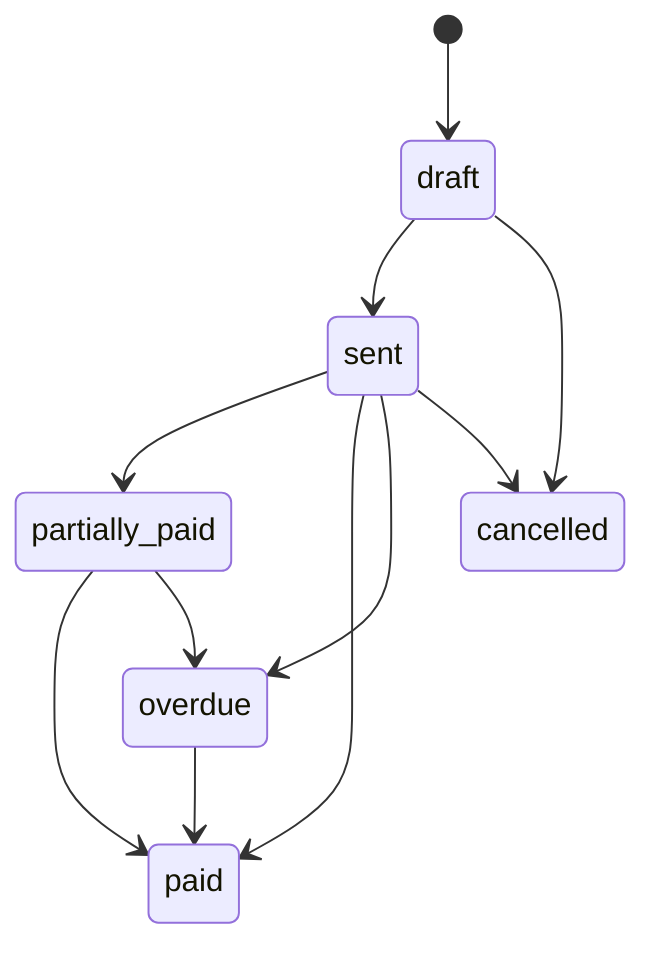

# InvoiceOps Golang Project Plan

InvoiceOps is the Go backend project for practicing the complete backend notes.

## Product description

InvoiceOps helps freelancers and small businesses create invoices, manage clients, track partial payments, process payment webhooks, send reminders, and see overdue/payment dashboards.

## Backend modules

- auth
- workspace
- users
- clients
- invoices
- invoice line items
- payments
- payment webhooks
- reminders
- files
- audit logs
- dashboard
- background workers

## MVP API list

```text
POST   /auth/signup
POST   /auth/login
POST   /auth/refresh
POST   /auth/logout

POST   /workspaces
GET    /workspaces/current

POST   /clients
GET    /clients
GET    /clients/{id}
PATCH  /clients/{id}
DELETE /clients/{id}

POST   /invoices
GET    /invoices
GET    /invoices/{id}
PATCH  /invoices/{id}
POST   /invoices/{id}/send
POST   /invoices/{id}/cancel

POST   /payments/webhooks/razorpay
GET    /payments

GET    /dashboard/summary
GET    /audit-logs
```

## Status lifecycle



## Database tables

- users
- workspaces
- workspace_members
- clients
- invoices
- invoice_items
- payments
- webhook_events
- reminder_jobs
- file_attachments
- audit_logs

## What each Go topic teaches in this project

- [[Go HTTP Server]]: routes and handlers
- [[Go Middleware]]: auth, logging, rate limits
- [[Go JSON Validation DTOs]]: clean request/response contracts
- [[Go Database SQL]]: repositories and queries
- [[Go Transactions and Repository Pattern]]: payment webhook and invoice updates
- [[Go Concurrency Goroutines Channels]]: worker pool
- [[Go Worker Queues and Background Jobs]]: reminders and emails
- [[Go Testing]]: service, handler, repository tests
- [[Go Logging Observability]]: request id, metrics, tracing
- [[Go Security for Backend]]: auth, webhook signature, object authorization
- [[Go Deployment Docker]]: Docker and production run

## Development milestones

1. create Go module and folder structure
2. build health endpoint
3. add config and logger
4. add database connection and migrations
5. build auth
6. build clients
7. build invoices
8. add invoice status lifecycle
9. add payment webhook
10. add idempotency table
11. add reminder worker
12. add dashboard queries
13. add tests
14. add Dockerfile
15. add observability and rate limiting

## Senior interview story

This project is not only CRUD. The real senior parts are idempotent payment webhooks, partial payment lifecycle, worker retries, audit logs, authorization per workspace, database indexes, and observability around failed payments/reminders.

## Advanced coding modules to add

- REST API MVP with [[Go REST API Coding]]
- OpenAPI contract with [[Go OpenAPI Documentation]]
- gRPC internal service with [[Go gRPC Services]]
- WebSocket live invoice updates with [[Go WebSocket Realtime]]
- optional GraphQL dashboard with [[Go GraphQL Backend]]
- Redis cache/rate limit/queue with [[Go Redis Cache Queue Rate Limit]]
- auth with [[Go Auth JWT Sessions]] and [[Go Password Hashing]]
- webhook idempotency with [[Go Webhooks Idempotency]]
- migrations with [[Go Database Migrations]]
- file uploads with [[Go File Uploads]]
- scheduled jobs with [[Go Cron Scheduled Jobs]]
- graceful shutdown with [[Go Graceful Shutdown]]
- external API client with [[Go API Client External Calls]]
- telemetry with [[Go OpenTelemetry Metrics Tracing]]

## Code checkpoints

1. `go test ./...` passes
2. each endpoint has request/response examples
3. each database write has a clear transaction boundary
4. duplicate webhook test passes
5. login rate limit works
6. worker retries are idempotent
7. WebSocket disconnect does not leak goroutines
8. gRPC call has timeout/deadline
9. Docker container starts with health endpoint
10. logs include request id and workspace id where safe

