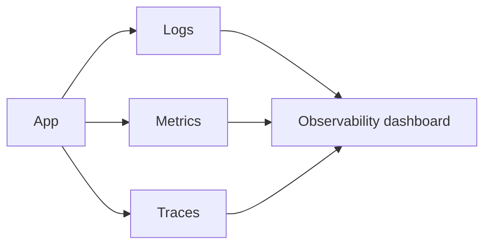
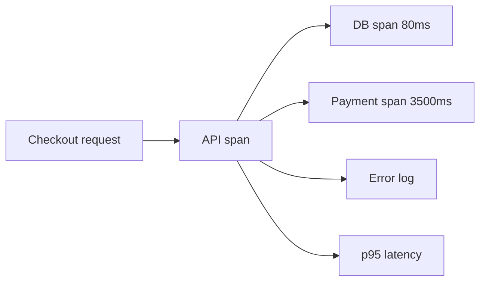
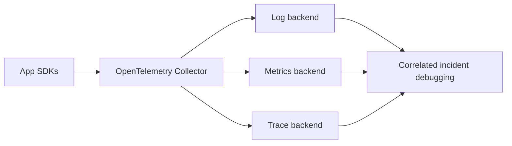

# Logs Metrics Traces

## Complete notes

Logs, metrics, and traces are the three main observability signals.

## Easy explanation

Logs explain events, metrics show trends, and traces show one request moving through services.

In simple words: if you can explain `Logs Metrics Traces` with one real request, one failure case, and one metric, you understand the topic much better than just memorizing the definition.

## Simple example

Think of answering: what is broken, who is affected, why did it happen, and how fast can we fix it. This topic explains logs, metrics, traces, alerts, and debugging.

For `Logs Metrics Traces`, ask yourself:

1. What is the normal happy path?
2. What can fail?
3. What is the tradeoff?
4. What would I monitor in production?

## Real-life examples

### Easy real-life example

A log tells what happened, a metric shows how often, and a trace shows where a request went.

### Difficult production example

A microservice incident is debugged by correlating trace id across gateway, service, database, queue, and external API spans with logs and SLO metrics.

### How to relate this topic

When reading `Logs Metrics Traces`, connect it to:

- one user action
- one backend component
- one failure case
- one tradeoff
- one metric

## Important points

- Core idea: `Logs Metrics Traces` must be understood through its production use case, not just its definition.
- When to use it: Focus on actionable logs, metrics, traces, SLOs, dashboards, alerting, incident response, correlation ids, and debugging workflow.
- At scale: explain the bottleneck, failure path, operational owner, and rollback/fallback.
- What to monitor: request rate, error rate, p95/p99 latency, saturation, trace spans, SLO burn rate, alert volume, and MTTR.
- Interview rule: always give one concrete example, one tradeoff, one failure mode, and one metric.

## Diagram

## Examples

- Log: `payment failed for order 123`
- Metric: `error_rate = 2%`
- Trace: request moved API -> payment service -> database

## Common mistakes

- Logging without request id or trace id.
- Alerting on noisy internal symptoms instead of user impact.
- Having dashboards but no runbook or owner.
- Not correlating logs, metrics, and traces.
- Ignoring high-cardinality metric cost.

## Quick revision

Logs, metrics, and traces are the three main observability signals.

## Examples and deeper diagrams

### Same incident through three signals

Problem: checkout is slow.

- Log: `payment provider timeout for order 123`
- Metric: p95 latency increased from 300ms to 4s
- Trace: request spent 3.5s in payment provider call

### What to add in backend logs

- request id
- user id if safe
- endpoint
- status code
- latency
- error stack
- dependency timings

### SDE-3 rule

If you cannot observe it, you cannot operate it.

## 2026 update: OpenTelemetry first

> [!tip] Production standard
> Use OpenTelemetry as the common instrumentation layer so traces, metrics, and logs are not locked to one vendor. In modern systems, add trace ids to logs and propagate context across every service boundary.

## Deep understanding checklist

To fully understand `Logs Metrics Traces`, be able to answer:

1. Where does it sit in the architecture?
2. What production problem does it solve?
3. What is the simplest implementation?
4. What breaks when traffic or data grows?
5. What is the main failure mode?
6. What tradeoff does it introduce?
7. Which metric proves it is healthy?

Strong answer focus: Focus on actionable logs, metrics, traces, SLOs, dashboards, alerting, incident response, correlation ids, and debugging workflow.

## Senior interview bank

These are topic-specific questions and strong answers for `Logs Metrics Traces`.

### 1. How would you investigate this production issue?

Start with impact and scope, ask what changed, inspect metrics for the symptom, traces for the slow/failing span, and logs for exact errors. Mitigate first if users are impacted, then root cause.

### 2. What metrics matter most?

Request rate, error rate, latency percentiles, saturation, dependency latency, queue lag, retry count, cache hit rate, DB pool usage, and SLO burn rate.

### 3. What logs are useful?

Structured logs with request id, trace id, user/tenant id when safe, endpoint, status, latency, dependency timing, and error code. Avoid secrets and excessive high-cardinality noise.

### 4. When should an alert page someone?

Page only on user-impacting symptoms or fast SLO burn: failed payments, high 5xx, high p99, severe queue lag, data loss risk, or total dependency outage.

### 5. What is the senior signal?

A senior engineer narrows systematically instead of guessing: scope, change, metrics, traces, logs, mitigation, root cause, prevention.

## Topic-specific drill

### How would I answer `Logs Metrics Traces` if the interviewer asks directly?

For `Logs Metrics Traces`, I would explain the debugging workflow: symptom, scope, recent change, metric, trace, log, mitigation, and prevention.

### What is the trap question for `Logs Metrics Traces`?

The trap is giving only a definition. A senior answer must include a concrete production example, a failure mode, a tradeoff, and a metric.

### What should I draw?

Draw the smallest flow that shows where `Logs Metrics Traces` sits, then add the failure path next to the happy path.

## Reviewer checklist

- Can I explain this without reading the note?
- Can I draw the happy path and failure path?
- Can I name one concrete metric?
- Can I explain the tradeoff against a simpler option?
- Can I give a production example in under two minutes?
