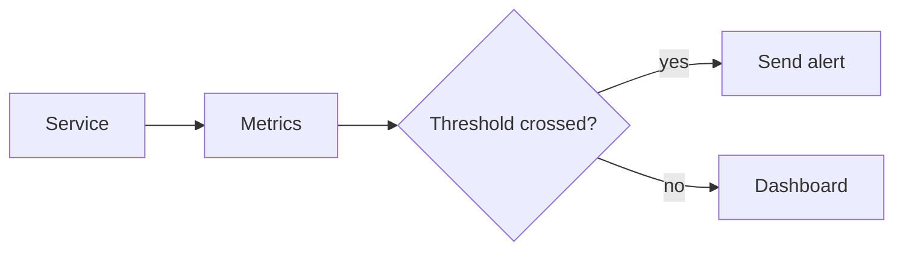

# Monitoring and Alerting

## Complete notes

Monitoring tracks system health. Alerting notifies when something goes wrong.

## Easy explanation

Monitoring tracks system health.

In simple words: if you can explain `Monitoring and Alerting` with one real request, one failure case, and one metric, you understand the topic much better than just memorizing the definition.

## Simple example

Think of answering: what is broken, who is affected, why did it happen, and how fast can we fix it. This topic explains logs, metrics, traces, alerts, and debugging.

For `Monitoring and Alerting`, ask yourself:

1. What is the normal happy path?
2. What can fail?
3. What is the tradeoff?
4. What would I monitor in production?

## Real-life examples

### Easy real-life example

A user says checkout is slow. You check logs, metrics, and traces to see where the request spent time.

### Difficult production example

A production incident affects only one region and one API version. You need request IDs, trace spans, dashboards, alerts, runbooks, and recent deploy/config correlation.

### How to relate this topic

When reading `Monitoring and Alerting`, connect it to:

- one user action
- one backend component
- one failure case
- one tradeoff
- one metric

## Important points

- Core idea: `Monitoring and Alerting` must be understood through its production use case, not just its definition.
- When to use it: Focus on actionable logs, metrics, traces, SLOs, dashboards, alerting, incident response, correlation ids, and debugging workflow.
- At scale: explain the bottleneck, failure path, operational owner, and rollback/fallback.
- What to monitor: request rate, error rate, p95/p99 latency, saturation, trace spans, SLO burn rate, alert volume, and MTTR.
- Interview rule: always give one concrete example, one tradeoff, one failure mode, and one metric.

## Diagram

## Common mistakes

- Logging without request id or trace id.
- Alerting on noisy internal symptoms instead of user impact.
- Having dashboards but no runbook or owner.
- Not correlating logs, metrics, and traces.
- Ignoring high-cardinality metric cost.

## Quick revision

Monitoring tracks system health. Alerting notifies when something goes wrong.

## 2026 update: alert on symptoms first

> [!tip] SRE alert rule
> Alert on user-visible symptoms: high error rate, high latency, low availability, queue backlog, or failed payments. Dashboards can show causes, but pages should wake people only when users or revenue are affected.

## Deep understanding checklist

To fully understand `Monitoring and Alerting`, be able to answer:

1. Where does it sit in the architecture?
2. What production problem does it solve?
3. What is the simplest implementation?
4. What breaks when traffic or data grows?
5. What is the main failure mode?
6. What tradeoff does it introduce?
7. Which metric proves it is healthy?

Strong answer focus: Focus on actionable logs, metrics, traces, SLOs, dashboards, alerting, incident response, correlation ids, and debugging workflow.

## Production example and edge cases

Example: during a payment incident, metrics show error spike, traces show payment provider timeout, logs show request ids and provider error codes, and the alert should point to a runbook.

For `Monitoring and Alerting`, the edge cases to always think about are:

- duplicate request or duplicate event
- dependency timeout or partial failure
- stale data or inconsistent state
- bad input or abusive client
- high traffic causing bottleneck
- rollback or replay after a bad deploy

Interview answer rule: after explaining the concept, immediately give one production example, one failure mode, one tradeoff, and one metric.

## Senior interview bank

These are topic-specific questions and strong answers for `Monitoring and Alerting`.

### 1. How would you investigate this production issue?

Start with impact and scope, ask what changed, inspect metrics for the symptom, traces for the slow/failing span, and logs for exact errors. Mitigate first if users are impacted, then root cause.

### 2. What metrics matter most?

Request rate, error rate, latency percentiles, saturation, dependency latency, queue lag, retry count, cache hit rate, DB pool usage, and SLO burn rate.

### 3. What logs are useful?

Structured logs with request id, trace id, user/tenant id when safe, endpoint, status, latency, dependency timing, and error code. Avoid secrets and excessive high-cardinality noise.

### 4. When should an alert page someone?

Page only on user-impacting symptoms or fast SLO burn: failed payments, high 5xx, high p99, severe queue lag, data loss risk, or total dependency outage.

### 5. What is the senior signal?

A senior engineer narrows systematically instead of guessing: scope, change, metrics, traces, logs, mitigation, root cause, prevention.

## Topic-specific drill

### How would I answer `Monitoring and Alerting` if the interviewer asks directly?

For `Monitoring and Alerting`, I would explain the debugging workflow: symptom, scope, recent change, metric, trace, log, mitigation, and prevention.

### What is the trap question for `Monitoring and Alerting`?

The trap is giving only a definition. A senior answer must include a concrete production example, a failure mode, a tradeoff, and a metric.

### What should I draw?

Draw the smallest flow that shows where `Monitoring and Alerting` sits, then add the failure path next to the happy path.

## Reviewer checklist

- Can I explain this without reading the note?
- Can I draw the happy path and failure path?
- Can I name one concrete metric?
- Can I explain the tradeoff against a simpler option?
- Can I give a production example in under two minutes?
