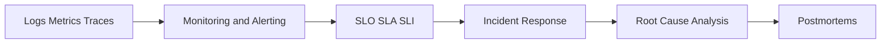

# Observability Content Table

- [[Logs Metrics Traces]]
- [[Monitoring and Alerting]]

## Revision dashboard

Observability helps you understand what is happening inside production systems.

## Visual topic map

Use this map like the Excalidraw roadmap: follow the arrows first, then open the linked notes.

## Color legend

- Blue = core concept
- Green = recommended pattern
- Red = risk or failure mode
- Purple = tradeoff
- Orange = current 2026 update

## Linked notes in this map

- [[Logs Metrics Traces]]
- [[Monitoring and Alerting]]
- [[SLO SLA SLI]]
- [[Incident Response]]
- [[Root Cause Analysis]]
- [[Postmortems]]

## Grill audit additions

- [[Production Debugging Playbook]]
