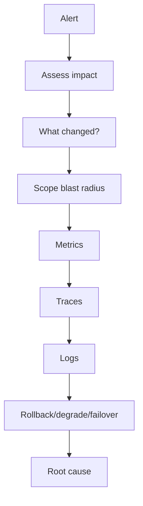

# Production Debugging Playbook

## Complete notes

A production debugging playbook is a repeatable method for investigating incidents without guessing.

## Easy explanation

A production debugging playbook is a repeatable method for investigating incidents without guessing.

In simple words: if you can explain `Production Debugging Playbook` with one real request, one failure case, and one metric, you understand the topic much better than just memorizing the definition.

## Simple example

Think of answering: what is broken, who is affected, why did it happen, and how fast can we fix it. This topic explains logs, metrics, traces, alerts, and debugging.

For `Production Debugging Playbook`, ask yourself:

1. What is the normal happy path?
2. What can fail?
3. What is the tradeoff?
4. What would I monitor in production?

## Method

1. Check user impact and severity.
2. Ask what changed: deploy, config, traffic, data, dependency, cron, feature flag.
3. Scope the issue: one endpoint, region, tenant, node, or all traffic.
4. Use metrics to find the symptom.
5. Use traces to find the slow/failing span.
6. Use logs to inspect exact errors.
7. Mitigate first if users are impacted.
8. Root cause after the system is stable.

## Example

If p99 latency tripled but p50 is normal, suspect tail-only issues: one bad node, connection pool exhaustion, GC pauses, slow dependency, hot partition, or specific query shape.

## Real-life examples

### Easy real-life example

A user says checkout is slow. You check logs, metrics, and traces to see where the request spent time.

### Difficult production example

A production incident affects only one region and one API version. You need request IDs, trace spans, dashboards, alerts, runbooks, and recent deploy/config correlation.

### How to relate this topic

When reading `Production Debugging Playbook`, connect it to:

- one user action
- one backend component
- one failure case
- one tradeoff
- one metric

## Important points

- Core idea: `Production Debugging Playbook` must be understood through its production use case, not just its definition.
- When to use it: Focus on actionable logs, metrics, traces, SLOs, dashboards, alerting, incident response, correlation ids, and debugging workflow.
- At scale: explain the bottleneck, failure path, operational owner, and rollback/fallback.
- What to monitor: request rate, error rate, p95/p99 latency, saturation, trace spans, SLO burn rate, alert volume, and MTTR.
- Interview rule: always give one concrete example, one tradeoff, one failure mode, and one metric.

## Common mistakes

- Logging without request id or trace id.
- Alerting on noisy internal symptoms instead of user impact.
- Having dashboards but no runbook or owner.
- Not correlating logs, metrics, and traces.
- Ignoring high-cardinality metric cost.

## Quick revision

- One-line meaning: Production Debugging Playbook is a observability/debugging topic. It should be understood as part of a real production backend, not only as a definition.
- Use it when: Use it when you need to understand production behavior and incidents.
- Failure to mention: partial failure, overload, bad config, stale data, or unsafe retries.
- Tradeoff to mention: simplicity vs production safety.
- Metric to mention: Watch request rate, error rate, latency, saturation, traces, log volume, and alert quality.

## Deep understanding checklist

To fully understand `Production Debugging Playbook`, be able to answer:

1. Where does it sit in the architecture?
2. What production problem does it solve?
3. What is the simplest implementation?
4. What breaks when traffic or data grows?
5. What is the main failure mode?
6. What tradeoff does it introduce?
7. Which metric proves it is healthy?

Strong answer focus: Focus on actionable logs, metrics, traces, SLOs, dashboards, alerting, incident response, correlation ids, and debugging workflow.

## Senior interview bank

These are topic-specific questions and strong answers for `Production Debugging Playbook`.

### 1. How would you investigate this production issue?

Start with impact and scope, ask what changed, inspect metrics for the symptom, traces for the slow/failing span, and logs for exact errors. Mitigate first if users are impacted, then root cause.

### 2. What metrics matter most?

Request rate, error rate, latency percentiles, saturation, dependency latency, queue lag, retry count, cache hit rate, DB pool usage, and SLO burn rate.

### 3. What logs are useful?

Structured logs with request id, trace id, user/tenant id when safe, endpoint, status, latency, dependency timing, and error code. Avoid secrets and excessive high-cardinality noise.

### 4. When should an alert page someone?

Page only on user-impacting symptoms or fast SLO burn: failed payments, high 5xx, high p99, severe queue lag, data loss risk, or total dependency outage.

### 5. What is the senior signal?

A senior engineer narrows systematically instead of guessing: scope, change, metrics, traces, logs, mitigation, root cause, prevention.

## Topic-specific drill

### How would I answer `Production Debugging Playbook` if the interviewer asks directly?

For `Production Debugging Playbook`, I would explain the debugging workflow: symptom, scope, recent change, metric, trace, log, mitigation, and prevention.

### What is the trap question for `Production Debugging Playbook`?

The trap is giving only a definition. A senior answer must include a concrete production example, a failure mode, a tradeoff, and a metric.

### What should I draw?

Draw the smallest flow that shows where `Production Debugging Playbook` sits, then add the failure path next to the happy path.

## Reviewer checklist

- Can I explain this without reading the note?
- Can I draw the happy path and failure path?
- Can I name one concrete metric?
- Can I explain the tradeoff against a simpler option?
- Can I give a production example in under two minutes?
